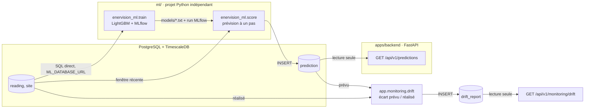

# ML-START : accès aux données, scoring, frontière API et ML

Document de référence du module `ml/`, cité par le code (`enervision_ml/config.py`, `data.py`,
`train.py`, `score.py`, `features.py`), par l'[ADR 0005](adr/0005-modele-prediction-lightgbm.md)
et par les vues d'architecture. Il répond à trois questions, et à elles seules :

1. **comment le pipeline accède aux données**, et pourquoi pas par l'API ;
2. **ce que fait un run de scoring**, étape par étape ;
3. **où passe la frontière entre l'API et le ML**, et pourquoi elle est là.

Le mode d'emploi (installation, commandes, options) est dans [`ml/README.md`](../ml/README.md).
Le choix du modèle est dans l'ADR 0005. Ce document ne les répète pas.

---

## 1. Mécanisme d'accès aux données

### Deux sources, un seul schéma de sortie

`enervision_ml.data` expose trois chargeurs qui produisent **exactement les mêmes neuf colonnes**
(`site_id`, `timestamp`, `consumption_kwh`, `temperature_celsius`, `humidity_percent`,
`solar_irradiance_wm2`, `is_working_hours`, `site_type`, `capacity_kw`) :

| Fonction | Source | Usage |
|---|---|---|
| `load_from_csv(path)` | `ml/data/all_sites_combined.csv` | Chemin de démarrage, tant que la base n'est pas peuplée |
| `load_from_database(connection)` | `reading` joint à `site`, **historique complet** | Entraînement |
| `load_recent_from_database(connection, since=…)` | `reading` joint à `site`, **borné par `since`** | Scoring |

L'égalité des schémas n'est pas un confort : c'est ce qui permet de valider tout le pipeline sur
CSV, sans base joignable, et d'obtenir le même comportement une fois la base peuplée. Une
divergence entre les deux chemins ne se verrait pas au chargement, elle se verrait en production
sous forme de prédictions silencieusement fausses.

### Connexion directe à PostgreSQL, pas l'API

Le pipeline lit `reading` et `site` **en SQL direct**, jamais par `GET /api/v1/readings`. Trois
raisons, à défendre telles quelles :

- **Volume.** L'entraînement lit l'historique complet d'une hypertable TimescaleDB. Le faire
  passer par une API REST paginée, sérialisée en JSON et contrôlée route par route, c'est payer
  trois fois pour un `SELECT`.
- **Couplage.** Le pipeline n'est pas un client de l'application, c'est un consommateur du
  schéma. Passer par l'API le rendrait dépendant du contrat HTTP, de l'authentification et de la
  disponibilité du service, pour lire des données dont il connaît déjà la forme.
- **Droits.** Un rôle de lecture sur deux tables est une surface plus petite qu'un compte
  applicatif porteur d'un rôle métier.

### `ML_DATABASE_URL`, et pourquoi ce n'est pas `DATABASE_URL`

La chaîne de connexion est lue dans **`ML_DATABASE_URL`**, jamais dans `DATABASE_URL`. Ce n'est
pas une préférence de nommage : `DATABASE_URL` est celle du backend applicatif, **propriétaire du
schéma**, avec les droits d'écriture complets. Réutiliser cette variable par défaut ferait tourner
l'entraînement et le scoring avec ces droits, **en silence**. `enervision_ml.config.database_url()`
lève donc plutôt que de retomber sur une valeur par défaut.

**Dette assumée, à dire à l'oral et non à masquer** : le rôle PostgreSQL dédié `enervision_ml`,
restreint en lecture sur `reading` et `site`, **n'est pas provisionné**. En développement,
`ML_DATABASE_URL` pointe sur la même base que le backend. La cible est un rôle séparé, cohérente
avec le principe de moindre privilège posé par l'[ADR 0003](adr/0003-autorisation-rbac-a-trois-roles.md).

### Le seul endroit qui construit les features

`enervision_ml.features.build_features` est **l'unique** constructeur de features, à
l'entraînement comme au scoring. Le piège que cela évite : si les deux divergent, même d'une
fenêtre de moyenne glissante, le modèle reçoit en service des features qui ne ressemblent plus à
ce qu'il a appris, et ses prédictions se dégradent **sans qu'aucune erreur ne se déclenche**.
Ne jamais réécrire cette logique ailleurs : importer le module.

Conséquence sur la validation : la coupure entraînement / validation est **chronologique**, jamais
un tirage aléatoire de lignes. Un tirage aléatoire laisserait des lignes de validation voir des
lignes d'entraînement à travers leurs lags et leurs moyennes glissantes, une fuite qui masquerait
un surapprentissage.

---

## 2. Les étapes d'un run de scoring

`python -m enervision_ml.score` calcule, pour chaque site ou pour un seul avec `--site-id`, la
consommation prévue de **l'heure suivant sa dernière lecture connue**, et écrit une ligne dans
`prediction`.

| # | Étape | Point de vigilance |
|---|---|---|
| 1 | Charger une **fenêtre récente** de `reading` joint à `site` : 21 jours par défaut | Une marge au-dessus des 168 h qu'exige le lag hebdomadaire. Un `SELECT` non borné sur l'hypertable serait la même erreur que celle corrigée sur `GET /readings` |
| 2 | Ajouter **une ligne future par site**, l'heure suivante, et calculer ses features par `build_features` | La même fonction qu'à l'entraînement, cf. section 1 |
| 3 | Si le **lag de 168 h est absent** (moins d'une semaine d'historique) : écrire `status = "insufficient_data"` | **LightGBM n'est jamais appelé.** Un modèle interrogé sans son lag principal rendrait un nombre, et ce nombre serait faux sans le dire |
| 4 | Sinon : `booster.predict(...)`, puis écrire `status = "available"` et la valeur prévue | |

### Ce que le run écrit, et ce qu'il n'écrase pas

La table `prediction` **n'a pas de contrainte d'unicité sur `(site_id, target_at)`** : chaque run
insère une ligne de plus au lieu d'écraser la précédente. C'est délibéré, et c'est ce qui rend
possible la comparaison prévision contre réalisé. La surveillance de dérive s'en sert : elle
retient, pour chaque `(site_id, target_at)`, la ligne du run le plus récent, celle-là même que
sert `GET /api/v1/predictions`. Voir l'[ADR 0011](adr/0011-surveillance-de-derive-dans-le-backend.md).

Trois contraintes de cohérence sont portées par la base et non par le code applicatif :
`status = 'available'` exige une `predicted_value` et interdit un `failure_reason` ;
`insufficient_data` et `error` exigent l'inverse ; `target_metric` est bornée à
`consumption_kwh` ou `consumption_kw`, et la forme énergie impose une `period_minutes`. Elles
sont vérifiées depuis le code qui écrit par `ml/tests/test_score_integration.py`, sur une vraie
base : un double ne prouverait rien d'une contrainte SQL.

**Limite connue de `--now`.** L'option décale l'instant de référence, pas la fenêtre de lecture :
`load_recent_from_database` n'a pas de borne haute et `build_scoring_frame` part toujours de la
dernière lecture connue. `target_at` vaut donc « dernière lecture du jeu + 1 h » quelle que soit
la valeur passée, et aucune boucle de rattrapage ne peut fabriquer de paires prévu/réalisé sur un
jeu figé.

### `model_reference` est un hachage, pas un nom de fichier

`train.py` réécrit **toujours le même chemin** (`models/lightgbm-consumption.txt`) à chaque
entraînement. Le nom de fichier ne distinguerait donc pas deux versions du modèle. `prediction`
porte pour cela le **SHA-256 tronqué du fichier modèle**. C'est ce qui permet, devant une
prédiction douteuse, de savoir quel modèle l'a produite.

### Mode CSV : rien n'est écrit en base

En `--csv`, le run ne touche pas la base. L'heure future calculée depuis la fin du CSV n'existe
dans aucune base réelle : ce serait inscrire une prévision pour un instant déjà passé. Le mode
sert à valider le pipeline sans base joignable.

### Limite assumée

La feature `is_working_hours` de la ligne future est **recopiée** depuis la dernière lecture
réelle, pas recalculée : il n'existe aucune règle d'heures ouvrables dans ce dépôt, elle vit dans
le générateur du jeu de données d'origine. L'approximation n'est fausse qu'aux heures de bascule,
sur une feature parmi une dizaine, pour une prévision à un seul pas.

---

## 3. La frontière entre l'API et le ML

**La règle, en une phrase : FastAPI ne fait jamais tourner LightGBM.**
`GET /api/v1/predictions` lit la dernière prévision par site dans `prediction`, jamais un recalcul
à la volée. Ce qui en découle, et qui est l'argument à tenir devant le jury :

- **La latence de l'API ne dépend pas du modèle.** Une route de lecture indexée
  (`ix_prediction_site_target`) répond en temps constant, qu'un run de scoring dure une seconde
  ou une minute.
- **Le service de production n'embarque ni LightGBM ni MLflow.** `ml/` est un projet Python
  séparé, avec son propre `uv.lock`. Le backend n'a aucune raison de porter ces dépendances, ni
  leur surface de vulnérabilités, pour un script lancé hors du chemin de requête.
- **Une panne du pipeline dégrade, elle n'interrompt pas.** Si le scoring ne tourne plus, l'API
  continue de servir la dernière prévision connue, avec son `created_at` et son
  `model_reference`, au lieu de rendre une erreur.
- **Le contrat est la table, pas un appel.** Ce qui traverse la frontière, ce sont des lignes de
  `prediction` et leurs contraintes de cohérence, vérifiables en SQL.

Le corollaire est qu'il n'y a **aucune prévision à la demande** : la fraîcheur d'une prévision est
celle du dernier run de scoring. Ce run est ordonnancé par Airflow, DAG `ml_score` en `@hourly`
(issue #115) ; seuls le mode `--csv` et un lancement local restent manuels, tout comme
l'entraînement, dont le DAG `ml_train` n'a pas de planification.

La surveillance de dérive traverse cette frontière **dans le sens de la table vers le backend**,
sans la percer : elle relit `prediction` et `reading` en SQL, ne charge aucun modèle, et n'appelle
pas MLflow. Son calcul, son seuil et son refus de comparer à la métrique d'entraînement sont dans
l'[ADR 0011](adr/0011-surveillance-de-derive-dans-le-backend.md).

---

## Voir aussi

- [`ml/README.md`](../ml/README.md) : installation, commandes, options, où écrire les tests
- [ADR 0005](adr/0005-modele-prediction-lightgbm.md) : pourquoi LightGBM, et les 6 candidats écartés
- [ADR 0006](adr/0006-moteur-de-regles-dans-le-backend.md) : ce qui consomme les prédictions
- [`architecture/20-backend.md`](architecture/20-backend.md) : le contrat de `GET /predictions`
- [`architecture/40-data.md`](architecture/40-data.md) : le modèle de données
- [ADR 0011](adr/0011-surveillance-de-derive-dans-le-backend.md) : la surveillance de dérive
