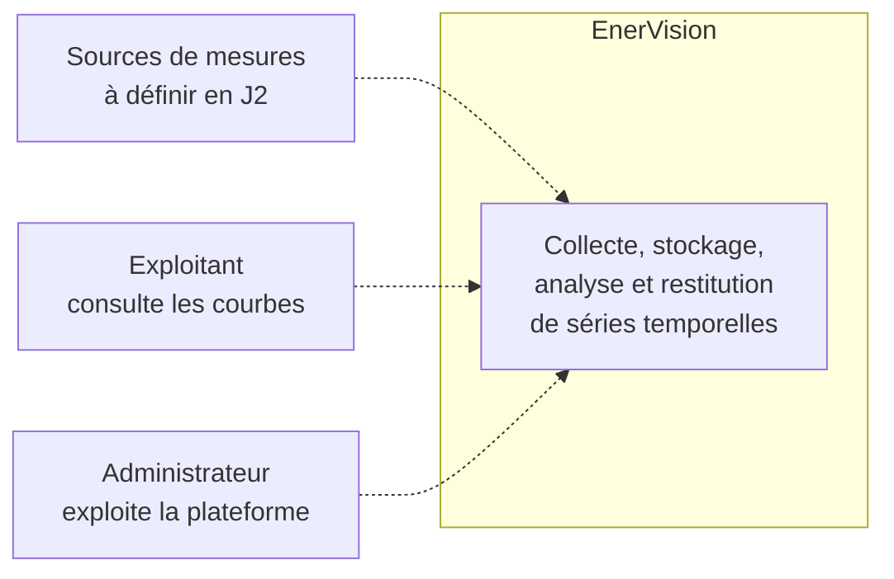
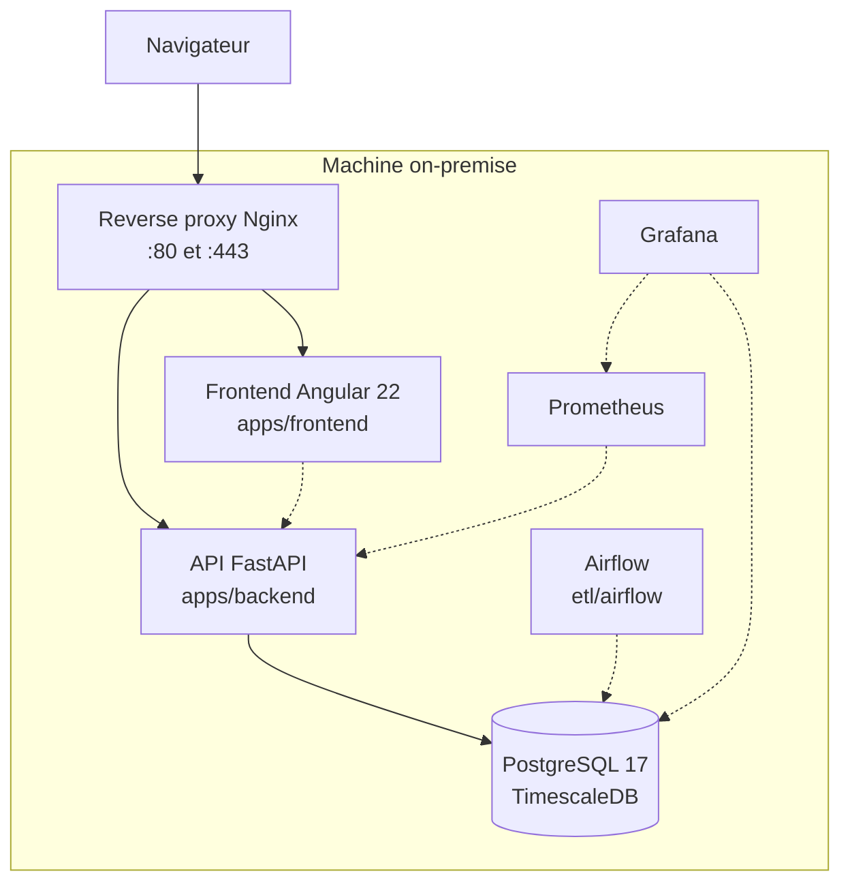
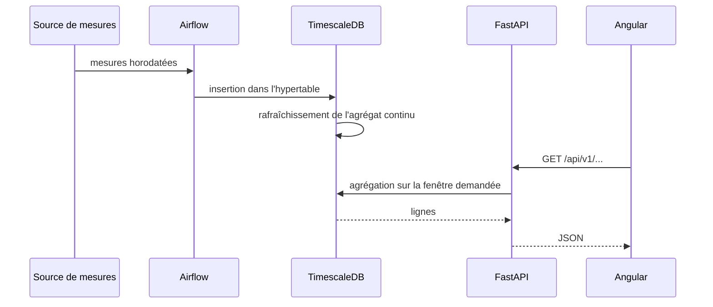

# Vue d'ensemble

EnerVision collecte, stocke, analyse et restitue des séries temporelles énergétiques, sur une
machine on-premise.

## Cadre du projet

Quatre jalons ont été posés à l'ouverture du projet. Ils ont disparu du `README.md` lors de la
réécriture de l'arborescence (`2670483`) et ne subsistaient que sur `main`. Ils sont repris ici
parce qu'ils disent ce que le projet doit prouver, et donc à quoi sert chaque décision technique.

| Jalon | Intitulé | Ce que la documentation apporte |
|---|---|---|
| J1 | Valider la préparation de l'environnement et du repo | `10-infra.md` décrit la stack du poste de développement et la commande qui la démarre |
| J2 | Valider le périmètre retenu et les choix technologiques | Les ADR (`../adr/`) portent les choix ; `40-data.md` liste les questions de périmètre encore ouvertes |
| J3 | Ingestion & backend | `20-backend.md` |
| J4 | Architecture, sécurité & frontend | Les cinq vues, et la section « Sécurité » ci-dessous qui consolide les surfaces exposées |
| J5 | Valider la robustesse et assurer les livrables | `20-backend.md` et `30-frontend.md` renvoient aux conventions de tests de chaque application |

## Contexte

Statut : `Cible`. Les acteurs et les sources de mesures ne sont pas arrêtés, c'est l'objet du
jalon J2.

## Conteneurs

Trait plein pour ce qui tourne, pointillé pour ce qui est cible.

Le lien `front -.-> api` reste en pointillé : le frontend appelle bien une API, mais un
intercepteur répond à sa place tant que les endpoints n'existent pas. Voir
[30-frontend.md](30-frontend.md).

Le lien `prom -.-> api` de même : l'API expose bien `/metrics` au format Prometheus, mais aucun
collecteur ne vient le lire.

## État de la stack

| Domaine | Technologie | Emplacement | Statut | Ce qui existe réellement |
|---|---|---|---|---|
| Backend | FastAPI, Python 3.14 | `apps/backend` | `En cours` | Factory, configuration, journalisation, 2 sondes de santé, `/metrics`, contrat OpenAPI versionné, routes `sites`, `alerts`, `recommendations`, `stats/summary`, `readings`, `sensors/status` et `predictions` en lecture (endpoints → services → repositories → models) |
| Frontend | Angular 22, Node 24 | `apps/frontend` | `En cours` | Tableau de bord sur route `/dashboard`, authentification complète (garde de route, intercepteur de jeton), cinq services HTTP, graphiques Chart.js. `stats`/`alerts` sur fixtures, `predictions` branché sur l'API réelle |
| Base | PostgreSQL 17 + TimescaleDB | `db` | `Fait` | Bootstrap de l'extension, base de test, chaîne Alembic. Schéma applicatif créé (`site`, `dataset`, `reading` en hypertable, `prediction`, `alert`, `recommendation`) |
| ML | LightGBM, MLflow | `ml` | `En cours` | Pipeline d'entraînement et de scoring (`enervision_ml.train`/`.score`, features par lags/moyennes glissantes partagées entre les deux, baseline de persistance saisonnière, suivi MLflow local), exposé en lecture via `GET /predictions`. Voir [ADR 0005](../adr/0005-modele-prediction-lightgbm.md) et [ML-START.md](../../ML-START.md). Automatisation (Airflow) et surveillance de dérive (EC06, #44/#45) pas encore construites |
| Infra | Docker Compose, Nginx, Terraform, k3s single-node | `infra`, `docker-compose.prod.yml` | `En cours` | Reverse proxy et overlay de déploiement écrits et validés, jamais lancés sur le serveur ([ADR 0007](../adr/0007-terminaison-tls-et-reverse-proxy-nginx.md)). Module d'installation k3s jamais appliqué, aucune ressource Kubernetes déclarée |
| Monitoring | Prometheus, Grafana, Alertmanager | `monitoring` | `Cible` | Rien, hors le `/metrics` exposé par l'API |
| ETL | Apache Airflow | `etl/airflow` | `Cible` | Rien |
| CI/CD | GitHub Actions | `.github/workflows` | `Cible` | Rien |

## Flux bout en bout

Statut : `Cible`. Aucun maillon de cette chaîne n'existe aujourd'hui, à l'exception de la base.

## Sécurité

Section rattachée au jalon J3. Le détail par brique est dans chaque document ; voici la vue
consolidée.

### En place

- **Authentification et autorisation.** JWT d'accès de 15 minutes, jeton de rafraîchissement
  opaque en cookie `HttpOnly` avec rotation et détection de réutilisation, mots de passe en
  Argon2id, RBAC à trois rôles. Détail dans [20-backend.md](20-backend.md), décisions dans les
  [ADR 0002](../adr/0002-authentification-jwt-et-refresh-opaque.md) et
  [0003](../adr/0003-autorisation-rbac-a-trois-roles.md).
- **Interdire par défaut.** Toute route exige un jeton, sauf quatre exceptions listées dans un
  fichier de test qui interroge réellement chaque route sans identifiant.
- **Révocation immédiate.** Le compte est relu en base à chaque requête : une désactivation ou un
  changement de rôle prend effet à la requête suivante, pas au bout de 15 minutes.
- **Limitation de débit à fenêtre glissante** sur trois clés, évaluée avant le hachage. Pas de
  verrouillage de compte, qui serait un déni de service trivial.
- **Journal d'audit en ajout seul**, garanti par deux déclencheurs PostgreSQL
  ([ADR 0004](../adr/0004-journal-d-audit-en-ajout-seul.md)).
- **Les secrets n'ont pas de valeur par défaut.** `APP_SECRET_KEY` et `DATABASE_URL` sont requis
  sans repli, et la configuration refuse de démarrer sur cinq erreurs silencieuses : secret trop
  court ou laissé à sa valeur d'exemple, `debug` en production, joker CORS, origines vides hors
  local, cookie `SameSite=None` sans `Secure`.
- **CORS explicite** : origines listées, méthodes et en-têtes énumérés, jamais de joker.
- **En-têtes de sécurité** posés par l'application (`nosniff`, `DENY`, `no-referrer`) et
  `Cache-Control: no-store` sur les routes d'authentification.
- **Caviardage des journaux** : jetons, empreintes Argon2, mots de passe et cookies sont
  expurgés avant écriture.
- **Documentation interactive fermée** en préproduction et en production, `/metrics` derrière un
  jeton facultatif, sonde de disponibilité qui ne publie plus la version de TimescaleDB.
- **CI backend bloquante** : format, lint, typage strict et tests avec seuil de couverture.
- **Conteneur backend non-root**, déclaré dans `apps/backend/Dockerfile`.
- **Terminaison TLS au frontal** : un reverse proxy Nginx est le seul service publié, il redirige
  80 vers 443, sert le SPA et l'API sous la même origine, pose **HSTS** et **CSP** que
  l'application refuse délibérément de poser, et ajoute une **limitation de débit au frontal**
  distincte de celle de l'application. Voir
  [ADR 0007](../adr/0007-terminaison-tls-et-reverse-proxy-nginx.md).
- **Côté infrastructure** : la clé SSH est marquée `sensitive`, le kubeconfig reste en `600/root`
  sur la machine cible et n'est lu que par `sudo`, `*.tfvars` est ignoré par git sauf les
  `.example`.

### Absent, et assumé

- **Rôles PostgreSQL cantonnés** pour l'ETL et le travail d'apprentissage. C'est la vraie
  frontière pour ces deux consommateurs, qui écrivent en base et non par HTTP. Reporté parce que
  cela impose une réinitialisation de base à toute l'équipe. Voir l'ADR 0003.
- **`REVOKE` sur `audit_log`** : les déclencheurs arrêtent les accidents, les privilèges
  arrêteraient une application compromise. Même raison de report.
- **Portée par site** dans l'autorisation : les rôles sont globaux, un opérateur du site A peut
  agir sur le site B. C'est la limite connue du modèle.
- **Certificat reconnu** : aucun nom de domaine public ne résout vers la machine, donc le défi
  HTTP-01 de Let's Encrypt ne peut pas aboutir. Le certificat servi est auto-signé, le chemin ACME
  est livré et documenté mais pas exercé.
- **Analyse de dépendances et de conteneurs** dans la CI, qui relève du chantier CI/CD.

## Décisions structurantes

Elles vivent dans `../adr/`, pas ici.

| ADR | Objet |
|---|---|
| [0001](../adr/0001-postgresql-timescaledb.md) | PostgreSQL 17 avec l'extension TimescaleDB, et la frontière `db/` vs `alembic/` |
