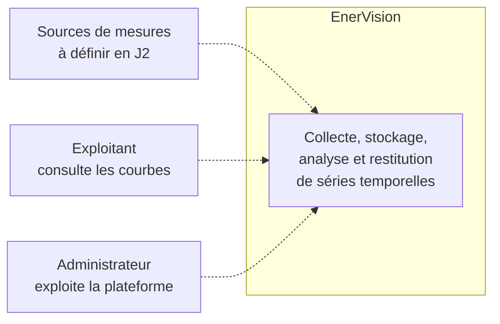
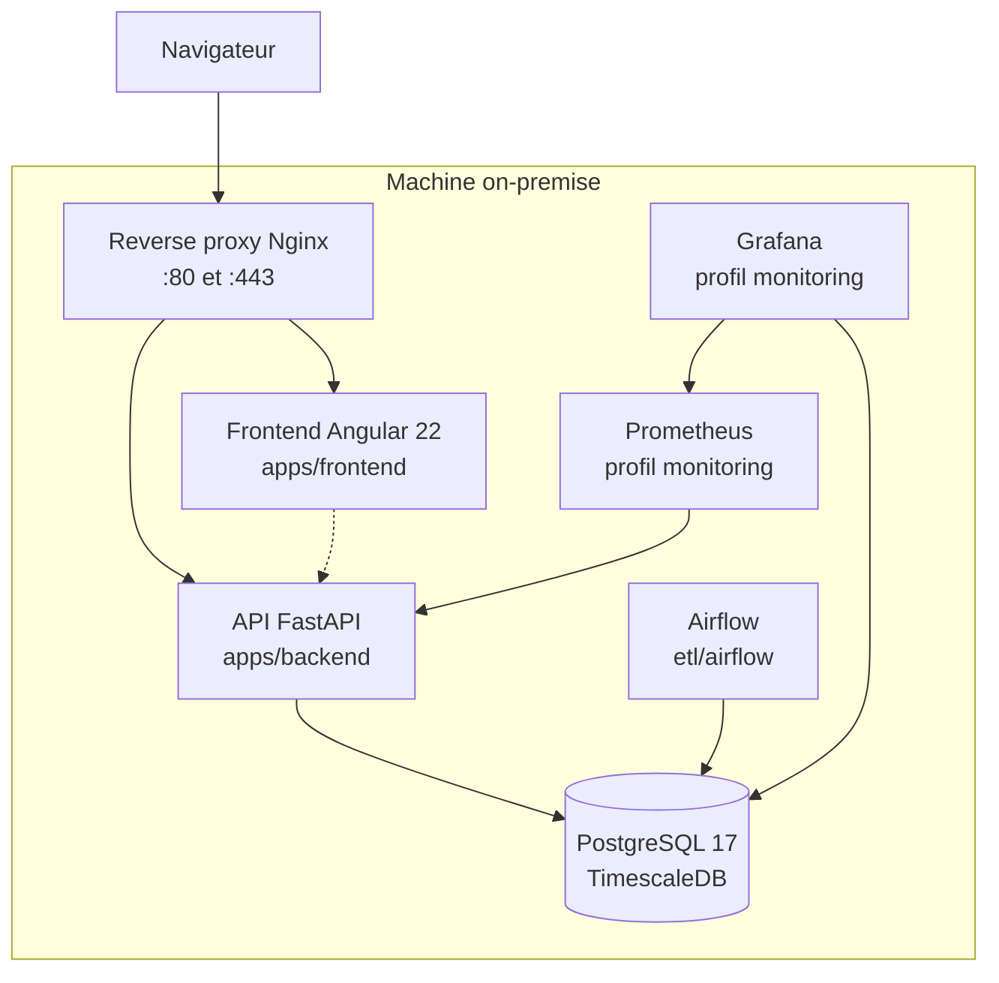
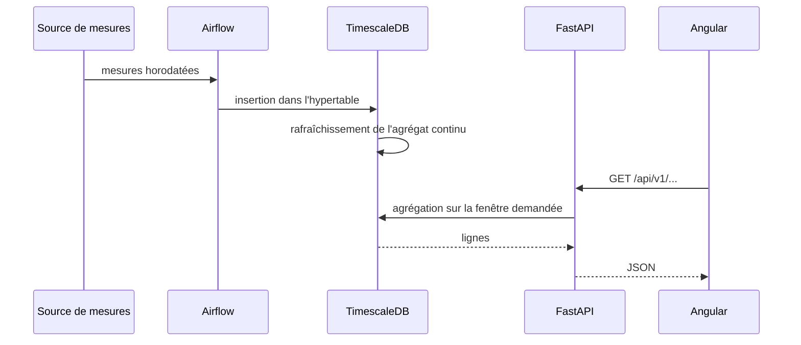

# Vue d'ensemble

EnerVision collecte, stocke, analyse et restitue des séries temporelles énergétiques, sur une
machine on-premise.

## Cadre du projet

Quatre jalons ont été posés à l'ouverture du projet. Ils ont disparu du `README.md` lors de la
réécriture de l'arborescence (`2670483`) et ne subsistaient que sur `main`. Ils sont repris ici
parce qu'ils disent ce que le projet doit prouver, et donc à quoi sert chaque décision technique.

| Jalon | Intitulé | Ce que la documentation apporte |
|---|---|---|
| J1 | Valider la préparation de l'environnement et du repo | `10-infra.md` décrit la stack du poste de développement et la commande qui la démarre |
| J2 | Valider le périmètre retenu et les choix technologiques | Les ADR (`../adr/`) portent les choix ; `40-data.md` liste les questions de périmètre encore ouvertes |
| J3 | Ingestion & backend | `20-backend.md` |
| J4 | Architecture, sécurité & frontend | Les cinq vues, et la section « Sécurité » ci-dessous qui consolide les surfaces exposées |
| J5 | Valider la robustesse et assurer les livrables | `20-backend.md` et `30-frontend.md` renvoient aux conventions de tests de chaque application |

## Contexte

Statut : `Cible`. Les acteurs et les sources de mesures ne sont pas arrêtés, c'est l'objet du
jalon J2.

## Conteneurs

Trait plein pour ce qui tourne, pointillé pour ce qui est cible.

Le lien `front -.-> api` reste en pointillé : le frontend appelle bien une API, mais un
intercepteur répond à sa place tant que les endpoints n'existent pas. Voir
[30-frontend.md](30-frontend.md).

Le lien `airflow --> db` est maintenant en trait plein : six DAGs tournent, deux pour
l'entraînement et le scoring du modèle ML (issue #115), un pour la détection d'alertes et la
génération des recommandations (issue #116), un pour la surveillance de dérive (issue #45),
`historical_import` pour le dataset historique (issue #119) et `mock_api_import` pour l'ingestion
horaire de l'API Mock (issue #15). La réconciliation entre les deux sources de lectures (issue
#15) est tranchée : le trou entre la fin de l'historique (31/12/2024) et le début de l'ingestion
API Mock est accepté comme définitivement perdu, aucune mesure réelle n'existant pour cette
période. `mock_api_import` refuse toute fenêtre qui recouvrirait des lectures déjà importées du
CSV plutôt que de laisser les deux sources dupliquer silencieusement un même instant, et le
pipeline ML déduplique par construction (`DISTINCT ON`, source `csv` préférée) au cas où un
recouvrement se produirait malgré tout, voir [40-data.md](40-data.md).

Les liens de la supervision sont en trait plein depuis le 23/09 (issue #26) : Prometheus scrute
`/metrics` avec un jeton, Grafana lit Prometheus et, par un rôle en lecture seule, les tables
métier de TimescaleDB. Ils tournent en prod sous le profil Compose `monitoring`, à la demande
ailleurs ([ADR 0016](../adr/0016-supervision-en-profil-compose.md),
[60-observabilite.md](60-observabilite.md)).

## État de la stack

| Domaine | Technologie | Emplacement | Statut | Ce qui existe réellement |
|---|---|---|---|---|
| Backend | FastAPI, Python 3.14 | `apps/backend` | `En cours` | Factory, configuration, journalisation, 2 sondes de santé, `/metrics`, contrat OpenAPI versionné, routes `sites`, `alerts`, `recommendations`, `stats/summary`, `readings`, `sensors/status` et `predictions` en lecture (endpoints → services → repositories → models) |
| Frontend | Angular 22, Node 24 | `apps/frontend` | `En cours` | Tableau de bord sur route `/dashboard`, authentification complète (garde de route, intercepteur de jeton), cinq services HTTP, graphiques Chart.js. `stats`/`alerts` sur fixtures, `predictions` branché sur l'API réelle |
| Base | PostgreSQL 17 + TimescaleDB | `db` | `Fait` | Bootstrap de l'extension, base de test, chaîne Alembic. Schéma applicatif créé (`site`, `dataset`, `reading` en hypertable, `prediction`, `alert`, `recommendation`) |
| ML | LightGBM, MLflow | `ml` | `En cours` | Pipeline d'entraînement et de scoring (`enervision_ml.train`/`.score`, features par lags/moyennes glissantes partagées entre les deux, baseline de persistance saisonnière, suivi MLflow local), exposé en lecture via `GET /predictions`, orchestré par Airflow (`ml_train`/`ml_score`). Voir [ADR 0005](../adr/0005-modele-prediction-lightgbm.md) et [ML-START.md](../ML-START.md). Surveillance de dérive livrée côté backend (`app.monitoring.drift`, table `drift_report`, `GET /monitoring/drift`, DAG `derive`), voir [ADR 0013](../adr/0013-surveillance-de-derive-dans-le-backend.md) |
| Infra | Docker Compose, Nginx, Terraform, k3s single-node | `infra`, `docker-compose.prod.yml` | `En cours` | Reverse proxy et overlay de déploiement écrits et validés, jamais lancés sur le serveur ([ADR 0007](../adr/0007-terminaison-tls-et-reverse-proxy-nginx.md)). Provisionnement de la VM par Terraform, qui installe Docker, prépare les deux environnements et enregistre le runner, jamais appliqué ([ADR 0010](../adr/0010-terraform-provisionne-github-actions-deploie.md)). Module d'installation k3s jamais appliqué, aucune ressource Kubernetes déclarée |
| Stockage objet | Garage, S3 | `infra/garage`, `docker-compose.yml` | `Fait` | Un Garage par environnement, `--single-node --default-bucket`, secrets par l'environnement, ports sur `127.0.0.1`, fumée S3 et SSE-C en CI. Reçoit les archives CSV gzip du DAG `retention`, chiffrées SSE-C, avant `drop_chunks` ([ADR 0019](../adr/0019-stockage-objet-garage-et-cycle-de-vie-des-mesures.md), [ADR 0020](../adr/0020-chiffrement-au-repos-coffre-luks-et-sse-c.md)) |
| Monitoring | Prometheus, Grafana, Alertmanager | `monitoring` | `Fait` | Profil Compose `monitoring`, actif en prod : Prometheus et trois exporteurs (PostgreSQL, hôte, conteneurs), neuf règles d'alerte testées par `promtool`, Alertmanager vers Mailpit, trois tableaux de bord Grafana provisionnés. Voir [60-observabilite.md](60-observabilite.md) |
| ETL | Apache Airflow | `etl/airflow` | `En cours` | Webserver et scheduler avec LocalExecutor via Docker Compose, sur une base PostgreSQL dédiée. Six DAGs en sous-processus `uv run` : `ml_train`, `ml_score`, `alertes`, `historical_import`, `mock_api_import` et `derive` (quotidien, surveillance de dérive). L'import historique reste manuel et l'import API Mock s'exécute chaque heure. Réconciliation entre les deux sources (issue #15) : trou temporel accepté, recouvrement refusé à l'ingestion et dédupliqué en défense côté ML, voir [40-data.md](40-data.md). |
| CI/CD | GitHub Actions | `.github/workflows` | `En cours` | Un orchestrateur `ci.yml` qui n'appelle que les composants modifiés ([ADR 0014](../adr/0014-pipeline-ci-unique-et-deploiement-conditionne.md)) : lint, typage, tests avec seuil de couverture bloquant, tests d'intégration sur TimescaleDB réel, audit de dépendances, SAST Bandit, quality gate SonarCloud, intégrité des DAGs Airflow, Terraform, Compose et supervision, parcours Playwright et tirs k6 contre la stack de prod ([ADR 0015](../adr/0015-tests-e2e-et-de-charge-contre-la-stack-compose.md)). Déploiement vers la VM ENI par `deploy.yml`, appelé une fois « CI ok » vert, `dev` en recette et `main` en production après approbation ([ADR 0009](../adr/0009-deux-environnements-compose-sur-la-vm-eni.md)), mais jamais exécuté : le runner n'est pas enregistré sur la machine. Détail dans [50-cicd.md](50-cicd.md) |

## Flux bout en bout

Statut : `En cours`. **Le chemin de lecture tourne** entre la base, l'API et le frontend.
**Le chemin d'ingestion est maintenant orchestré par Airflow** : `historical_import` charge le
dataset CSV/JSON sur déclenchement manuel et `mock_api_import` collecte chaque heure les mesures
de l'API Mock. Les DAGs `ml_train` et `ml_score` (issue #115), `alertes` (issue #116) et `derive`
(issue #45) portent le pipeline ML, la détection d'alertes et la surveillance de dérive. La
réconciliation entre les deux sources de lectures (issue #15) est close : voir
[40-data.md](40-data.md) pour le détail du garde-fou d'ingestion et de la déduplication ML.

## Sécurité

Section rattachée au jalon J3. Le détail par brique est dans chaque document ; voici la vue
consolidée.

### En place

- **Authentification et autorisation.** JWT d'accès de 15 minutes, jeton de rafraîchissement
  opaque en cookie `HttpOnly` avec rotation et détection de réutilisation, mots de passe en
  Argon2id, RBAC à trois rôles. Détail dans [20-backend.md](20-backend.md), décisions dans les
  [ADR 0002](../adr/0002-authentification-jwt-et-refresh-opaque.md) et
  [0003](../adr/0003-autorisation-rbac-a-trois-roles.md).
- **Chiffrement au repos.** Les archives de mesures déposées sur Garage sont chiffrées par clé
  client (SSE-C). Le coffre LUKS des volumes Docker (`scripts/coffre-luks.sh`) est prêt pour une
  vraie VM, mais la machine ENI est un conteneur LXC sans device-mapper : le chiffrement de son
  disque relève de l'hôte Proxmox, demandé à l'école. Ce qui est couvert et ce qui ne l'est pas :
  [ADR 0020](../adr/0020-chiffrement-au-repos-coffre-luks-et-sse-c.md).
- **Interdire par défaut.** Toute route exige un jeton, sauf quatre exceptions listées dans un
  fichier de test qui interroge réellement chaque route sans identifiant.
- **Révocation immédiate.** Le compte est relu en base à chaque requête : une désactivation ou un
  changement de rôle prend effet à la requête suivante, pas au bout de 15 minutes.
- **Limitation de débit à fenêtre glissante** sur trois clés, évaluée avant le hachage. Pas de
  verrouillage de compte, qui serait un déni de service trivial.
- **Journal d'audit en ajout seul**, garanti par deux déclencheurs PostgreSQL
  ([ADR 0004](../adr/0004-journal-d-audit-en-ajout-seul.md)).
- **Les secrets n'ont pas de valeur par défaut.** `APP_SECRET_KEY` et `DATABASE_URL` sont requis
  sans repli, et la configuration refuse de démarrer sur cinq erreurs silencieuses : secret trop
  court ou laissé à sa valeur d'exemple, `debug` en production, joker CORS, origines vides hors
  local, cookie `SameSite=None` sans `Secure`.
- **CORS explicite** : origines listées, méthodes et en-têtes énumérés, jamais de joker.
- **En-têtes de sécurité** posés par l'application (`nosniff`, `DENY`, `no-referrer`) et
  `Cache-Control: no-store` sur les routes d'authentification.
- **Caviardage des journaux** : jetons, empreintes Argon2, mots de passe et cookies sont
  expurgés avant écriture.
- **Documentation interactive fermée** en préproduction et en production, `/metrics` derrière un
  jeton, exigé dès que la supervision tourne, sonde de disponibilité qui ne publie plus la version de TimescaleDB.
- **CI backend bloquante** : format, lint, typage strict et tests avec seuil de couverture.
- **Conteneur backend non-root**, déclaré dans `apps/backend/Dockerfile`.
- **Terminaison TLS au frontal** : un reverse proxy Nginx est le seul service publié, il redirige
  80 vers 443, sert le SPA et l'API sous la même origine, pose **HSTS** et **CSP** que
  l'application refuse délibérément de poser, et ajoute une **limitation de débit au frontal**
  distincte de celle de l'application. Voir
  [ADR 0007](../adr/0007-terminaison-tls-et-reverse-proxy-nginx.md).
- **Côté infrastructure** : la clé SSH est marquée `sensitive`, le kubeconfig reste en `600/root`
  sur la machine cible et n'est lu que par `sudo`, `*.tfvars` est ignoré par git sauf les
  `.example`.

### Absent, et assumé

- **Rôles PostgreSQL cantonnés** pour l'ETL et le travail d'apprentissage. C'est la vraie
  frontière pour ces deux consommateurs, qui écrivent en base et non par HTTP. Reporté parce que
  cela impose une réinitialisation de base à toute l'équipe. Voir l'ADR 0003.
- **`REVOKE` sur `audit_log`** : les déclencheurs arrêtent les accidents, les privilèges
  arrêteraient une application compromise. Même raison de report.
- **Portée par site** dans l'autorisation : les rôles sont globaux, un opérateur du site A peut
  agir sur le site B. C'est la limite connue du modèle.
- **Certificat reconnu** : aucun nom de domaine public ne résout vers la machine, donc le défi
  HTTP-01 de Let's Encrypt ne peut pas aboutir. Le certificat servi est auto-signé, le chemin ACME
  est livré et documenté mais pas exercé.
- **Analyse des images de conteneur** dans la CI. Celle des dépendances, elle, est en place
  (`pip-audit`, `npm audit`, Dependabot sur 5 écosystèmes), de même que le SAST Bandit. Voir
  [50-cicd.md](50-cicd.md).

## Décisions structurantes

Elles vivent dans `../adr/`, pas ici.

| ADR | Objet |
|---|---|
| [0001](../adr/0001-postgresql-timescaledb.md) | PostgreSQL 17 avec l'extension TimescaleDB, et la frontière `db/` vs `alembic/` |
| [0002](../adr/0002-authentification-jwt-et-refresh-opaque.md) | Authentification par JWT d'accès et jeton de rafraîchissement opaque |
| [0003](../adr/0003-autorisation-rbac-a-trois-roles.md) | Autorisation RBAC à trois rôles, avec relecture du compte à chaque requête |
| [0004](../adr/0004-journal-d-audit-en-ajout-seul.md) | Journal d'audit en ajout seul, garanti par PostgreSQL |
| [0005](../adr/0005-modele-prediction-lightgbm.md) | Modèle de prédiction de consommation : LightGBM |
| [0006](../adr/0006-moteur-de-regles-dans-le-backend.md) | Le moteur de règles de recommandation vit dans le backend, pas dans `ml/` |
| [0007](../adr/0007-terminaison-tls-et-reverse-proxy-nginx.md) | Terminaison TLS par un reverse proxy Nginx, en Docker Compose |
| [0008](../adr/0008-airflow-execute-le-code-du-backend.md) | Airflow exécute le code du backend en sous-processus, dans son propre environnement |
| [0009](../adr/0009-deux-environnements-compose-sur-la-vm-eni.md) | Deux environnements sur la VM ENI, un projet Compose chacun, déployés par un runner auto-hébergé |
| [0010](../adr/0010-terraform-provisionne-github-actions-deploie.md) | Terraform provisionne la machine, GitHub Actions déploie l'application |
| [0019](../adr/0019-stockage-objet-garage-et-cycle-de-vie-des-mesures.md) | Stockage objet Garage par environnement ; les chunks anciens de `reading` sont exportés en CSV gzip puis supprimés |
| [0020](../adr/0020-chiffrement-au-repos-coffre-luks-et-sse-c.md) | Chiffrement au repos : coffre LUKS des volumes Docker de la VM, SSE-C des archives |
