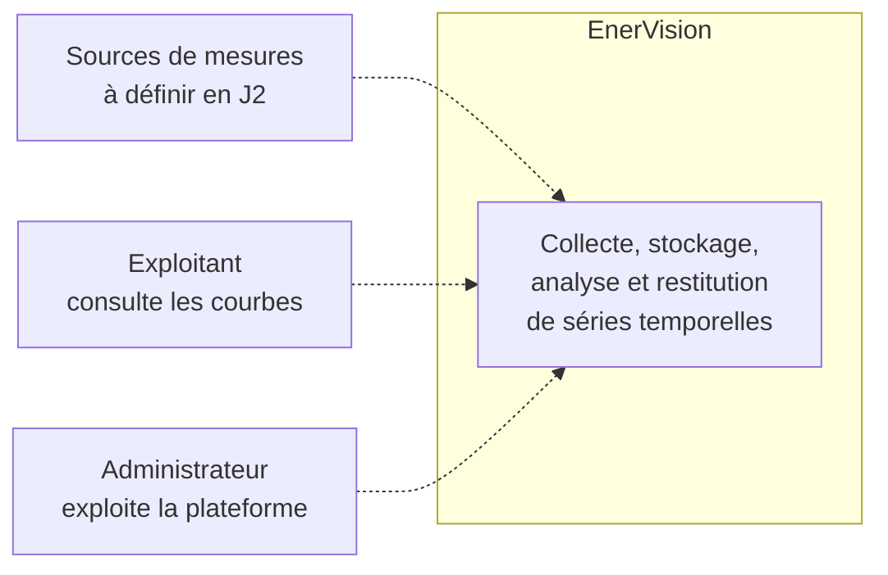
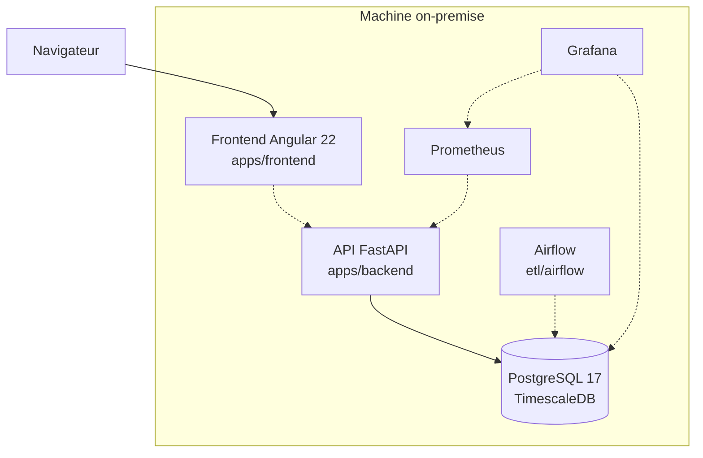
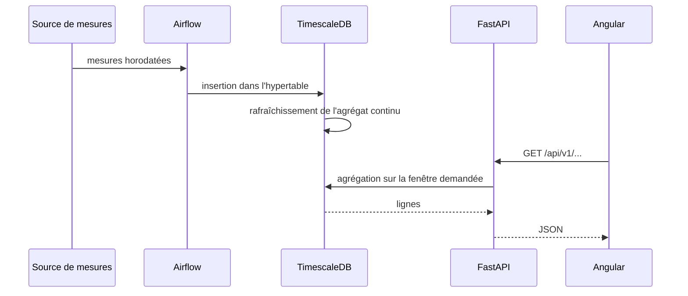

# Vue d'ensemble

EnerVision collecte, stocke, analyse et restitue des séries temporelles énergétiques, sur une
machine on-premise.

## Cadre du projet

Quatre jalons ont été posés à l'ouverture du projet. Ils ont disparu du `README.md` lors de la
réécriture de l'arborescence (`2670483`) et ne subsistaient que sur `main`. Ils sont repris ici
parce qu'ils disent ce que le projet doit prouver, et donc à quoi sert chaque décision technique.

| Jalon | Intitulé | Ce que la documentation apporte |
|---|---|---|
| J1 | Valider la préparation de l'environnement et du repo | `10-infra.md` décrit la stack du poste de développement et la commande qui la démarre |
| J2 | Valider le périmètre retenu et les choix technologiques | Les ADR (`../adr/`) portent les choix ; `40-data.md` liste les questions de périmètre encore ouvertes |
| J3 | Ingestion & backend | `20-backend.md` |
| J4 | Architecture, sécurité & frontend | Les cinq vues, et la section « Sécurité » ci-dessous qui consolide les surfaces exposées |
| J5 | Valider la robustesse et assurer les livrables | `20-backend.md` et `30-frontend.md` renvoient aux conventions de tests de chaque application |

## Contexte

Statut : `Cible`. Les acteurs et les sources de mesures ne sont pas arrêtés, c'est l'objet du
jalon J2.

## Conteneurs

Trait plein pour ce qui tourne, pointillé pour ce qui est cible.

Le lien `front -.-> api` est en pointillé à dessein : le frontend n'appelle aujourd'hui aucune
API, `provideHttpClient` n'est pas encore installé. Voir [30-frontend.md](30-frontend.md).

Le lien `prom -.-> api` de même : l'API expose bien `/metrics` au format Prometheus, mais aucun
collecteur ne vient le lire.

## État de la stack

| Domaine | Technologie | Emplacement | Statut | Ce qui existe réellement |
|---|---|---|---|---|
| Backend | FastAPI, Python 3.14 | `apps/backend` | `En cours` | Factory, configuration, journalisation, 2 sondes de santé, `/metrics`. Aucune couche métier |
| Frontend | Angular 22, Node 24 | `apps/frontend` | `En cours` | Squelette `ng new` standalone, routes vides, aucun service HTTP |
| Base | PostgreSQL 17 + TimescaleDB | `db` | `Fait` | Bootstrap de l'extension, base de test, chaîne Alembic. Aucune table applicative |
| Infra | Terraform, k3s single-node | `infra/terraform` | `En cours` | Module d'installation du cluster. Jamais appliqué, aucune ressource Kubernetes déclarée |
| Monitoring | Prometheus, Grafana, Alertmanager | `monitoring` | `Cible` | Rien, hors le `/metrics` exposé par l'API |
| ETL | Apache Airflow | `etl/airflow` | `Cible` | Rien |
| CI/CD | GitHub Actions | `.github/workflows` | `Cible` | Rien |

## Flux bout en bout

Statut : `Cible`. Aucun maillon de cette chaîne n'existe aujourd'hui, à l'exception de la base.

## Sécurité

Section rattachée au jalon J3. Le détail par brique est dans chaque document ; voici la vue
consolidée.

### En place

- **Les secrets n'ont pas de valeur par défaut.** `APP_SECRET_KEY` et `DATABASE_URL` sont requis
  sans repli : l'application refuse de démarrer si l'un manque, plutôt que de tourner avec une
  valeur de démonstration. `.env` reste hors dépôt, `.env.example` est versionné.
- **CORS conditionnel** : le middleware n'est ajouté que si `APP_CORS_ORIGINS` est renseigné.
- **Documentation interactive fermée en production** : `/docs`, `/redoc` et `/openapi.json` sont
  désactivés dès que `APP_ENV=prod`.
- **Conteneur backend non-root**, déclaré dans `apps/backend/Dockerfile`.
- **Côté infrastructure** : la clé SSH est marquée `sensitive`, le kubeconfig reste en `600/root`
  sur la machine cible et n'est lu que par `sudo`, `*.tfvars` est ignoré par git sauf les
  `.example`.

### Absent

- **Aucune authentification ni autorisation.** Les deux endpoints exposés sont publics. Rien
  n'est encore décidé sur ce point.
- Pas de TLS, pas de limitation de débit, pas de journalisation des accès, pas de rotation des
  secrets.
- Aucune analyse de dépendances ni de conteneur, faute de CI.

## Décisions structurantes

Elles vivent dans `../adr/`, pas ici.

| ADR | Objet |
|---|---|
| [0001](../adr/0001-postgresql-timescaledb.md) | PostgreSQL 17 avec l'extension TimescaleDB, et la frontière `db/` vs `alembic/` |
