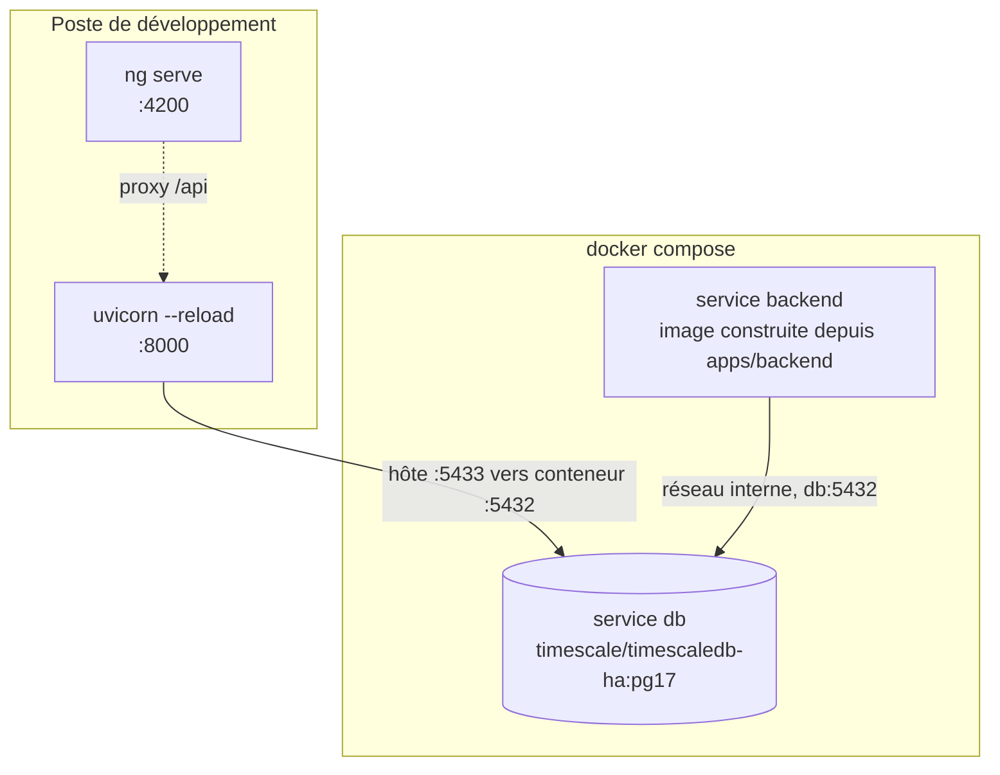
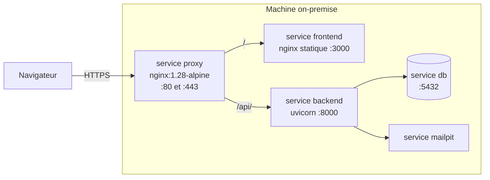
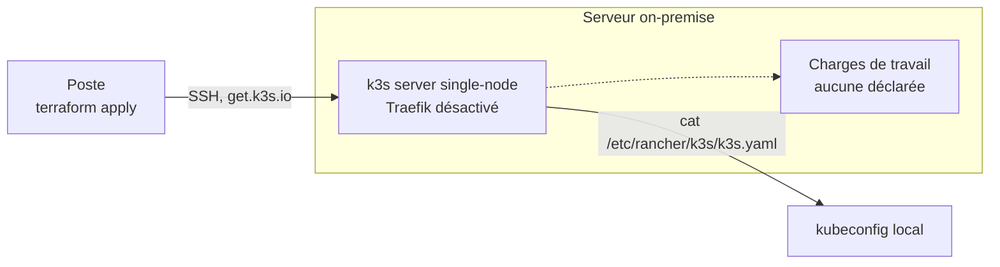
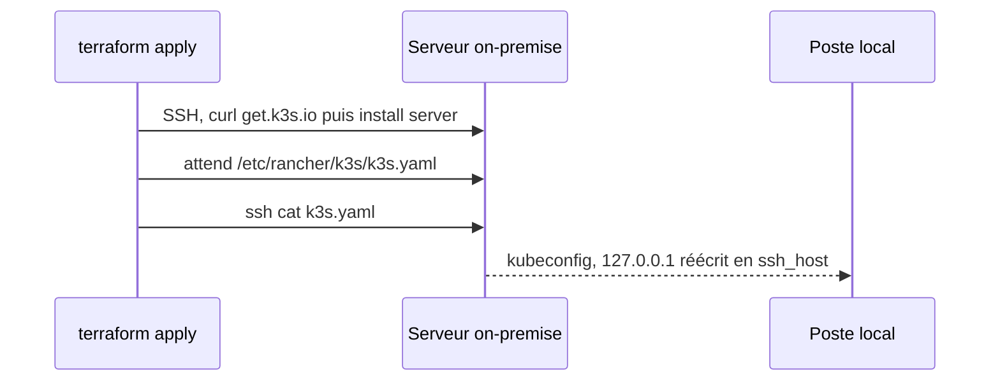

# Infrastructure

Trois topologies coexistent et ne servent pas la même chose. Ce document dit laquelle vaut dans
quel contexte, quelles décisions sont arrêtées, et ce qui manque encore entre elles.

| Topologie | Sert à | Statut |
|---|---|---|
| Docker Compose | Développer et recetter sur le poste | `Fait` |
| Docker Compose plus reverse proxy | Déployer sur la machine on-premise | `Fait` |
| k3s single-node | Cible à terme | `En cours` |

## Poste de développement

Statut : `Fait`. Défini par `docker-compose.yml`, projet `enervision`.



| Service | Image | Points notables |
|---|---|---|
| `db` | `timescale/timescaledb-ha:pg17` | Publié sur **5433** côté hôte, 5432 souvent déjà pris. `healthcheck` `pg_isready`, 12 tentatives, `start_period` 40s |
| `backend` | Construite depuis `apps/backend` | `depends_on: db, condition: service_healthy`. **N'embarque pas le source** : toute modification impose `docker compose up -d --build backend` |

**La boucle de développement n'utilise pas le service `backend`.** `make db-up` puis `make dev` :
seule la base tourne en conteneur, l'API et `ng serve` tournent sur le poste avec le rechargement
à chaud, lancés ensemble par `make dev` (`make dev-backend`/`make dev-frontend` pour lancer l'un
des deux seul). Le service `backend` sert la stack complète et la recette. Les deux occupent le
port 8000, ils ne se lancent donc pas ensemble.

Trois pièges sont documentés en tête du `docker-compose.yml`, ils ne se devinent pas :

- `PGDATA` vaut `/home/postgres/pgdata/data` pour l'image `-ha`, et non le chemin habituel de
  l'image `postgres`. Monté ailleurs, le volume ne retient rien, sans le moindre message.
- `db/init` est monté **fichier par fichier**. Monter le dossier masquerait les scripts d'init de
  l'image, dont `timescaledb-tune`. Ajouter un fichier dans `db/init/` impose donc une ligne dans
  le compose. Voir [`db/README.md`](../../db/README.md).
- `LocalExecutor` exécute les tâches comme sous-processus du **scheduler**, jamais du webserver :
  c'est le scheduler qui a besoin du volume `airflow_ml_state` (modèle, magasin MLflow).

### Airflow (issues #115, #116 et #119)

Trois services Airflow sont définis dans `docker-compose.yml`. Les `docker compose profiles` ne
sont pas utilisés : le démarrage reste explicite via `make airflow-up` et Airflow ne fait pas
partie de la boucle `make dev`.

| Service | Rôle | Points notables |
|---|---|---|
| `airflow-init` | Migre la base de métadonnées et crée le compte admin | Conteneur jetable (`restart: "no"`). `webserver` et `scheduler` attendent qu'il se termine avec succès |
| `airflow-webserver` | Interface Airflow sur le port `8080` | Avec `LocalExecutor`, il n'exécute aucune tâche lui-même |
| `airflow-scheduler` | Planifie et exécute les tâches | Les DAGs tournent en sous-processus avec `LocalExecutor` |

`LocalExecutor` exécute les tâches dans le scheduler et non dans le webserver.

Les services sont construits depuis :

```text
etl/airflow/Dockerfile
```

avec la racine du dépôt comme contexte Docker.

Airflow 2.10.4 fonctionne avec Python 3.12, tandis que le pipeline ML et le backend utilisent des
dépendances Python 3.14.

L'image Airflow embarque donc deux environnements distincts :

```text
/opt/ml/.venv
/opt/backend/.venv
```

Le premier contient le pipeline Machine Learning.

Le second contient le backend EnerVision utilisé par les DAGs `alertes` et
`historical_import`.

Cette séparation évite d'installer directement LightGBM, MLflow ou les dépendances SQLAlchemy du
backend dans l'environnement Python utilisé par Airflow.

Le choix est décrit dans
[l'ADR 0008](../adr/0008-airflow-execute-le-code-du-backend.md).

Les DAGs actuellement présents sont :

| DAG | Planification | Ce qu'il exécute |
|---|---|---|
| `ml_train` | manuelle | `enervision_ml.train` dans `/opt/ml/.venv` |
| `ml_score` | `0 * * * *` | `enervision_ml.score` dans `/opt/ml/.venv` |
| `alertes` | `15 * * * *` | `app.detection.internal_alerts` puis `app.cli generate-recommendations` dans `/opt/backend/.venv` |
| `historical_import` | manuelle | `app.etl.historical_import` dans `/opt/backend/.venv` |

#### Import historique

Le DAG :

```text
historical_import
```

est défini dans :

```text
etl/airflow/dags/historical_import.py
```

Il ne contient aucune logique d'import propre.

Il utilise un `BashOperator` pour exécuter le module backend existant :

```text
app.etl.historical_import
```

dans l'environnement :

```text
/opt/backend/.venv
```

Le flux est donc :

```text
Airflow scheduler
      |
      v
historical_import
      |
      v
BashOperator
      |
      v
app.etl.historical_import
      |
      v
PostgreSQL / TimescaleDB
```

Les fichiers historiques locaux sont montés en lecture seule dans les services Airflow :

```text
./data/raw:/opt/data/raw:ro
```

Les chemins utilisés depuis le conteneur sont :

```text
/opt/data/raw/all_sites_combined.csv
/opt/data/raw/dataset_metadata.json
```

Le montage en lecture seule empêche les traitements Airflow de modifier les fichiers sources.

Le dataset historique sert uniquement à initialiser les données de l'environnement.

Le DAG utilise donc :

```text
schedule = None
catchup = False
max_active_runs = 1
```

Il est déclenché manuellement.

`max_active_runs = 1` empêche deux imports du même dataset de s'exécuter simultanément.

La tâche possède également :

```text
retries = 1
retry_delay = 2 minutes
execution_timeout = 30 minutes
```

Le traitement historique étant idempotent, une reprise après une erreur transitoire ne doit pas
créer de doublons.

Deux exécutions manuelles successives ont été validées avec succès.

Après les deux exécutions, PostgreSQL/TimescaleDB contenait toujours :

```text
122647
```

lectures avec :

```text
source = "csv"
```

La deuxième exécution n'a donc pas dupliqué les lectures historiques.

#### DAG alertes

Le DAG `alertes` est planifié à la quinzième minute de chaque heure.

La règle `anomaly` compare une lecture à la `prediction` du même instant, que `ml_score` écrit à
l'heure pile. Le décalage laisse donc du temps au scoring pour terminer.

Aucune dépendance Airflow explicite n'est cependant déclarée entre `ml_score` et `alertes`.
Quatre règles de détection sur cinq ne dépendent pas du modèle, et l'absence d'un modèle entraîné
ne doit pas empêcher les autres alertes d'être produites.

Les deux tâches du DAG `alertes` s'enchaînent :

```text
detection
    |
    v
recommandations
```

`recommendation.alert_id` étant une clé étrangère `NOT NULL`, la génération des recommandations
est exécutée après la détection.

Les traitements sont idempotents en base grâce aux contraintes :

```text
uq_alert_source_reference
uq_recommendation_alert_rule
```

Chaque tâche possède deux tentatives, deux minutes d'attente entre les tentatives et un plafond
de cinq minutes par tentative.

#### DAGs ML

`ml_train` reste manuel.

Réentraîner le modèle est coûteux et `train.py` remplace actuellement le modèle existant sans
comparer automatiquement les métriques du nouveau modèle avec celles du précédent.

Tant que ce mécanisme de sélection n'existe pas, le réentraînement reste déclenché humainement.

`ml_score` est planifié toutes les heures et réutilise le modèle produit par `ml_train`.

Il utilise :

```text
max_active_runs = 1
retries = 2
execution_timeout = 30 minutes
```

Deux scorings ne peuvent donc pas s'exécuter simultanément sur les mêmes données.

#### Configuration Airflow

`airflow-init` s'appuie sur l'entrypoint de l'image Airflow avec :

```text
_AIRFLOW_DB_MIGRATE
_AIRFLOW_WWW_USER_*
```

Une migration de la base Airflow qui échoue fait échouer `airflow-init`.

Le `webserver` et le `scheduler` dépendent du succès de ce service et ne démarrent donc pas sur
une base de métadonnées non initialisée.

Les variables Airflow sont fournies depuis le fichier `.env`.

Les secrets ne sont pas passés dans les arguments des processus.

Les variables `AIRFLOW_*` ne sont volontairement pas déclarées avec `${VAR:?}` dans le bloc
commun de Docker Compose : Compose interpole le fichier complet même lorsqu'un seul service est
démarré.

La validation des secrets nécessaires est réalisée par `airflow-init`.

Le scheduler reçoit également les variables nécessaires aux traitements backend :

```text
DATABASE_URL
APP_SECRET_KEY
```

`APP_SECRET_KEY` est alimentée par :

```text
AIRFLOW_APP_SECRET_KEY
```

Cette clé est distincte de celle utilisée par l'API EnerVision.

#### Base de métadonnées Airflow

Airflow utilise une base PostgreSQL dédiée :

```text
airflow
```

Elle est créée lors de l'initialisation de PostgreSQL par :

```text
db/init/120-airflow-database.sql
```

Sur un volume `pgdata` déjà existant, les scripts de `docker-entrypoint-initdb.d` ne sont pas
rejoués automatiquement.

Dans ce cas, la base peut être créée manuellement une fois :

```powershell
docker compose exec db psql -U enervision -d enervision -c "CREATE DATABASE airflow;"
```

#### CI Airflow

Le workflow :

```text
.github/workflows/airflow.yml
```

utilise Python 3.12 via :

```text
etl/airflow/.python-version
```

Il vérifie :

```text
formatage Ruff
analyse statique Ruff
tests d'intégrité des DAGs
construction de l'image Airflow
```

La construction de l'image embarque :

```text
ml/
apps/backend/
```

Une modification de ces composants peut donc casser l'image Airflow.

La CI vérifie également sans accès réseau que les commandes utilisées par les DAGs sont
importables depuis leurs environnements respectifs.

Pour l'import historique, elle exécute notamment :

```text
python -m app.etl.historical_import --help
```

depuis `/opt/backend`.

Cette vérification permet de détecter une dépendance backend manquante ou un environnement Docker
incomplet sans avoir besoin de démarrer PostgreSQL.

#### Dépendance système LightGBM

`libgomp1` est installé explicitement dans l'image Airflow.

LightGBM dépend de cette bibliothèque OpenMP.

Sans elle, l'image Docker pourrait être construite correctement mais l'import de LightGBM
échouerait au moment de l'exécution avec une erreur liée à :

```text
libgomp.so.1
```

## Machine cible, exécution Docker

Statut : `Fait`. Défini par l'overlay `docker-compose.prod.yml`, appliqué par-dessus le
`docker-compose.yml`. Écrit et validé sur le poste, **jamais encore lancé sur le serveur de
l'école**. Décision et motifs dans l'[ADR 0007](../adr/0007-terminaison-tls-et-reverse-proxy-nginx.md).



Le proxy est **le seul service à publier des ports** sur le réseau. Backend et frontend ne sont
plus publiés du tout, la base et l'interface Mailpit sont ramenées sur `127.0.0.1`, donc joignables
par tunnel SSH et pas autrement. Le détail du routage, les deux modes d'obtention du certificat et
la commande de validation hors exécution sont dans [`infra/proxy/README.md`](../../infra/proxy/README.md).

Deux conséquences se propagent jusqu'à l'application, et elles ne se devinent pas :

- Servir le SPA et l'API sous la même origine est ce qui rend le cookie `__Secure-ev_refresh`
  utilisable. Sans cela, `apiUrl: '/api/v1'` ne mène nulle part une fois en conteneur.
- `APP_TRUST_PROXY_HEADERS` passe à vrai en même temps, sinon la limitation de débit par IP
  compte sur l'IP du proxy et devient globale.

## Cible à terme, k3s

Statut : `En cours`. Le module `infra/terraform/modules/k3s/` installe le cluster. Il n'a jamais
été appliqué.



### Ce que le Terraform fait



### Ce que le Terraform ne fait pas

Il déclare le provider `null` et **lui seul** : ni `kubernetes`, ni `helm`. Aucun namespace,
aucun déploiement, aucun service, aucun ingress. À l'issue d'un `apply`, on dispose d'un cluster
vide et d'un kubeconfig, rien de plus.

## Décisions figées

Ces arbitrages sont pris. Ils ne vivaient jusqu'ici que dans des commentaires de code et des
`description` de variables, c'est-à-dire qu'ils ne survivaient pas au premier remaniement.

| Décision | Raison | Où elle est appliquée |
|---|---|---|
| k3s single-node plutôt que Kubernetes complet | Une seule machine on-premise, pas de plan de contrôle à répartir | `modules/k3s/main.tf` |
| `k3s_version` obligatoire, valeur vide refusée | Sans épinglage, `get.k3s.io` installe la dernière version à chaque exécution : le déploiement cesse d'être reproductible | `validation` dans `modules/k3s/variables.tf` |
| Traefik désactivé | Le choix d'ingress reste ouvert, on ne veut pas en subir un par défaut | `k3s_disable_components`, défaut `["traefik"]` |
| Kubeconfig laissé en `600/root`, lu par `sudo` | `--write-kubeconfig-mode 644` exposerait `cluster-admin` à tout utilisateur local de la machine | Commentaire et `fetch_kubeconfig` dans `modules/k3s/main.tf` |
| State Terraform en backend `local` | Un seul opérateur, pas d'exécution concurrente, pas de dépendance à un stockage distant | `environments/dev/versions.tf` |
| `.terraform.lock.hcl` versionné | Fige les versions de provider entre contributeurs et future CI | Commentaire dans `.gitignore` |
| `*.tfvars` ignoré, `*.tfvars.example` versionné | Les tfvars portent l'adresse du serveur et le chemin de la clé | `.gitignore` |
| Désinstallation gérée au `destroy` | `k3s-uninstall.sh` en `on_failure = continue` : un serveur injoignable ne bloque pas le `destroy` | `modules/k3s/main.tf` |
| Deux racines, `dev` et `prod` | Séparation des états et des variables par environnement | `environments/` |
| Terminaison TLS par un reverse proxy Nginx en Compose | L'ingress k3s supposait un registre et des manifestes qui n'existent pas, à quatre jours du rendu | `docker-compose.prod.yml`, [ADR 0007](../adr/0007-terminaison-tls-et-reverse-proxy-nginx.md) |
| Certificat auto-signé par défaut, chemin ACME câblé | Aucun domaine public ne résout vers la machine : le défi HTTP-01 ne peut pas aboutir | `scripts/tls-selfsigned.sh`, `infra/proxy/acme-deploy-hook.sh` |

## Ports et noms

| Quoi | Valeur | Remarque |
|---|---|---|
| PostgreSQL, côté hôte | `5433` | Redirigé vers 5432 dans le conteneur. 5432 est souvent déjà pris |
| PostgreSQL, côté réseau Compose | `db:5432` | Nom de service, utilisé par `DATABASE_URL` du service `backend` |
| API | `8000` | Identique en conteneur et hors conteneur |
| Frontend, `ng serve` | `4200` | Boucle de développement. Valeur par défaut d'`APP_CORS_ORIGINS` |
| Frontend en conteneur | `3000` | Ce qu'écoute le nginx de l'image, en conteneur comme côté hôte |
| Reverse proxy | `80` et `443` | Les seuls ports publiés par `docker-compose.prod.yml`. 80 ne sert que la redirection et le défi ACME |
| SSH du serveur | `22` par défaut | `ssh_port`, redéfinissable |
| Base applicative | `enervision` | Variable `POSTGRES_DB` |
| Base de test | `enervision_test` | Créée par `db/init/110-test-database.sql`, nom attendu en dur par `apps/backend/tests/conftest.py` |
| Base de métadonnées Airflow | `airflow` | Créée par `db/init/120-airflow-database.sql`, même conteneur `db` |
| Webserver Airflow | `8080` | `make airflow-up`. Scheduler et webserver ne publient que ce port ; les tâches (`LocalExecutor`) tournent côté scheduler, sans port propre |

## Le trou vers k3s

Rien ne relie aujourd'hui ce qui est construit par Compose et ce qui tournerait sur k3s. Compose
construit une image backend localement ; k3s ne saurait pas où la trouver. C'est la première
question à trancher, avant toute ressource Kubernetes.

## Questions ouvertes

- **Quel ingress** remplace Traefik le jour de la bascule k3s. Qui termine le TLS est tranché par
  l'[ADR 0007](../adr/0007-terminaison-tls-et-reverse-proxy-nginx.md), mais la réponse vaut pour la
  topologie Compose, pas pour Kubernetes.
- **Quel nom de domaine public**, sans lequel Let's Encrypt reste hors d'atteinte et le certificat
  reste auto-signé.
- **Quel registre d'images**, et comment il est alimenté sans CI.
- **Quel stockage persistant** côté Kubernetes pour PostgreSQL, et si la base tourne dans le
  cluster ou à côté.
- **Quelle stratégie de sauvegarde et de restauration** des données de mesure.
- **Que devient `environments/prod/`**, aujourd'hui réduit à un `.gitkeep`.
