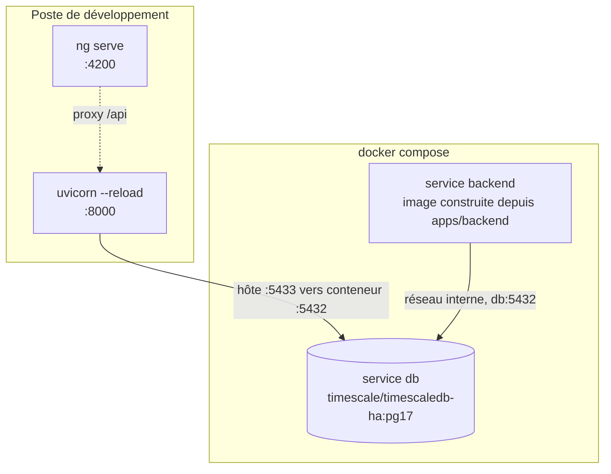
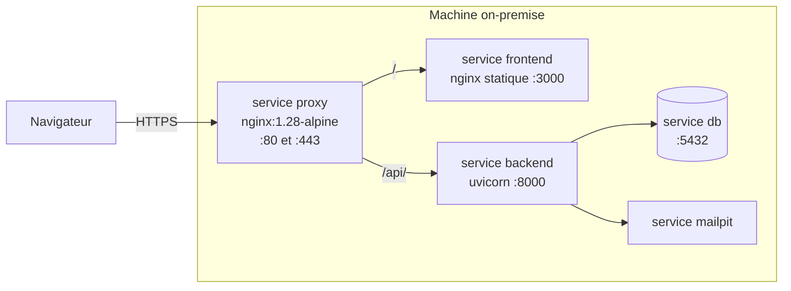
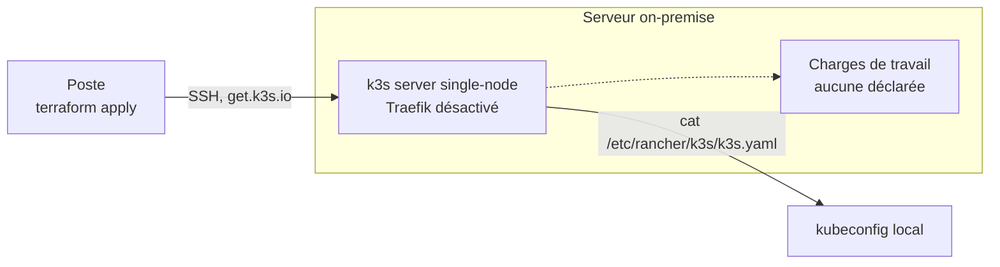
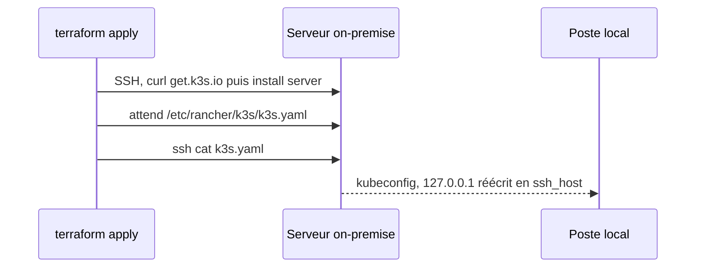

# Infrastructure

Trois topologies coexistent et ne servent pas la même chose. Ce document dit laquelle vaut dans
quel contexte, quelles décisions sont arrêtées, et ce qui manque encore entre elles.

| Topologie | Sert à | Statut |
|---|---|---|
| Docker Compose | Développer et recetter sur le poste | `Fait` |
| Docker Compose plus reverse proxy | Déployer sur la machine on-premise | `Fait` |
| k3s single-node | Cible à terme | `En cours` |

## Poste de développement

Statut : `Fait`. Défini par `docker-compose.yml`, projet `enervision`.

| Service | Image | Points notables |
|---|---|---|
| `db` | `timescale/timescaledb-ha:pg17` | Publié sur **5433** côté hôte, 5432 souvent déjà pris. `healthcheck` `pg_isready`, 12 tentatives, `start_period` 40s |
| `backend` | Construite depuis `apps/backend` | `depends_on: db, condition: service_healthy`. **N'embarque pas le source** : toute modification impose `docker compose up -d --build backend` |

**La boucle de développement n'utilise pas le service `backend`.** `make db-up` puis `make dev` :
seule la base tourne en conteneur, l'API et `ng serve` tournent sur le poste avec le rechargement
à chaud, lancés ensemble par `make dev` (`make dev-backend`/`make dev-frontend` pour lancer l'un
des deux seul). Le service `backend` sert la stack complète et la recette. Les deux occupent le
port 8000, ils ne se lancent donc pas ensemble.

Trois pièges sont documentés en tête du `docker-compose.yml`, ils ne se devinent pas :

- `PGDATA` vaut `/home/postgres/pgdata/data` pour l'image `-ha`, et non le chemin habituel de
  l'image `postgres`. Monté ailleurs, le volume ne retient rien, sans le moindre message.
- `db/init` est monté **fichier par fichier**. Monter le dossier masquerait les scripts d'init de
  l'image, dont `timescaledb-tune`. Ajouter un fichier dans `db/init/` impose donc une ligne dans
  le compose. Voir [`db/README.md`](../../db/README.md).
- `LocalExecutor` exécute les tâches comme sous-processus du **scheduler**, jamais du webserver :
  c'est le scheduler qui a besoin du volume `airflow_ml_state` (modèle, magasin MLflow).

### Airflow (issues #115 et #116)

Trois services, `docker compose profiles` non utilisés (démarrage explicite via `make
airflow-up`, pas dans `make dev`) :

| Service | Rôle | Points notables |
|---|---|---|
| `airflow-init` | Migre la base de métadonnées, crée le compte admin | Conteneur jetable (`restart: "no"`), ne redémarre jamais. `webserver`/`scheduler` attendent qu'il se termine avec succès |
| `airflow-webserver` | UI, port `8080` | `LocalExecutor` : n'exécute aucune tâche lui-même |
| `airflow-scheduler` | Planifie et **exécute** les tâches (`LocalExecutor`) | Les DAGs y tournent en sous-processus (`uv run --no-sync python -m ...`), c'est lui qui a besoin du volume `airflow_ml_state` |

Construits depuis `etl/airflow/Dockerfile`, contexte `.` (racine du repo, pas `etl/airflow/`) :
l'image doit pouvoir `COPY` les sources de `ml/` **et** de `apps/backend/` pour se synchroniser
deux environnements Python **3.14** (`/opt/ml/.venv` et `/opt/backend/.venv`, `uv sync --locked` à
la construction), distincts du Python 3.12 qui fait tourner Airflow lui-même. Les DAGs shellent
vers ces venvs plutôt que d'importer LightGBM, MLflow ou SQLAlchemy dans le process Airflow.
Le choix et ses contreparties sont dans
l'[ADR 0008](../adr/0008-airflow-execute-le-code-du-backend.md).

| DAG | Planification | Ce qu'il lance, et où |
|---|---|---|
| `ml_train` | manuelle | `enervision_ml.train`, dans `/opt/ml/.venv` |
| `ml_score` | `0 * * * *` | `enervision_ml.score`, dans `/opt/ml/.venv` |
| `alertes` | `15 * * * *` | `app.detection.internal_alerts` puis `app.cli generate-recommendations`, dans `/opt/backend/.venv` |

**Pourquoi `alertes` tourne à la quinzième minute.** Sa règle `anomaly` compare une lecture à la
`prediction` du même instant, que `ml_score` écrit à l'heure pile. Le décalage laisse le scoring
finir. Aucune dépendance n'est déclarée entre les deux DAGs pour autant, ni `ExternalTaskSensor` ni
tâche greffée : quatre règles de détection sur cinq ne touchent pas au modèle, et un modèle jamais
entraîné ne doit pas priver le parc de ses alertes. Ses deux tâches s'enchaînent en revanche
(`recommendation.alert_id` est une clé étrangère `NOT NULL`), et toutes deux sont rejouables sans
risque : l'idempotence est portée par la base, `uq_alert_source_reference` et
`uq_recommendation_alert_rule`.

`airflow-init` s'appuie sur l'entrypoint de l'image (`_AIRFLOW_DB_MIGRATE`,
`_AIRFLOW_WWW_USER_*`) plutôt que sur un script maison : l'entrypoint porte le code de sortie, une
migration ratée (typiquement la base `airflow` absente, cf. ci-dessous) fait échouer le service et
`webserver`/`scheduler` ne démarrent pas sur une base non migrée. Le mot de passe du compte admin
passe par l'environnement, jamais par `argv` (ni `ps`, ni `docker compose config`).

Les variables `AIRFLOW_*` ne sont volontairement pas en `${VAR:?}` : Compose interpole le fichier
entier avant de filtrer les services, une variable requise manquante casserait `make db-up`,
`make dev`... pour tout poste dont le `.env` est antérieur. Elles valent `${VAR:-}` et c'est
`airflow-init` qui refuse de démarrer (clé Fernet, clé Flask, mot de passe ou
`AIRFLOW_APP_SECRET_KEY` vides).

Le conteneur reçoit deux variables du backend en plus de `ML_DATABASE_URL` : `DATABASE_URL`, en
dialecte asyncpg, et `APP_SECRET_KEY`, alimentée par `AIRFLOW_APP_SECRET_KEY`. Cette dernière est
**délibérément différente** de celle de l'API. La configuration du backend refuse de se construire
sans clé, mais la détection ne signe ni ne vérifie aucun jeton : un Airflow compromis, qui permet
déjà d'exécuter du code depuis son interface, ne doit pas livrer par-dessus la clé de signature
des JWT.

**Pourquoi `ml_train` est manuel.** Réentraîner est coûteux et sa cadence n'est pas une décision
prise. Surtout, `train.py` écrase le modèle sans comparer ses métriques à celles de l'ancien : un
cron déploierait silencieusement un modèle dégradé. Tant que ce garde-fou n'existe pas, le
déclenchement reste humain. `ml_score`, lui, est planifié à l'heure, avec `max_active_runs=1`
(pas deux scorings simultanés dans `prediction`), 2 tentatives et un plafond de 30 minutes.

CI : `.github/workflows/airflow.yml` (Python 3.12 via `etl/airflow/.python-version`) lance lint et
tests d'intégrité des DAGs, et construit l'image (elle `COPY` `ml/` et `apps/backend/`, une
modification de l'un ou de l'autre peut donc la casser, d'où leurs chemins dans les déclencheurs)
avant de vérifier que les deux environnements s'y importent sans réseau.

Piège à connaître : sur un volume `pgdata` déjà peuplé (poste de dev existant plutôt que premier
`make db-up`), `db/init/120-airflow-database.sql` ne se rejoue pas (PostgreSQL n'exécute
`docker-entrypoint-initdb.d/` que sur un volume vide). Créer la base `airflow` à la main une fois :
`docker compose exec db psql -U $POSTGRES_USER -d $POSTGRES_DB -c "CREATE DATABASE airflow;"`.

`libgomp1` est installé explicitement dans l'image (`apt-get`, en root) : l'image Airflow de base
est minimale et n'embarque pas la runtime OpenMP dont LightGBM a besoin, sans quoi l'erreur
(`OSError: libgomp.so.1`) n'apparaît qu'à la première tâche réellement exécutée, pas à la
construction de l'image.

## Machine cible, exécution Docker

Statut : `Fait`. Défini par l'overlay `docker-compose.prod.yml`, appliqué par-dessus le
`docker-compose.yml`. Écrit et validé sur le poste, **jamais encore lancé sur le serveur de
l'école**. Décision et motifs dans l'[ADR 0007](../adr/0007-terminaison-tls-et-reverse-proxy-nginx.md).

Le proxy est **le seul service à publier des ports** sur le réseau. Backend et frontend ne sont
plus publiés du tout, la base et l'interface Mailpit sont ramenées sur `127.0.0.1`, donc joignables
par tunnel SSH et pas autrement. Le détail du routage, les deux modes d'obtention du certificat et
la commande de validation hors exécution sont dans [`infra/proxy/README.md`](../../infra/proxy/README.md).

Deux conséquences se propagent jusqu'à l'application, et elles ne se devinent pas :

- Servir le SPA et l'API sous la même origine est ce qui rend le cookie `__Secure-ev_refresh`
  utilisable. Sans cela, `apiUrl: '/api/v1'` ne mène nulle part une fois en conteneur.
- `APP_TRUST_PROXY_HEADERS` passe à vrai en même temps, sinon la limitation de débit par IP
  compte sur l'IP du proxy et devient globale.

## Cible à terme, k3s

Statut : `En cours`. Le module `infra/terraform/modules/k3s/` installe le cluster. Il n'a jamais
été appliqué.

### Ce que le Terraform fait

### Ce que le Terraform ne fait pas

Il déclare le provider `null` et **lui seul** : ni `kubernetes`, ni `helm`. Aucun namespace,
aucun déploiement, aucun service, aucun ingress. À l'issue d'un `apply`, on dispose d'un cluster
vide et d'un kubeconfig, rien de plus.

## Décisions figées

Ces arbitrages sont pris. Ils ne vivaient jusqu'ici que dans des commentaires de code et des
`description` de variables, c'est-à-dire qu'ils ne survivaient pas au premier remaniement.

| Décision | Raison | Où elle est appliquée |
|---|---|---|
| k3s single-node plutôt que Kubernetes complet | Une seule machine on-premise, pas de plan de contrôle à répartir | `modules/k3s/main.tf` |
| `k3s_version` obligatoire, valeur vide refusée | Sans épinglage, `get.k3s.io` installe la dernière version à chaque exécution : le déploiement cesse d'être reproductible | `validation` dans `modules/k3s/variables.tf` |
| Traefik désactivé | Le choix d'ingress reste ouvert, on ne veut pas en subir un par défaut | `k3s_disable_components`, défaut `["traefik"]` |
| Kubeconfig laissé en `600/root`, lu par `sudo` | `--write-kubeconfig-mode 644` exposerait `cluster-admin` à tout utilisateur local de la machine | Commentaire et `fetch_kubeconfig` dans `modules/k3s/main.tf` |
| State Terraform en backend `local` | Un seul opérateur, pas d'exécution concurrente, pas de dépendance à un stockage distant | `environments/dev/versions.tf` |
| `.terraform.lock.hcl` versionné | Fige les versions de provider entre contributeurs et future CI | Commentaire dans `.gitignore` |
| `*.tfvars` ignoré, `*.tfvars.example` versionné | Les tfvars portent l'adresse du serveur et le chemin de la clé | `.gitignore` |
| Désinstallation gérée au `destroy` | `k3s-uninstall.sh` en `on_failure = continue` : un serveur injoignable ne bloque pas le `destroy` | `modules/k3s/main.tf` |
| Deux racines, `dev` et `prod` | Séparation des états et des variables par environnement | `environments/` |
| Terminaison TLS par un reverse proxy Nginx en Compose | L'ingress k3s supposait un registre et des manifestes qui n'existent pas, à quatre jours du rendu | `docker-compose.prod.yml`, [ADR 0007](../adr/0007-terminaison-tls-et-reverse-proxy-nginx.md) |
| Certificat auto-signé par défaut, chemin ACME câblé | Aucun domaine public ne résout vers la machine : le défi HTTP-01 ne peut pas aboutir | `scripts/tls-selfsigned.sh`, `infra/proxy/acme-deploy-hook.sh` |

## Ports et noms

| Quoi | Valeur | Remarque |
|---|---|---|
| PostgreSQL, côté hôte | `5433` | Redirigé vers 5432 dans le conteneur. 5432 est souvent déjà pris |
| PostgreSQL, côté réseau Compose | `db:5432` | Nom de service, utilisé par `DATABASE_URL` du service `backend` |
| API | `8000` | Identique en conteneur et hors conteneur |
| Frontend, `ng serve` | `4200` | Boucle de développement. Valeur par défaut d'`APP_CORS_ORIGINS` |
| Frontend en conteneur | `3000` | Ce qu'écoute le nginx de l'image, en conteneur comme côté hôte |
| Reverse proxy | `80` et `443` | Les seuls ports publiés par `docker-compose.prod.yml`. 80 ne sert que la redirection et le défi ACME |
| SSH du serveur | `22` par défaut | `ssh_port`, redéfinissable |
| Base applicative | `enervision` | Variable `POSTGRES_DB` |
| Base de test | `enervision_test` | Créée par `db/init/110-test-database.sql`, nom attendu en dur par `apps/backend/tests/conftest.py` |
| Base de métadonnées Airflow | `airflow` | Créée par `db/init/120-airflow-database.sql`, même conteneur `db` |
| Webserver Airflow | `8080` | `make airflow-up`. Scheduler et webserver ne publient que ce port ; les tâches (`LocalExecutor`) tournent côté scheduler, sans port propre |

## Le trou vers k3s

Rien ne relie aujourd'hui ce qui est construit par Compose et ce qui tournerait sur k3s. Compose
construit une image backend localement ; k3s ne saurait pas où la trouver. C'est la première
question à trancher, avant toute ressource Kubernetes.

## Questions ouvertes

- **Quel ingress** remplace Traefik le jour de la bascule k3s. Qui termine le TLS est tranché par
  l'[ADR 0007](../adr/0007-terminaison-tls-et-reverse-proxy-nginx.md), mais la réponse vaut pour la
  topologie Compose, pas pour Kubernetes.
- **Quel nom de domaine public**, sans lequel Let's Encrypt reste hors d'atteinte et le certificat
  reste auto-signé.
- **Quel registre d'images**, et comment il est alimenté sans CI.
- **Quel stockage persistant** côté Kubernetes pour PostgreSQL, et si la base tourne dans le
  cluster ou à côté.
- **Quelle stratégie de sauvegarde et de restauration** des données de mesure.
- **Que devient `environments/prod/`**, aujourd'hui réduit à un `.gitkeep`.
