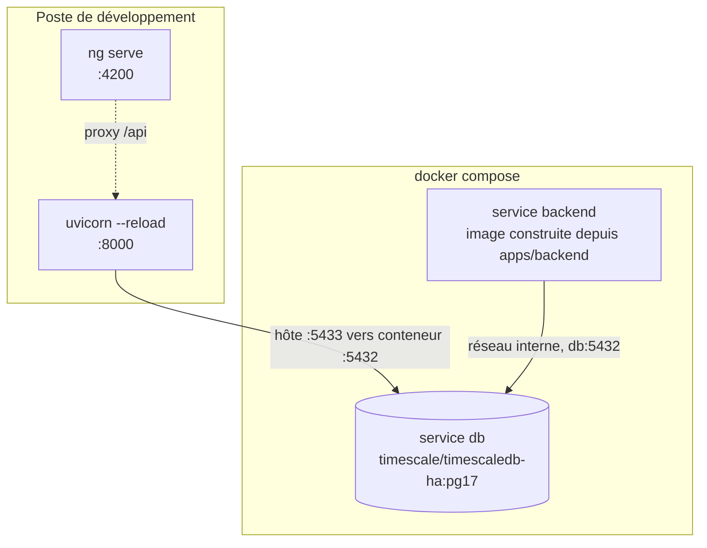
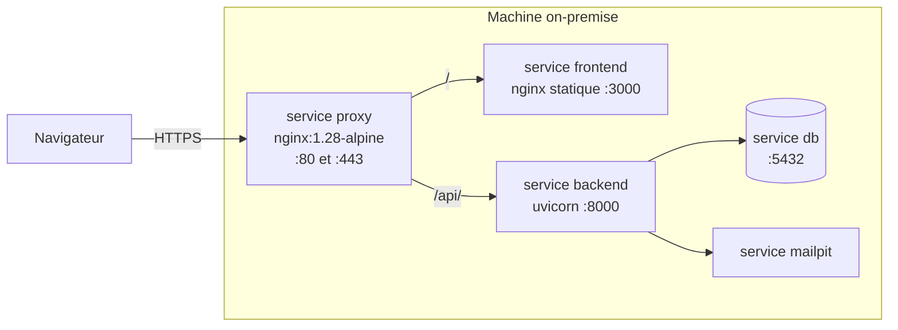
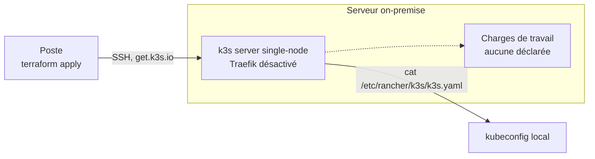
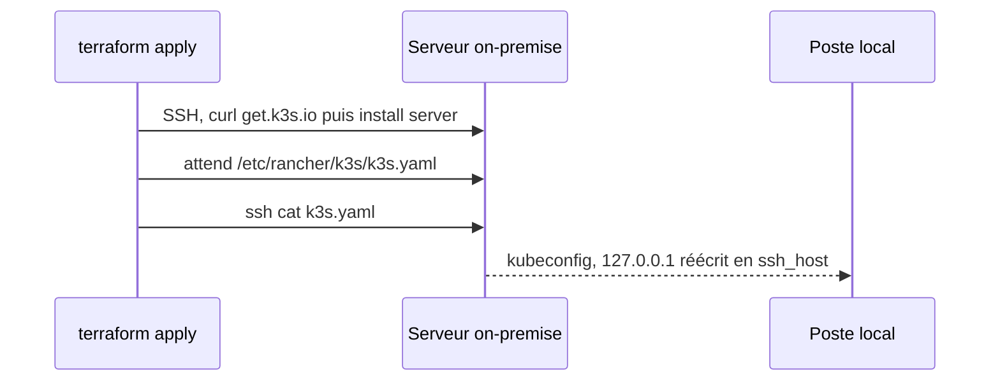

# Infrastructure

Trois topologies coexistent et ne servent pas la même chose. Ce document dit laquelle vaut dans
quel contexte, quelles décisions sont arrêtées, et ce qui manque encore entre elles.

| Topologie | Sert à | Statut |
|---|---|---|
| Docker Compose | Développer et recetter sur le poste | `Fait` |
| Docker Compose plus reverse proxy | Déployer sur la machine on-premise | `Fait` |
| k3s single-node | Cible à terme | `En cours` |

## Poste de développement

Statut : `Fait`. Défini par `docker-compose.yml`, projet `enervision`.

| Service | Image | Points notables |
|---|---|---|
| `db` | `timescale/timescaledb-ha:pg17` | Publié sur **5433** côté hôte, 5432 souvent déjà pris. `healthcheck` `pg_isready`, 12 tentatives, `start_period` 40s |
| `backend` | Construite depuis `apps/backend` | `depends_on: db, condition: service_healthy`. **N'embarque pas le source** : toute modification impose `docker compose up -d --build backend` |

**La boucle de développement n'utilise pas le service `backend`.** `make db-up` puis `make dev` :
seule la base tourne en conteneur, l'API et `ng serve` tournent sur le poste avec le rechargement
à chaud, lancés ensemble par `make dev` (`make dev-backend`/`make dev-frontend` pour lancer l'un
des deux seul). Le service `backend` sert la stack complète et la recette. Les deux occupent le
port 8000, ils ne se lancent donc pas ensemble.

Deux pièges sont documentés en tête du `docker-compose.yml`, ils ne se devinent pas :

- `PGDATA` vaut `/home/postgres/pgdata/data` pour l'image `-ha`, et non le chemin habituel de
  l'image `postgres`. Monté ailleurs, le volume ne retient rien, sans le moindre message.
- `db/init` est monté **fichier par fichier**. Monter le dossier masquerait les scripts d'init de
  l'image, dont `timescaledb-tune`. Ajouter un fichier dans `db/init/` impose donc une ligne dans
  le compose. Voir [`db/README.md`](../../db/README.md).

## Machine cible, exécution Docker

Statut : `Fait`. Défini par l'overlay `docker-compose.prod.yml`, appliqué par-dessus le
`docker-compose.yml`. Écrit et validé sur le poste, **jamais encore lancé sur le serveur de
l'école**. Décision et motifs dans l'[ADR 0007](../adr/0007-terminaison-tls-et-reverse-proxy-nginx.md).

Le proxy est **le seul service à publier des ports** sur le réseau. Backend et frontend ne sont
plus publiés du tout, la base et l'interface Mailpit sont ramenées sur `127.0.0.1`, donc joignables
par tunnel SSH et pas autrement. Le détail du routage, les deux modes d'obtention du certificat et
la commande de validation hors exécution sont dans [`infra/proxy/README.md`](../../infra/proxy/README.md).

Deux conséquences se propagent jusqu'à l'application, et elles ne se devinent pas :

- Servir le SPA et l'API sous la même origine est ce qui rend le cookie `__Secure-ev_refresh`
  utilisable. Sans cela, `apiUrl: '/api/v1'` ne mène nulle part une fois en conteneur.
- `APP_TRUST_PROXY_HEADERS` passe à vrai en même temps, sinon la limitation de débit par IP
  compte sur l'IP du proxy et devient globale.

## Cible à terme, k3s

Statut : `En cours`. Le module `infra/terraform/modules/k3s/` installe le cluster. Il n'a jamais
été appliqué.

### Ce que le Terraform fait

### Ce que le Terraform ne fait pas

Il déclare le provider `null` et **lui seul** : ni `kubernetes`, ni `helm`. Aucun namespace,
aucun déploiement, aucun service, aucun ingress. À l'issue d'un `apply`, on dispose d'un cluster
vide et d'un kubeconfig, rien de plus.

## Décisions figées

Ces arbitrages sont pris. Ils ne vivaient jusqu'ici que dans des commentaires de code et des
`description` de variables, c'est-à-dire qu'ils ne survivaient pas au premier remaniement.

| Décision | Raison | Où elle est appliquée |
|---|---|---|
| k3s single-node plutôt que Kubernetes complet | Une seule machine on-premise, pas de plan de contrôle à répartir | `modules/k3s/main.tf` |
| `k3s_version` obligatoire, valeur vide refusée | Sans épinglage, `get.k3s.io` installe la dernière version à chaque exécution : le déploiement cesse d'être reproductible | `validation` dans `modules/k3s/variables.tf` |
| Traefik désactivé | Le choix d'ingress reste ouvert, on ne veut pas en subir un par défaut | `k3s_disable_components`, défaut `["traefik"]` |
| Kubeconfig laissé en `600/root`, lu par `sudo` | `--write-kubeconfig-mode 644` exposerait `cluster-admin` à tout utilisateur local de la machine | Commentaire et `fetch_kubeconfig` dans `modules/k3s/main.tf` |
| State Terraform en backend `local` | Un seul opérateur, pas d'exécution concurrente, pas de dépendance à un stockage distant | `environments/dev/versions.tf` |
| `.terraform.lock.hcl` versionné | Fige les versions de provider entre contributeurs et future CI | Commentaire dans `.gitignore` |
| `*.tfvars` ignoré, `*.tfvars.example` versionné | Les tfvars portent l'adresse du serveur et le chemin de la clé | `.gitignore` |
| Désinstallation gérée au `destroy` | `k3s-uninstall.sh` en `on_failure = continue` : un serveur injoignable ne bloque pas le `destroy` | `modules/k3s/main.tf` |
| Deux racines, `dev` et `prod` | Séparation des états et des variables par environnement | `environments/` |
| Terminaison TLS par un reverse proxy Nginx en Compose | L'ingress k3s supposait un registre et des manifestes qui n'existent pas, à quatre jours du rendu | `docker-compose.prod.yml`, [ADR 0007](../adr/0007-terminaison-tls-et-reverse-proxy-nginx.md) |
| Certificat auto-signé par défaut, chemin ACME câblé | Aucun domaine public ne résout vers la machine : le défi HTTP-01 ne peut pas aboutir | `scripts/tls-selfsigned.sh`, `infra/proxy/acme-deploy-hook.sh` |

## Ports et noms

| Quoi | Valeur | Remarque |
|---|---|---|
| PostgreSQL, côté hôte | `5433` | Redirigé vers 5432 dans le conteneur. 5432 est souvent déjà pris |
| PostgreSQL, côté réseau Compose | `db:5432` | Nom de service, utilisé par `DATABASE_URL` du service `backend` |
| API | `8000` | Identique en conteneur et hors conteneur |
| Frontend, `ng serve` | `4200` | Boucle de développement. Valeur par défaut d'`APP_CORS_ORIGINS` |
| Frontend en conteneur | `3000` | Ce qu'écoute le nginx de l'image, en conteneur comme côté hôte |
| Reverse proxy | `80` et `443` | Les seuls ports publiés par `docker-compose.prod.yml`. 80 ne sert que la redirection et le défi ACME |
| SSH du serveur | `22` par défaut | `ssh_port`, redéfinissable |
| Base applicative | `enervision` | Variable `POSTGRES_DB` |
| Base de test | `enervision_test` | Créée par `db/init/110-test-database.sql`, nom attendu en dur par `apps/backend/tests/conftest.py` |

## Le trou vers k3s

Rien ne relie aujourd'hui ce qui est construit par Compose et ce qui tournerait sur k3s. Compose
construit une image backend localement ; k3s ne saurait pas où la trouver. C'est la première
question à trancher, avant toute ressource Kubernetes.

## Questions ouvertes

- **Quel ingress** remplace Traefik le jour de la bascule k3s. Qui termine le TLS est tranché par
  l'[ADR 0007](../adr/0007-terminaison-tls-et-reverse-proxy-nginx.md), mais la réponse vaut pour la
  topologie Compose, pas pour Kubernetes.
- **Quel nom de domaine public**, sans lequel Let's Encrypt reste hors d'atteinte et le certificat
  reste auto-signé.
- **Quel registre d'images**, et comment il est alimenté sans CI.
- **Quel stockage persistant** côté Kubernetes pour PostgreSQL, et si la base tourne dans le
  cluster ou à côté.
- **Quelle stratégie de sauvegarde et de restauration** des données de mesure.
- **Que devient `environments/prod/`**, aujourd'hui réduit à un `.gitkeep`.
