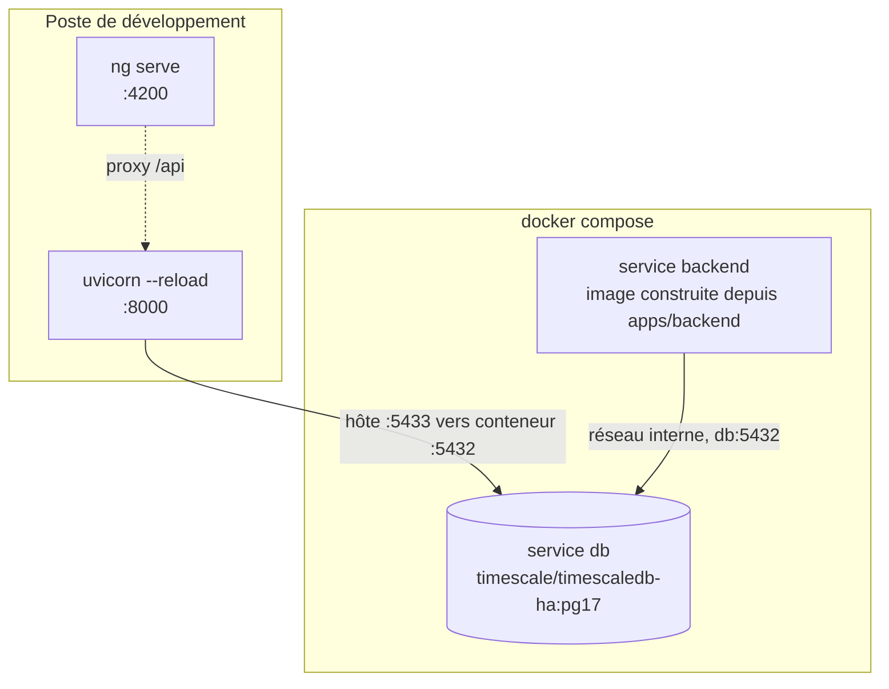
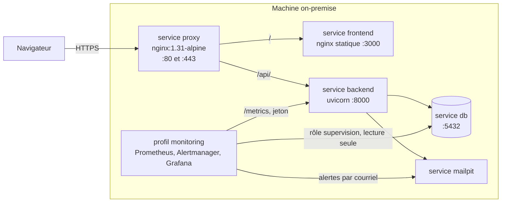
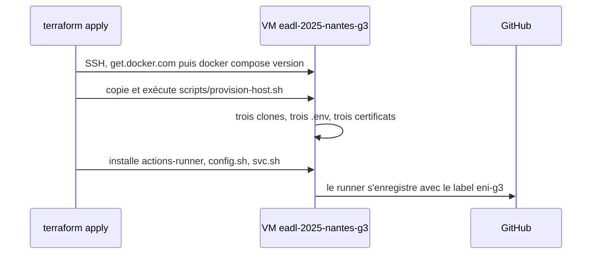
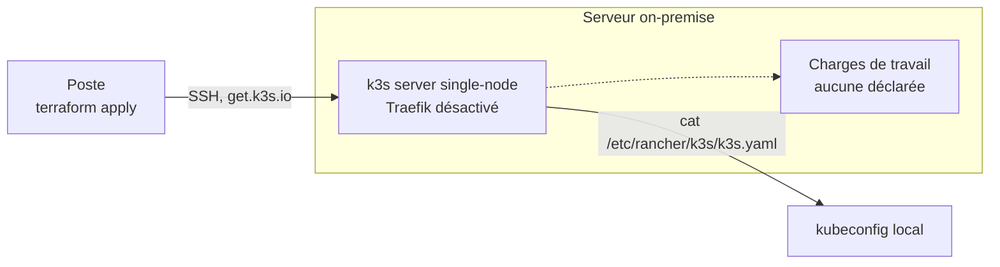
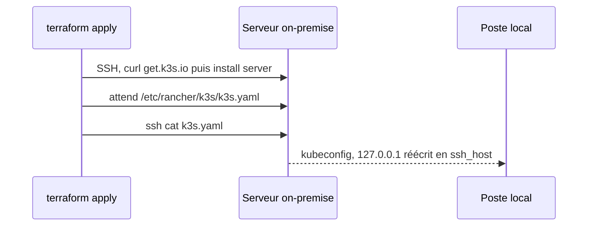

# Infrastructure

Plusieurs topologies coexistent et ne servent pas la même chose. Ce document dit laquelle vaut
dans quel contexte, quelles décisions sont arrêtées, et ce qui manque encore entre elles.

| Topologie | Sert à | Statut |
|---|---|---|
| Docker Compose | Développer et recetter sur le poste | `Fait` |
| Docker Compose plus reverse proxy | Déployer sur la machine on-premise | `Fait` |
| Deux projets Compose sur la VM ENI, recette et production | Déploiement continu depuis GitHub | `En cours` |
| Provisionnement Terraform de la VM | Préparer la machine et enregistrer le runner | `En cours` |
| k3s single-node | Cible à terme | `En cours` |
| MLflow (`ml/`) | Tracker les expériences et le registre de modèles en local | `Fait`, non relié aux autres topologies |

## Poste de développement

Statut : `Fait`. Défini par `docker-compose.yml`, projet `enervision`.

| Service | Image | Points notables |
|---|---|---|
| `db` | `timescale/timescaledb-ha:pg17` | Publié sur **5433** côté hôte, 5432 souvent déjà pris. `healthcheck` `pg_isready`, 12 tentatives, `start_period` 40s |
| `backend` | Construite depuis `apps/backend` | `depends_on: db, condition: service_healthy`. **N'embarque pas le source** : toute modification impose `docker compose up -d --build backend` |
| `prometheus`, `alertmanager`, `grafana`, exporteurs | Images épinglées par tag | Profil `monitoring`, jamais démarrés par `make dev`. `make monitoring-up` les lance en `--no-deps`. Voir [60-observabilite.md](60-observabilite.md) |
| `k6` | `grafana/k6` | Profil `load`, lancé par `make load-*` le temps d'un tir, sur le réseau du projet. Voir [`tests/load/README.md`](../../tests/load/README.md) |

**La boucle de développement n'utilise pas le service `backend`.** `make db-up` puis `make dev` :
seule la base tourne en conteneur, l'API et `ng serve` tournent sur le poste avec le rechargement
à chaud, lancés ensemble par `make dev` (`make dev-backend`/`make dev-frontend` pour lancer l'un
des deux seul). Le service `backend` sert la stack complète et la recette. Les deux occupent le
port 8000, ils ne se lancent donc pas ensemble.

Trois pièges sont documentés en tête du `docker-compose.yml`, ils ne se devinent pas :

- `PGDATA` vaut `/home/postgres/pgdata/data` pour l'image `-ha`, et non le chemin habituel de
  l'image `postgres`. Monté ailleurs, le volume ne retient rien, sans le moindre message.
- `db/init` est monté **fichier par fichier**. Monter le dossier masquerait les scripts d'init de
  l'image, dont `timescaledb-tune`. Ajouter un fichier dans `db/init/` impose donc une ligne dans
  le compose. Voir [`db/README.md`](../../db/README.md).
- `LocalExecutor` exécute les tâches comme sous-processus du **scheduler**, jamais de l'api-server :
  c'est le scheduler qui a besoin du volume `airflow_ml_state` (modèle, magasin MLflow).

### Airflow (issues #15, #115, #116 et #119)

Quatre services (Airflow 3.3), `docker compose profiles` non utilisés (démarrage explicite via `make
airflow-up`, pas dans `make dev`) :

| Service | Rôle | Points notables |
|---|---|---|
| `airflow-init` | Migre la base de métadonnées, crée le compte admin | Conteneur jetable (`restart: "no"`), ne redémarre jamais. `api-server`, `dag-processor` et `scheduler` attendent qu'il se termine avec succès |
| `airflow-apiserver` | UI et API REST (`/api/v2`), port `8080` | `LocalExecutor` : n'exécute aucune tâche lui-même. Sert aussi l'Execution API que les tâches appellent, d'où le secret JWT partagé |
| `airflow-dag-processor` | Parse `dags/` et publie les DAGs sérialisés | Composant à part entière depuis Airflow 3 : le scheduler ne lit plus les fichiers de DAG |
| `airflow-scheduler` | Planifie et **exécute** les tâches (`LocalExecutor`) | Les DAGs y tournent en sous-processus (`uv run --no-sync python -m ...`), c'est lui qui a besoin du volume `airflow_ml_state` |

Airflow 3 impose deux choses que le compose reflète : les tâches ne touchent plus la base de
métadonnées et passent par l'Execution API de l'`api-server`, avec un jeton signé par
`AIRFLOW_JWT_SECRET` (secret partagé entre conteneurs, jamais celui généré au démarrage) ; et
l'authentification par défaut (`SimpleAuthManager`) ne sait pas créer de compte, d'où le
`FabAuthManager` qui garde le compte admin posé par `airflow-init`. Pas de `triggerer` : aucun
opérateur déférable dans les DAGs.

Construits depuis `etl/airflow/Dockerfile`, contexte `.` (racine du repo, pas `etl/airflow/`) :
l'image doit pouvoir `COPY` les sources de `ml/` **et** de `apps/backend/` pour se synchroniser
deux environnements Python **3.14** (`/opt/ml/.venv` et `/opt/backend/.venv`, `uv sync --locked` à
la construction), distincts du Python 3.12 qui fait tourner Airflow lui-même. Les DAGs shellent
vers ces venvs plutôt que d'importer LightGBM, MLflow ou SQLAlchemy dans le process Airflow.
Le choix et ses contreparties sont dans
l'[ADR 0008](../adr/0008-airflow-execute-le-code-du-backend.md).

| DAG | Planification | Ce qu'il lance, et où |
|---|---|---|
| `ml_train` | manuelle | `enervision_ml.train`, dans `/opt/ml/.venv` |
| `ml_score` | `0 * * * *` | `enervision_ml.score`, dans `/opt/ml/.venv` |
| `alertes` | `15 * * * *` | `app.detection.internal_alerts` puis `app.cli generate-recommendations`, dans `/opt/backend/.venv` |
| `historical_import` | manuelle | `app.etl.historical_import`, dans `/opt/backend/.venv` ; les fichiers de `data/raw` sont montés en lecture seule dans `/opt/data/raw` |
| `mock_api_import` | `45 * * * *` | `app.etl.mock_api_import`, dans `/opt/backend/.venv` ; importe depuis l'API Mock la mesure de l'heure pile précédant son déclenchement |
| `derive` | `30 5 * * *` | `app.monitoring.drift`, dans `/opt/backend/.venv` ; quotidien parce que sa fenêtre couvre 168 h, et sans reprise parce qu'une dérive n'est pas une panne passagère |

Le DAG `historical_import` réutilise le pipeline historique existant sans dupliquer sa logique.
Il reste manuel, car le dataset sert à initialiser l'environnement. Le montage
`./data/raw:/opt/data/raw:ro` permet au scheduler de lire les fichiers CSV/JSON sans pouvoir les
modifier.

Le DAG `mock_api_import` exécute le pipeline API Mock toutes les heures, à la minute `:45`.
Un `CronTriggerTimetable` explicite lui attribue un intervalle d'une heure, y compris lors d'un
déclenchement manuel, mais la fenêtre transmise au script backend part de l'heure pile qui
précède le déclenchement (pas de l'intervalle Airflow tel quel), pour que la mesure importée
tombe à :00 et non à :45, voir [40-data.md](40-data.md). Le pipeline charge la mesure dans les
tables communes `site` et `reading`. Le décalage à `:45` laisse quinze minutes avant le
scoring exécuté à l'heure pile, puis quinze minutes supplémentaires avant les alertes à `:15`.
`max_active_runs=1` empêche deux exécutions du DAG de se chevaucher.

Le DAG conserve `catchup=False` pour éviter un rattrapage massif depuis sa date de démarrage.
Une interruption du scheduler peut donc créer un intervalle manquant, qui devra être rejoué
explicitement par une opération de backfill.

**Pourquoi `alertes` tourne à la quinzième minute.** Sa règle `anomaly` compare une lecture à la
`prediction` du même instant, que `ml_score` écrit à l'heure pile. Le décalage laisse le scoring
finir. Aucune dépendance n'est déclarée entre les deux DAGs pour autant, ni `ExternalTaskSensor` ni
tâche greffée : quatre règles de détection sur cinq ne touchent pas au modèle, et un modèle jamais
entraîné ne doit pas priver le parc de ses alertes. Le décalage est donc une convention et non une
garantie : le plafond de `ml_score` est de 30 minutes, et un scoring qui déborde de `:15` prive
`anomaly` de la `prediction` de l'heure, qu'elle ne retrouvera au passage suivant que si sa fenêtre
la couvre encore. Les quatre autres règles ne s'en aperçoivent pas.

Ses deux tâches s'enchaînent en revanche (`recommendation.alert_id` est une clé étrangère `NOT
NULL`), et toutes deux sont rejouables sans risque : l'idempotence est portée par la base,
`uq_alert_source_reference` et `uq_recommendation_alert_rule`. Chacune a 2 tentatives, 2 minutes
d'attente entre elles et un plafond de 5 minutes **par tentative** : au pire, reprises comprises,
l'enchaînement occupe 38 minutes, ce qui le garde sous le pas horaire qu'un `max_active_runs=1`
rend contraignant.

`airflow-init` s'appuie sur l'entrypoint de l'image (`_AIRFLOW_DB_MIGRATE`,
`_AIRFLOW_WWW_USER_*`) plutôt que sur un script maison : l'entrypoint porte le code de sortie, une
migration ratée (typiquement la base `airflow` absente, cf. ci-dessous) fait échouer le service et
`api-server`, `dag-processor` et `scheduler` ne démarrent pas sur une base non migrée. Le mot de passe du compte admin
passe par l'environnement, jamais par `argv` (ni `ps`, ni `docker compose config`).

Les variables `AIRFLOW_*` ne sont volontairement pas en `${VAR:?}` : Compose interpole le fichier
entier avant de filtrer les services, une variable requise manquante casserait `make db-up`,
`make dev`... pour tout poste dont le `.env` est antérieur. Elles valent `${VAR:-}` et c'est
`airflow-init` qui refuse de démarrer (clé Fernet, clé de session de l'API, secret JWT, mot de
passe ou `AIRFLOW_APP_SECRET_KEY` vides).

Le conteneur reçoit deux variables du backend en plus de `ML_DATABASE_URL` : `DATABASE_URL`, en
dialecte asyncpg, et `APP_SECRET_KEY`, alimentée par `AIRFLOW_APP_SECRET_KEY`. Cette dernière est
**délibérément différente** de celle de l'API. La configuration du backend refuse de se construire
sans clé, mais la détection ne signe ni ne vérifie aucun jeton : un Airflow compromis, qui permet
déjà d'exécuter du code depuis son interface, ne doit pas livrer par-dessus la clé de signature
des JWT.

**Pourquoi `ml_train` est manuel.** Réentraîner est coûteux et sa cadence n'est pas une décision
prise. Surtout, `train.py` écrase le modèle sans comparer ses métriques à celles de l'ancien : un
cron déploierait silencieusement un modèle dégradé. Tant que ce garde-fou n'existe pas, le
déclenchement reste humain. `ml_score`, lui, est planifié à l'heure, avec `max_active_runs=1`
(pas deux scorings simultanés dans `prediction`), 2 tentatives et un plafond de 30 minutes.

CI : `.github/workflows/airflow.yml` (Python 3.12 via `etl/airflow/.python-version`) lance lint et
tests d'intégrité des DAGs, et construit l'image (elle `COPY` `ml/` et `apps/backend/`, une
modification de l'un ou de l'autre peut donc la casser, d'où leurs chemins dans les déclencheurs)
avant de vérifier que les deux environnements s'y importent sans réseau.

Piège à connaître : sur un volume `pgdata` déjà peuplé (poste de dev existant plutôt que premier
`make db-up`), `db/init/120-airflow-database.sql` ne se rejoue pas (PostgreSQL n'exécute
`docker-entrypoint-initdb.d/` que sur un volume vide). Créer la base `airflow` à la main une fois :
`docker compose exec db psql -U $POSTGRES_USER -d $POSTGRES_DB -c "CREATE DATABASE airflow;"`.

`libgomp1` est installé explicitement dans l'image (`apt-get`, en root) : l'image Airflow de base
est minimale et n'embarque pas la runtime OpenMP dont LightGBM a besoin, sans quoi l'erreur
(`OSError: libgomp.so.1`) n'apparaît qu'à la première tâche réellement exécutée, pas à la
construction de l'image.

### MLflow (`ml/`)

Statut : `Fait`, en local uniquement. Défini par `ml/docker-compose.mlflow.yml`, indépendant
du `docker-compose.yml` principal (réseau, volumes et démarrage séparés).

| Service | Image | Points notables |
|---|---|---|
| `mlflow-db` | `postgres:17` | Stocke le tracking store MLflow. Mot de passe obligatoire via `MLFLOW_DB_PASSWORD` |
| `mlflow` | Construite depuis `ml/` | Expose l'UI et l'API MLflow sur `127.0.0.1:5000`. Artefacts sur volume `mlflow-artifacts`, tracking store sur `mlflow-db` |

Portée actuelle : environnement de tracking et de registre de modèles pour le développement
local uniquement. Ce compose n'est relié ni à `docker-compose.prod.yml`, ni aux deux
environnements Compose de la VM ENI, ni à la cible k3s. Le magasin utilisé par Airflow pour
`ml_train`/`ml_score` (SQLite, volume `airflow_ml_state`) en est distinct — les deux MLflow ne
se voient pas tant que `MLFLOW_TRACKING_URI` n'est pas posé côté Airflow.

Limite connue : le DAG Airflow `ml_train` enregistre lui aussi une version a chaque execution
via `registered_model_name` (magasin SQLite du volume `airflow_ml_state`, distinct de ce
serveur). Versions et artefacts s'y accumulent sans politique de nettoyage -- fonctionne en
l'etat, mais a surveiller si les entrainements deviennent frequents.

Pour relier les runs Airflow (`ml_train`, magasin SQLite local) a ce serveur MLflow, positionner
`MLFLOW_TRACKING_URI=http://mlflow:5000` dans l'environnement du service `airflow-scheduler` (ou
`http://host.docker.internal:5000` si le serveur MLflow tourne hors du reseau Compose principal),
et s'assurer que le conteneur Airflow peut joindre le service `mlflow` -- ce qui suppose de les
rapprocher sur le meme reseau Docker ou d'exposer MLflow autrement qu'en `127.0.0.1` uniquement
(cf. point 1 sur l'exposition du port). Non fait a ce jour : aucun besoin de centraliser les runs
d'entrainement Airflow et locaux n'a encore ete identifie.
## Machine cible, exécution Docker

Statut : `Fait`. Défini par l'overlay `docker-compose.prod.yml`, appliqué par-dessus le
`docker-compose.yml`. Écrit et validé sur le poste, **jamais encore lancé sur le serveur de
l'école**. Décision et motifs dans l'[ADR 0007](../adr/0007-terminaison-tls-et-reverse-proxy-nginx.md).

Le proxy est **le seul service à publier des ports** sur le réseau. Backend et frontend ne sont
plus publiés du tout, la base et l'interface Mailpit sont ramenées sur `127.0.0.1`, donc joignables
par tunnel SSH et pas autrement. Le détail du routage, les deux modes d'obtention du certificat et
la commande de validation hors exécution sont dans [`infra/proxy/README.md`](../../infra/proxy/README.md).

Deux conséquences se propagent jusqu'à l'application, et elles ne se devinent pas :

- Servir le SPA et l'API sous la même origine est ce qui rend le cookie `__Secure-ev_refresh`
  utilisable. Sans cela, `apiUrl: '/api/v1'` ne mène nulle part une fois en conteneur.
- `APP_TRUST_PROXY_HEADERS` passe à vrai en même temps, sinon la limitation de débit par IP
  compte sur l'IP du proxy et devient globale.

### Trois environnements sur la même machine

Statut : `En cours`. Décision et motifs dans
l'[ADR 0009](../adr/0009-deux-environnements-compose-sur-la-vm-eni.md), étendue à un troisième
environnement par l'[ADR 0017](../adr/0017-environnement-dev-a-la-demande.md) ; noms,
certificats et frontal sans port dans l'[ADR 0018](../adr/0018-noms-publics-certificats-dns01-et-frontal-sni.md).
La VM `eadl-2025-nantes-g3` porte le développement, la recette et la production, chacun dans son
clone du dépôt, son `.env` et son projet Compose. Le nom de projet préfixe volumes, réseau et
conteneurs : rien n'est partagé. `scripts/provision-host.sh` prépare les trois dossiers, génère
les secrets et les certificats, et ne démarre rien.

| | Développement | Recette | Production |
|---|---|---|---|
| Branche, environnement GitHub | toute branche lancée à la main, `dev` | `dev`, `rec` | `main`, `prod` |
| Dossier, projet Compose | `/srv/enervision/dev`, `enervision-dev` | `/srv/enervision/rec`, `enervision-rec` | `/srv/enervision/prod`, `enervision-prod` |
| URL | `https://dev.enervision-g3.dynv6.net` | `https://rec.enervision-g3.dynv6.net` | `https://prod.enervision-g3.dynv6.net` |
| Proxy HTTP, HTTPS, PROXY protocol, sur `127.0.0.1` | `8083`, `9443`, `9444` | `8081`, `8443`, `8444` | `10080`, `10443`, `10444` |
| PostgreSQL, Mailpit, Airflow, sur `127.0.0.1` | `5435`, `8027`, `8084` | `5434`, `8026`, `8082` | `5433`, `8025`, `8080` |
| Supervision (profil `monitoring`) | à la demande, `make monitoring-up` | à la demande, `make monitoring-up` | active, `COMPOSE_PROFILES=monitoring` |
| Grafana, Prometheus, Alertmanager, sur `127.0.0.1` | `3003`, `9092`, `9095` | `3002`, `9091`, `9094` | `3001`, `9090`, `9093` |

Les trois noms sont publics chez dynv6 et visent l'IP privée de la VM : rien à déclarer sur
les postes du réseau de l'école, et rien n'est joignable hors de ce réseau. Trois noms distincts
sont nécessaires : le cookie `__Secure-ev_refresh` est posé par hôte, pas par port.

Aucune stack ne publie hors de la boucle locale. Le frontal `infra/front`, sur le réseau de
l'hôte, écoute 80 et 443 : il redirige le premier, et aiguille le second d'après le nom demandé
(SNI) vers l'écouteur PROXY protocol de la stack visée, sans déchiffrer le TLS. Chaque stack
garde son certificat Let's Encrypt, obtenu par défi DNS-01 (`make tls-dns01`) et renouvelé à
chaque déploiement ainsi que chaque nuit par `/etc/cron.d/enervision-tls`.

Le déploiement est décrit dans [50-cicd.md](50-cicd.md) : un runner GitHub Actions installé sur
la VM aligne le dossier sur la branche poussée et lance `make stack-up`.

### Provisionnement de la machine

Statut : `En cours`. Décision et frontière dans
l'[ADR 0010](../adr/0010-terraform-provisionne-github-actions-deploie.md) : **Terraform
provisionne la machine, GitHub Actions déploie l'application**. La racine
`infra/terraform/environments/vm-eni/` fait trois choses, et rien d'autre.

Aucune image n'y est construite, aucun conteneur lancé : un `apply` n'interrompt pas la stack qui
tourne. Le premier démarrage reste manuel, `make stack-up` dans chaque dossier ; les suivants
sont joués par le runner à chaque push. Terraform ne sait rien de l'état de la stack, c'est la
sonde de `deploy.yml` qui le dit.

Le jeton d'enregistrement du runner est valable une heure et ne vaut que pour une inscription :
l'`apply` n'est pas rejouable sans qu'un administrateur du dépôt en crée un nouveau.

## Cible à terme, k3s

Statut : `En cours`. Le module `infra/terraform/modules/k3s/` installe le cluster, depuis la
racine `infra/terraform/environments/k3s-cible/`. Il n'a jamais été appliqué.

### Ce que le Terraform fait

### Ce que le Terraform ne fait pas

Il déclare le provider `null` et **lui seul** : ni `kubernetes`, ni `helm`. Aucun namespace,
aucun déploiement, aucun service, aucun ingress. À l'issue d'un `apply`, on dispose d'un cluster
vide et d'un kubeconfig, rien de plus.

## Décisions figées

Ces arbitrages sont pris. Ils ne vivaient jusqu'ici que dans des commentaires de code et des
`description` de variables, c'est-à-dire qu'ils ne survivaient pas au premier remaniement.

| Décision | Raison | Où elle est appliquée |
|---|---|---|
| k3s single-node plutôt que Kubernetes complet | Une seule machine on-premise, pas de plan de contrôle à répartir | `modules/k3s/main.tf` |
| `k3s_version` obligatoire, valeur vide refusée | Sans épinglage, `get.k3s.io` installe la dernière version à chaque exécution : le déploiement cesse d'être reproductible | `validation` dans `modules/k3s/variables.tf` |
| Traefik désactivé | Le choix d'ingress reste ouvert, on ne veut pas en subir un par défaut | `k3s_disable_components`, défaut `["traefik"]` |
| Kubeconfig laissé en `600/root`, lu par `sudo` | `--write-kubeconfig-mode 644` exposerait `cluster-admin` à tout utilisateur local de la machine | Commentaire et `fetch_kubeconfig` dans `modules/k3s/main.tf` |
| State Terraform en backend `local` | Un seul opérateur, pas d'exécution concurrente, pas de dépendance à un stockage distant | `versions.tf` de chaque racine |
| `.terraform.lock.hcl` versionné | Fige les versions de provider entre contributeurs et future CI | Commentaire dans `.gitignore` |
| `*.tfvars` ignoré, `*.tfvars.example` versionné | Les tfvars portent l'adresse du serveur et le chemin de la clé | `.gitignore` |
| Désinstallation gérée au `destroy` | `k3s-uninstall.sh` en `on_failure = continue` : un serveur injoignable ne bloque pas le `destroy` | `modules/k3s/main.tf` |
| Une racine Terraform par machine provisionnée, nommée d'après elle | `environments/dev` laissait croire à un environnement applicatif, alors que `rec` et `prod` vivent sur la même machine et ne sont pas provisionnés par Terraform | `environments/vm-eni`, `environments/k3s-cible` |
| Terraform provisionne, GitHub Actions déploie | Deux chemins pour le même acte de livraison, c'est ce que la revue de #141 relève sur la VM | [ADR 0010](../adr/0010-terraform-provisionne-github-actions-deploie.md) |
| Connexion SSH par clé, jamais par mot de passe | Une variable de mot de passe finit en clair dans le state, ou dans les `triggers` qui y sont persistés | `environments/vm-eni/variables.tf`, `modules/k3s/main.tf` |
| Terminaison TLS par un reverse proxy Nginx en Compose | L'ingress k3s supposait un registre et des manifestes qui n'existent pas, à quatre jours du rendu | `docker-compose.prod.yml`, [ADR 0007](../adr/0007-terminaison-tls-et-reverse-proxy-nginx.md) |
| Certificat auto-signé par défaut, chemin ACME câblé | Aucun domaine public ne résout vers la machine : le défi HTTP-01 ne peut pas aboutir | `scripts/tls-selfsigned.sh`, `infra/proxy/acme-deploy-hook.sh` |
| Un projet Compose par environnement, sur la même machine | Une seule VM, et l'isolation par nom de projet ne demande ni cluster ni registre | `.env` de chaque dossier, [ADR 0009](../adr/0009-deux-environnements-compose-sur-la-vm-eni.md) |
| Runner GitHub Actions auto-hébergé sur la VM | Les runners hébergés par GitHub ne joignent pas une adresse privée d'école | `.github/workflows/deploy.yml` |
| Secrets dans le `.env` de chaque environnement, sur la machine | Ni dans git, ni dans GitHub : le runner n'a rien à recevoir | `scripts/provision-host.sh` |

## Ports et noms

| Quoi | Valeur | Remarque |
|---|---|---|
| PostgreSQL, côté hôte | `5433` | Redirigé vers 5432 dans le conteneur. 5432 est souvent déjà pris |
| PostgreSQL, côté réseau Compose | `db:5432` | Nom de service, utilisé par `DATABASE_URL` du service `backend` |
| API | `8000` | Identique en conteneur et hors conteneur |
| Frontend, `ng serve` | `4200` | Boucle de développement. Valeur par défaut d'`APP_CORS_ORIGINS` |
| Frontend en conteneur | `3000` | Ce qu'écoute le nginx de l'image, en conteneur comme côté hôte |
| Reverse proxy | `80` et `443`, plus `4443` | Les seuls ports publiés par `docker-compose.prod.yml`, via `PROXY_HTTP_PORT`, `PROXY_HTTPS_PORT` et `PROXY_FRONT_PORT`. 80 ne sert que la redirection et le défi ACME ; 4443 n'accepte que le PROXY protocol du frontal. Sur la VM, tous sur `127.0.0.1` |
| Frontal SNI de la VM | `80` et `443` de l'hôte | `infra/front`, seul composant exposé sur le réseau de l'école (ADR 0018) |
| SSH du serveur | `22` par défaut | `ssh_port`, redéfinissable |
| Base applicative | `enervision` | Variable `POSTGRES_DB` |
| Base de test | `enervision_test` | Créée par `db/init/110-test-database.sql`, nom attendu en dur par `apps/backend/tests/conftest.py` |
| Base de métadonnées Airflow | `airflow` | Créée par `db/init/120-airflow-database.sql`, même conteneur `db` |
| Grafana, Prometheus, Alertmanager | `3001`, `9090`, `9093` | Sur `127.0.0.1` seulement, profil `monitoring`. `GRAFANA_PORT`, `PROMETHEUS_PORT`, `ALERTMANAGER_PORT`. 3000 est pris par le frontend |
| API server Airflow | `8080` | `make airflow-up`. Api-server, scheduler et dag-processor ne publient que ce port ; les tâches (`LocalExecutor`) tournent côté scheduler, sans port propre |

## Le trou vers k3s

Rien ne relie aujourd'hui ce qui est construit par Compose et ce qui tournerait sur k3s. Compose
construit une image backend localement ; k3s ne saurait pas où la trouver. C'est la première
question à trancher, avant toute ressource Kubernetes.

## Questions ouvertes

- **Quel ingress** remplace Traefik le jour de la bascule k3s. Qui termine le TLS est tranché par
  l'[ADR 0007](../adr/0007-terminaison-tls-et-reverse-proxy-nginx.md), mais la réponse vaut pour la
  topologie Compose, pas pour Kubernetes.
- **Quel nom de domaine public**, sans lequel Let's Encrypt reste hors d'atteinte et le certificat
  reste auto-signé.
- **Quel registre d'images**, et comment il est alimenté sans CI.
- **Quel stockage persistant** côté Kubernetes pour PostgreSQL, et si la base tourne dans le
  cluster ou à côté.
- **Quelle stratégie de sauvegarde et de restauration** des données de mesure.
