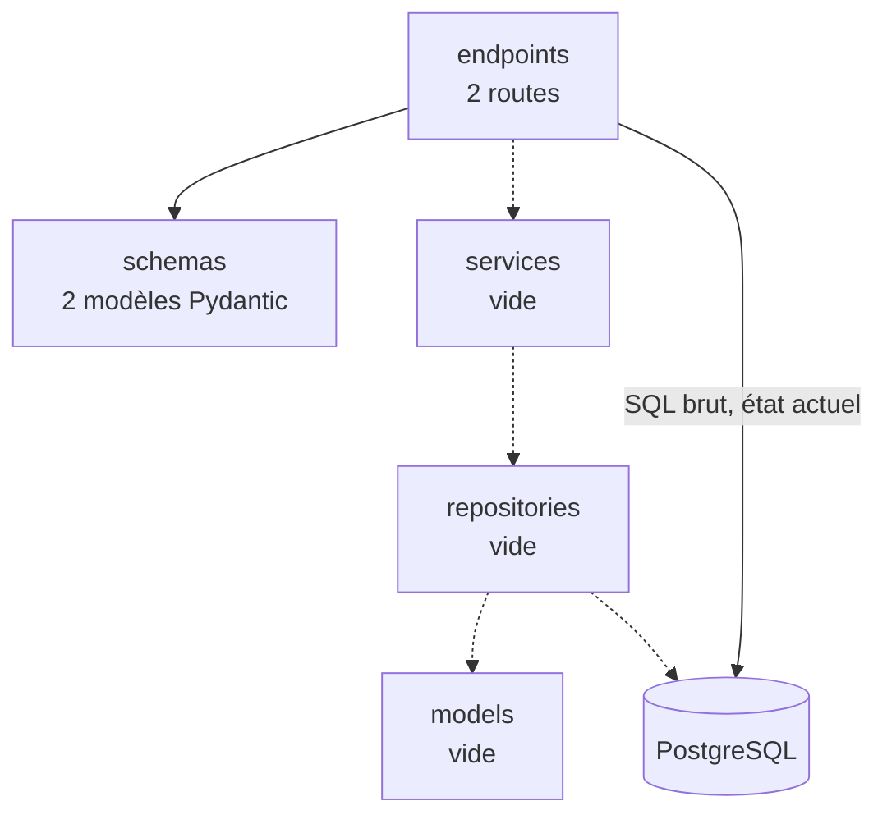
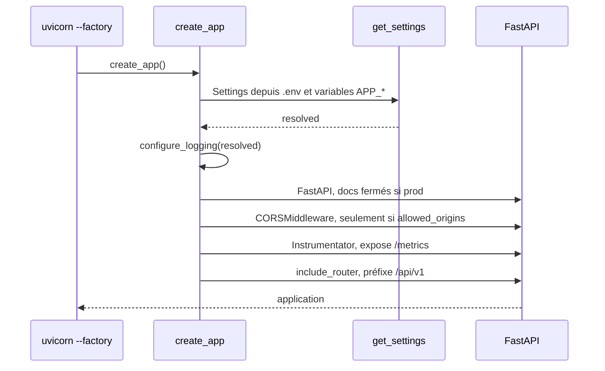
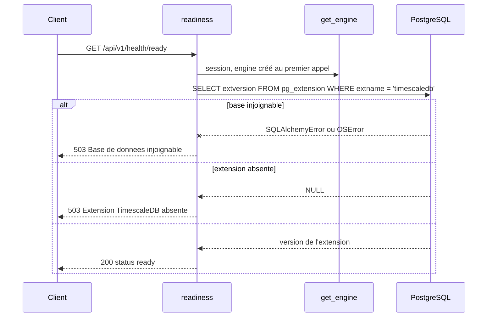

# Backend

API FastAPI, Python 3.14, SQLAlchemy asynchrone sur `asyncpg`. Source dans `apps/backend`.

## Couches

La doctrine est posée dans [`apps/backend/README.md`](../../apps/backend/README.md) et
[`TESTING.md`](../../apps/backend/TESTING.md) : `endpoints` appelle `services`, qui appelle
`repositories`, qui seuls touchent les `models`. Le sens de dépendance ne s'inverse jamais.

Dans les faits, trois de ces couches sont des dossiers vides.

Le trait plein de `endpoints` vers la base n'est pas une erreur de dessin : `/health/ready`
exécute aujourd'hui son `SELECT` directement, sans repository. C'est acceptable pour une sonde
d'infrastructure, qui vérifie la base elle-même et non une donnée métier. Ce raccourci ne doit
pas servir de modèle au premier endpoint métier.

`app/models/__init__.py` ne contient qu'un avertissement, qui mérite d'être connu avant la
première migration : tout modèle absent de ce module reste invisible d'un
`alembic revision --autogenerate`, qui produirait alors un `drop` de sa table.

## Démarrage

Point d'entrée : **une factory**, `uvicorn app.main:create_app --factory`. Aucune configuration
n'est lue à l'import du module, ce qui rend l'application testable et les migrations
indépendantes de l'environnement d'exécution.

**Le `lifespan` n'ouvre aucune connexion.** Au démarrage il journalise le nom, la version et
l'environnement ; à l'arrêt il libère l'engine. L'engine lui-même est construit paresseusement au
premier appel de `get_engine()`, mis en cache par `lru_cache`. Conséquence directe : une API qui
démarre ne prouve rien sur la base, la première connexion réelle a lieu au premier
`GET /api/v1/health/ready`. C'est ce qui rend cette sonde indispensable.

## Configuration

`Settings` est un `BaseSettings` Pydantic, lu depuis `.env` avec le préfixe `APP_`.

| Variable | Défaut | Rôle |
|---|---|---|
| `APP_SECRET_KEY` | **aucun** | Secret applicatif, `SecretStr` |
| `DATABASE_URL` | **aucun** | Chaîne de connexion, `postgresql+asyncpg://...` |
| `APP_ENV` | `local` | `local`, `dev`, `staging` ou `prod` |
| `APP_DEBUG` | `false` | Active aussi l'écho SQL de l'engine |
| `APP_LOG_LEVEL` | `INFO` | |
| `APP_CORS_ORIGINS` | `""` | Liste séparée par des virgules. Vide, aucun middleware CORS n'est posé |
| `APP_API_PREFIX` | `/api/v1` | |
| `APP_DATABASE_POOL_SIZE` | `5` | |
| `APP_DATABASE_MAX_OVERFLOW` | `10` | |

Deux pièges :

- **`DATABASE_URL` ne prend pas le préfixe `APP_`.** C'est le seul réglage dans ce cas, par
  `validation_alias`, pour rester compatible avec la convention d'Alembic et des hébergeurs.
- **`APP_SECRET_KEY` et `DATABASE_URL` n'ont pas de valeur par défaut.** L'application refuse de
  démarrer si l'un manque. C'est délibéré : mieux vaut un échec au démarrage qu'un service qui
  tourne avec un secret de démonstration.

Deux fichiers d'environnement, deux usages : `.env` à la racine alimente `docker-compose.yml`,
`apps/backend/.env` alimente l'API lancée sur le poste.

## Routes exposées

| Méthode | Chemin | Dans l'OpenAPI | Rôle |
|---|---|---|---|
| GET | `/api/v1/health/live` | oui | Le processus répond. Ne touche pas la base |
| GET | `/api/v1/health/ready` | oui | La base répond **et** l'extension TimescaleDB est chargée |
| GET | `/metrics` | non | Format Prometheus, exposé par l'instrumentator |
| GET | `/docs`, `/redoc`, `/openapi.json` | non | Désactivés quand `APP_ENV=prod` |

Aucune route métier n'existe à ce jour.

### `/health/ready`

Cette sonde porte une garde décrite dans l'[ADR 0001](../adr/0001-postgresql-timescaledb.md) : un
bootstrap de base sauté ne se voit pas au démarrage de l'API, elle le rend visible.

## Sécurité

Voir la vue consolidée dans [00-vue-ensemble.md](00-vue-ensemble.md). Côté backend :

- **Aucune authentification, aucune autorisation.** Les deux routes sont publiques. Le premier
  endpoint métier imposera de trancher ce point.
- Le CORS n'autorise que les origines listées, et n'existe pas si la liste est vide.
- `/docs`, `/redoc` et `/openapi.json` disparaissent en production.
- Le conteneur tourne en utilisateur non-root, avec un `HEALTHCHECK` sur `/api/v1/health/live`.
- Ni limitation de débit, ni journalisation des accès, ni en-têtes de sécurité.

## Observabilité

- Journalisation par `dictConfig` : format console en développement, JSON dès `APP_ENV=prod`.
  `sqlalchemy.engine` est forcé à `WARNING` pour ne pas noyer les journaux.
- `/metrics` au format Prometheus. **Aucun collecteur ne le lit** : `monitoring/` est vide.

## Tests

Conventions, gabarits et arborescence : [`apps/backend/TESTING.md`](../../apps/backend/TESTING.md).
Deux points structurants y sont fixés : les doubles passent par `app.dependency_overrides` et
jamais par `unittest.mock`, et les tests qui touchent la vraie base portent le marqueur
`integration`, exclu par défaut.

## Questions ouvertes

- **Authentification et autorisation** : quel mécanisme, quelle granularité.
- **Pagination et fenêtrage** des lectures de séries temporelles, qui conditionnent la forme des
  endpoints métier.
- **Politique de versionnement de l'API** au-delà du préfixe `/api/v1`.
