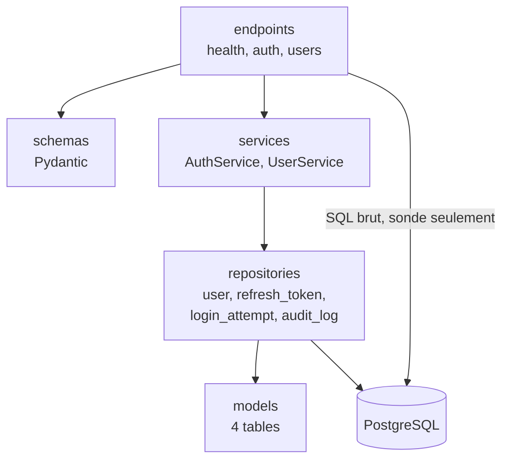
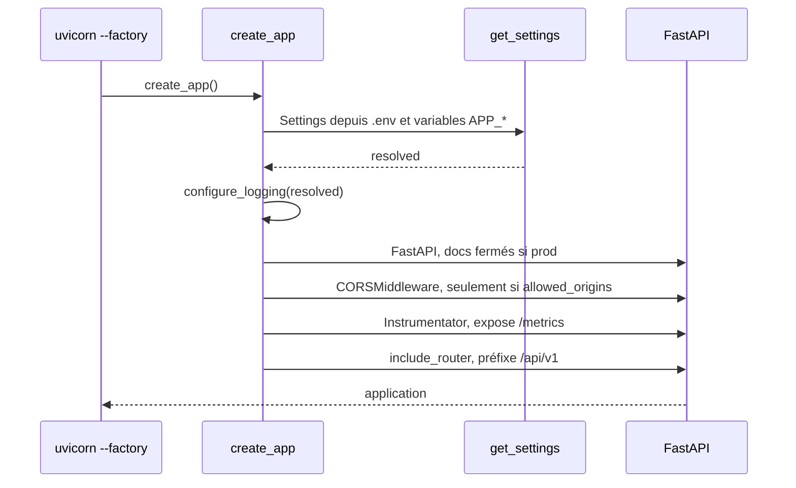
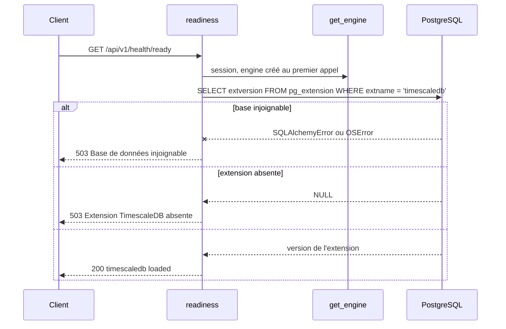

# Backend

API FastAPI, Python 3.14, SQLAlchemy asynchrone sur `asyncpg`. Source dans `apps/backend`.

## Couches

La doctrine est posée dans [`apps/backend/README.md`](../../apps/backend/README.md) et
[`TESTING.md`](../../apps/backend/TESTING.md) : `endpoints` appelle `services`, qui appelle
`repositories`, qui seuls touchent les `models`. Le sens de dépendance ne s'inverse jamais.

Les quatre couches existent désormais, portées par l'authentification.

Le trait plein de `endpoints` vers la base n'est pas une erreur de dessin : `/health/ready`
exécute aujourd'hui son `SELECT` directement, sans repository. C'est acceptable pour une sonde
d'infrastructure, qui vérifie la base elle-même et non une donnée métier. Ce raccourci ne doit
pas servir de modèle au premier endpoint métier.

`app/models/__init__.py` porte un avertissement qui reste valable à chaque nouveau modèle :
tout modèle absent de ce module est invisible d'un `alembic revision --autogenerate`, qui
produirait alors un `drop` de sa table. L'export va dans le même commit que le modèle.

`AuthService` et `UserService` ne connaissent ni `AsyncSession` ni `Request` : ils reçoivent
leurs dépôts et une `Transaction` réduite à `commit()`. C'est ce qui les rend testables sans
base, avec des doubles écrits à la main.

## Démarrage

Point d'entrée : **une factory**, `uvicorn app.main:create_app --factory`. Aucune configuration
n'est lue à l'import du module, ce qui rend l'application testable et les migrations
indépendantes de l'environnement d'exécution.

**Le `lifespan` n'ouvre aucune connexion.** Au démarrage il journalise le nom, la version et
l'environnement ; à l'arrêt il libère l'engine. L'engine lui-même est construit paresseusement au
premier appel de `get_engine()`, mis en cache par `lru_cache`. Conséquence directe : une API qui
démarre ne prouve rien sur la base, la première connexion réelle a lieu au premier
`GET /api/v1/health/ready`. C'est ce qui rend cette sonde indispensable.

## Configuration

`Settings` est un `BaseSettings` Pydantic, lu depuis `.env` avec le préfixe `APP_`.

| Variable | Défaut | Rôle |
|---|---|---|
| `APP_SECRET_KEY` | **aucun** | Secret applicatif, `SecretStr` |
| `DATABASE_URL` | **aucun** | Chaîne de connexion, `postgresql+asyncpg://...` |
| `APP_ENV` | `local` | `local`, `dev`, `staging` ou `prod` |
| `APP_DEBUG` | `false` | Active aussi l'écho SQL de l'engine |
| `APP_LOG_LEVEL` | `INFO` | |
| `APP_CORS_ORIGINS` | `""` | Liste séparée par des virgules. Vide, aucun middleware CORS n'est posé |
| `APP_API_PREFIX` | `/api/v1` | |
| `APP_DATABASE_POOL_SIZE` | `5` | |
| `APP_DATABASE_MAX_OVERFLOW` | `10` | |
| `APP_JWT_ISSUER` | `enervision-api` | Claim `iss`, vérifié au décodage |
| `APP_JWT_AUDIENCE` | `enervision-web` | Claim `aud`, vérifié au décodage |
| `APP_ACCESS_TOKEN_TTL_SECONDS` | `900` | Durée du jeton d'accès |
| `APP_REFRESH_TOKEN_TTL_SECONDS` | `604800` | Durée absolue d'une session, héritée à chaque rotation |
| `APP_REFRESH_COOKIE_NAME` | `ev_refresh` | Préfixé `__Secure-` dès que le cookie est `Secure` |
| `APP_COOKIE_PATH` | `/api/v1/auth` | Le cookie ne part que sur ces routes |
| `APP_COOKIE_SAMESITE` | `strict` | |
| `APP_COOKIE_SECURE` | déduit | Vrai hors `local` si non renseigné |
| `APP_ARGON2_TIME_COST` | `2` | |
| `APP_ARGON2_MEMORY_COST_KIB` | `19456` | Profil OWASP, environ 17 ms mesurés |
| `APP_ARGON2_PARALLELISM` | `1` | |
| `APP_ARGON2_MAX_CONCURRENCY` | `4` | Plafonne le pic mémoire du hachage |
| `APP_LOGIN_WINDOW_SECONDS` | `900` | Fenêtre glissante de la limitation |
| `APP_LOGIN_MAX_FAILURES_PER_IDENTIFIER_AND_IP` | `5` | Remplace le verrouillage de compte |
| `APP_LOGIN_MAX_FAILURES_PER_IP` | `20` | Arrête le balayage |
| `APP_LOGIN_MAX_FAILURES_PER_IDENTIFIER` | `50` | Signature d'une attaque distribuée |
| `APP_TRUST_PROXY_HEADERS` | `false` | À vrai derrière un proxy, sinon le compteur par IP devient global |
| `APP_EXPOSE_API_DOCS` | déduit | Faux en `staging` et `prod` si non renseigné |
| `APP_METRICS_TOKEN` | absent | Si présent, `/metrics` exige `Authorization: Bearer` |

Cinq gardes refusent de démarrer plutôt que de laisser passer une erreur silencieuse :
secret de moins de 32 caractères ou laissé à sa valeur d'exemple, `debug` en `staging` ou
`prod`, joker dans `APP_CORS_ORIGINS`, liste d'origines vide hors `local`, et cookie
`SameSite=None` sans `Secure`.

Trois pièges :

- **`DATABASE_URL` ne prend pas le préfixe `APP_`.** C'est le seul réglage dans ce cas, par
  `validation_alias`, pour rester compatible avec la convention d'Alembic et des hébergeurs.
- **`APP_SECRET_KEY` et `DATABASE_URL` n'ont pas de valeur par défaut.** L'application refuse de
  démarrer si l'un manque. C'est délibéré : mieux vaut un échec au démarrage qu'un service qui
  tourne avec un secret de démonstration.
- **Une `Settings` passée à `create_app()` pilote aussi les dépendances.** La factory installe
  une surcharge de `get_settings` ; sans elle, un test « en production » testerait la
  configuration du poste.

Deux fichiers d'environnement, deux usages : `.env` à la racine alimente `docker-compose.yml`,
`apps/backend/.env` alimente l'API lancée sur le poste.

## Routes exposées

| Méthode | Chemin | Dans l'OpenAPI | Rôle |
|---|---|---|---|
| GET | `/api/v1/health/live` | oui | Le processus répond. Ne touche pas la base |
| GET | `/api/v1/health/ready` | oui | La base répond **et** l'extension TimescaleDB est chargée |
| POST | `/api/v1/auth/login` | oui | Ouvre une session. Publique |
| POST | `/api/v1/auth/refresh` | oui | Fait tourner la session. Cookie seulement |
| POST | `/api/v1/auth/logout` | oui | Ferme la session courante. Idempotente |
| POST | `/api/v1/auth/logout-all` | oui | Ferme toutes les sessions du compte |
| POST | `/api/v1/auth/password` | oui | Change son propre mot de passe |
| GET | `/api/v1/auth/me` | oui | Décrit le compte connecté |
| GET | `/api/v1/users` | oui | Liste les comptes. `admin` |
| POST | `/api/v1/users` | oui | Crée un compte, rend un mot de passe provisoire. `admin` |
| PATCH | `/api/v1/users/{id}` | oui | Change le rôle ou l'activation. `admin` |
| POST | `/api/v1/users/{id}/password-reset` | oui | Réinitialise et ferme les sessions. `admin` |
| GET | `/metrics` | non | Format Prometheus. Jeton requis si `APP_METRICS_TOKEN` est posé |
| GET | `/docs`, `/redoc`, `/openapi.json` | non | Fermés en `staging` et en `prod` |

**Quatre routes seulement sont publiques** : les deux sondes, `/auth/login` et `/auth/logout`.
`tests/api/test_route_protection.py` interroge réellement chaque autre route sans identifiant et
échoue si l'une d'elles répond autre chose qu'un 401 ou un 403. Rendre une route publique impose
donc de modifier la liste dans ce fichier de test.

Aucune route métier n'existe à ce jour. Le contrat détaillé pour le frontend est dans
[31-contrat-authentification.md](31-contrat-authentification.md).

### `/health/ready`

Cette sonde porte une garde décrite dans l'[ADR 0001](../adr/0001-postgresql-timescaledb.md) : un
bootstrap de base sauté ne se voit pas au démarrage de l'API, elle le rend visible.

Elle ne publie **pas** la version de l'extension, qui part dans le journal : une version exacte
de composant servie sans authentification est de la reconnaissance gratuite pour qui cherche
une CVE.

## Sécurité

Voir la vue consolidée dans [00-vue-ensemble.md](00-vue-ensemble.md) et les décisions dans les
[ADR 0002](../adr/0002-authentification-jwt-et-refresh-opaque.md),
[0003](../adr/0003-autorisation-rbac-a-trois-roles.md) et
[0004](../adr/0004-journal-d-audit-en-ajout-seul.md). Côté backend, les ordres d'exécution qui
portent la sécurité, et qu'un refactor casserait sans rien faire échouer de visible :

1. **Les compteurs de limitation sont lus avant le hachage Argon2.** Dans l'autre ordre, chaque
   requête rejetée coûterait quand même 17 ms de processeur et 19 Mio de mémoire, et la
   protection deviendrait l'amplificateur de déni de service qu'elle doit empêcher.
2. **Un haché leurre est vérifié quand l'adresse est inconnue.** Sans lui, l'écart entre 2 ms et
   17 ms est un oracle d'existence de compte, mesurable à distance.
3. **La tentative échouée est validée en base avant que l'erreur ne soit levée.** `get_session()`
   ne valide pas de lui-même : la preuve disparaîtrait avec la transaction.
4. **Un jeton de rafraîchissement déjà tourné révoque toute sa famille ; un jeton expiré ne
   révoque rien.** La rotation ne protège de rien par elle-même, elle rend la réutilisation
   détectable.

Le reste, par ordre de surface :

- Le `Principal` est construit depuis la ligne en base, jamais depuis le claim `role` : un claim
  périmé ne peut pas provoquer d'élévation de privilège.
- `credentials_changed_at` est comparé à la seconde entière, parce que `iat` est une date JWT et
  n'a pas de précision inférieure.
- Le CORS liste ses origines, ses méthodes et ses en-têtes. Il n'est pas monté si la liste est
  vide, et la configuration refuse de démarrer dans ce cas hors `local`.
- La 422 renvoie le champ fautif et le type d'erreur, **jamais la valeur rejetée** : la réponse
  par défaut de FastAPI contient `input`, donc le mot de passe sur `/auth/login`.
- La 500 renvoie un identifiant de corrélation, la trace reste côté serveur.
- Un filtre de caviardage expurge jetons, empreintes Argon2, mots de passe et cookies avant
  écriture des journaux. C'est la troisième ligne de défense : la première est de ne rien passer
  de secret au logger, la deuxième de ne jamais mettre un jeton dans une URL.
- En-têtes posés par l'application : `X-Content-Type-Options`, `X-Frame-Options`,
  `Referrer-Policy`, plus `Cache-Control: no-store` sur `/auth/*`. HSTS et CSP appartiennent au
  terminateur TLS, que l'application ne connaît pas.
- Le conteneur tourne en utilisateur non-root, avec un `HEALTHCHECK` sur `/api/v1/health/live`.
- Ni limitation de débit au frontal, ni TLS, ni journalisation des accès applicative.

## Observabilité

- Journalisation par `dictConfig` : format console en développement, JSON dès `APP_ENV=prod`.
  `sqlalchemy.engine` est forcé à `WARNING` pour ne pas noyer les journaux.
- `/metrics` au format Prometheus. **Aucun collecteur ne le lit** : `monitoring/` est vide.

## Tests

Conventions, gabarits et arborescence : [`apps/backend/TESTING.md`](../../apps/backend/TESTING.md).

Trois fichiers méritent d'être connus avant de toucher à l'authentification :

- `tests/api/test_route_protection.py` : le garde-fou de l'autorisation, décrit plus haut.
- `tests/services/test_auth.py` : le faux hacheur y porte un compteur d'appels, ce qui permet les
  deux assertions qui prouvent le design, à savoir un appel quand l'adresse est inconnue et zéro
  appel quand la limite est atteinte.
- `tests/api/test_parcours_authentification.py` : six parcours contre la vraie base, sous le
  marqueur `integration`. C'est là que se démontrent l'atomicité de la rotation, la mort de la
  famille au rejeu et la révocation immédiate.

## Questions ouvertes

- **Portée par site dans l'autorisation** : les rôles sont globaux, un opérateur du site A peut
  agir sur le site B. C'est la limite connue du modèle, et le risque BOLA du top 10 API.
- **Rôles PostgreSQL cantonnés** pour l'ETL et le travail d'apprentissage, plus le `REVOKE` sur
  `audit_log`. Dette assumée, décrite dans les ADR 0003 et 0004.
- **Pagination et fenêtrage** des lectures de séries temporelles, qui conditionnent la forme des
  endpoints métier. Sans plafond dur, une requête sur dix ans d'historique suffit à faire tomber
  l'API.
- **Politique de versionnement de l'API** au-delà du préfixe `/api/v1`.
