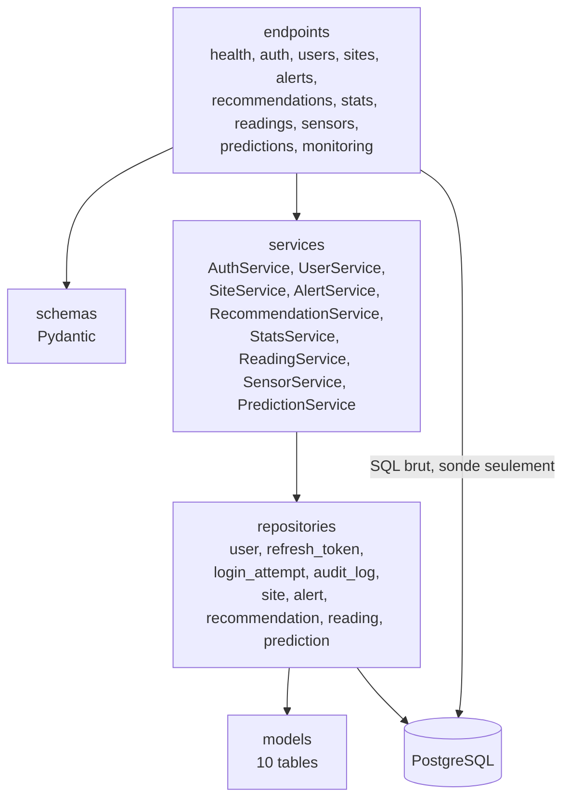
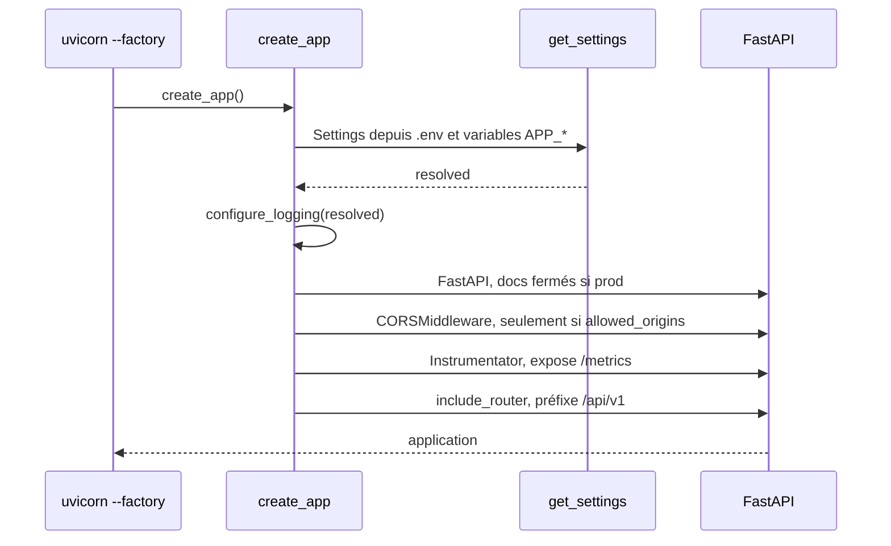
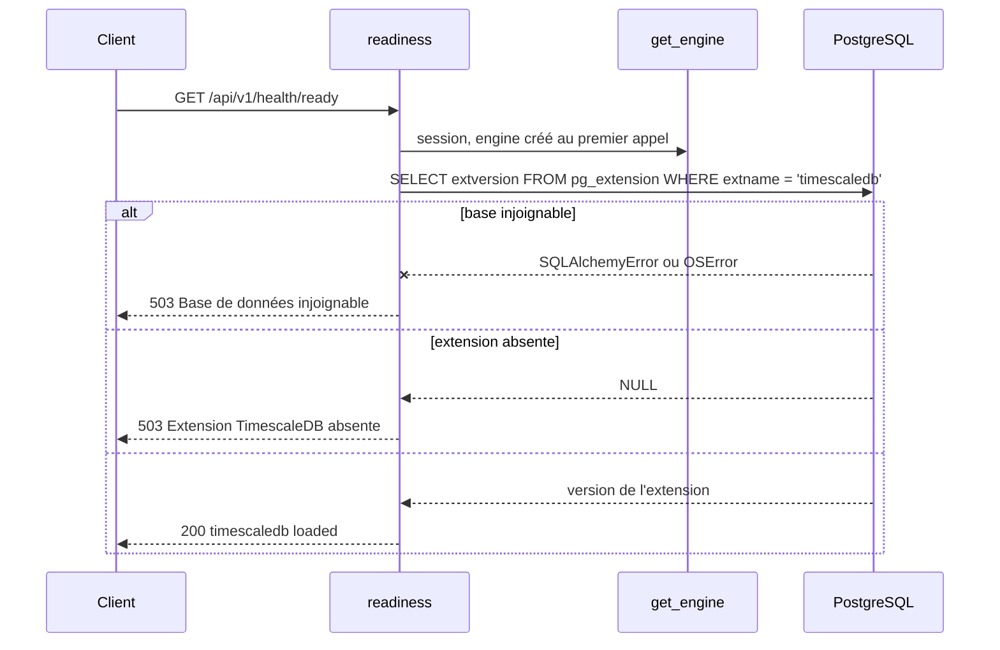

# Backend

API FastAPI, Python 3.14, SQLAlchemy asynchrone sur `asyncpg`. Source dans `apps/backend`.

## Couches

La doctrine est posée dans [`apps/backend/README.md`](../../apps/backend/README.md) et
[`TESTING.md`](../../apps/backend/TESTING.md) : `endpoints` appelle `services`, qui appelle
`repositories`, qui seuls touchent les `models`. Le sens de dépendance ne s'inverse jamais.

Les quatre couches existent désormais, portées par l'authentification.



Le trait plein de `endpoints` vers la base n'est pas une erreur de dessin : `/health/ready`
exécute aujourd'hui son `SELECT` directement, sans repository. C'est acceptable pour une sonde
d'infrastructure, qui vérifie la base elle-même et non une donnée métier. Ce raccourci ne doit
pas servir de modèle au premier endpoint métier.

`app/models/__init__.py` porte un avertissement qui reste valable à chaque nouveau modèle :
tout modèle absent de ce module est invisible d'un `alembic revision --autogenerate`, qui
produirait alors un `drop` de sa table. L'export va dans le même commit que le modèle.

`AuthService` et `UserService` ne connaissent ni `AsyncSession` ni `Request` : ils reçoivent
leurs dépôts et une `Transaction` réduite à `commit()`. C'est ce qui les rend testables sans
base, avec des doubles écrits à la main.

## Démarrage

Point d'entrée : **une factory**, `uvicorn app.main:create_app --factory`. Aucune configuration
n'est lue à l'import du module, ce qui rend l'application testable et les migrations
indépendantes de l'environnement d'exécution.



**Le `lifespan` n'ouvre aucune connexion.** Au démarrage il journalise le nom, la version et
l'environnement ; à l'arrêt il libère l'engine. L'engine lui-même est construit paresseusement au
premier appel de `get_engine()`, mis en cache par `lru_cache`. Conséquence directe : une API qui
démarre ne prouve rien sur la base, la première connexion réelle a lieu au premier
`GET /api/v1/health/ready`. C'est ce qui rend cette sonde indispensable.

## Configuration

`Settings` est un `BaseSettings` Pydantic, lu depuis `.env` avec le préfixe `APP_`.

| Variable | Défaut | Rôle |
|---|---|---|
| `APP_SECRET_KEY` | **aucun** | Secret applicatif, `SecretStr` |
| `DATABASE_URL` | **aucun** | Chaîne de connexion, `postgresql+asyncpg://...` |
| `APP_ENV` | `local` | `local`, `dev`, `staging` ou `prod` |
| `APP_DEBUG` | `false` | Active aussi l'écho SQL de l'engine |
| `APP_LOG_LEVEL` | `INFO` | |
| `APP_CORS_ORIGINS` | `""` | Liste séparée par des virgules. Vide, aucun middleware CORS n'est posé |
| `APP_API_PREFIX` | `/api/v1` | |
| `APP_DATABASE_POOL_SIZE` | `5` | |
| `APP_DATABASE_MAX_OVERFLOW` | `10` | |
| `APP_JWT_ISSUER` | `enervision-api` | Claim `iss`, vérifié au décodage |
| `APP_JWT_AUDIENCE` | `enervision-web` | Claim `aud`, vérifié au décodage |
| `APP_ACCESS_TOKEN_TTL_SECONDS` | `900` | Durée du jeton d'accès |
| `APP_REFRESH_TOKEN_TTL_SECONDS` | `604800` | Durée absolue d'une session, héritée à chaque rotation |
| `APP_REFRESH_COOKIE_NAME` | `ev_refresh` | Préfixé `__Secure-` dès que le cookie est `Secure` |
| `APP_COOKIE_PATH` | `/api/v1/auth` | Le cookie ne part que sur ces routes |
| `APP_COOKIE_SAMESITE` | `strict` | |
| `APP_COOKIE_SECURE` | déduit | Vrai hors `local` si non renseigné |
| `APP_ARGON2_TIME_COST` | `2` | |
| `APP_ARGON2_MEMORY_COST_KIB` | `19456` | Profil OWASP, environ 17 ms mesurés |
| `APP_ARGON2_PARALLELISM` | `1` | |
| `APP_ARGON2_MAX_CONCURRENCY` | `4` | Plafonne le pic mémoire du hachage |
| `APP_LOGIN_WINDOW_SECONDS` | `900` | Fenêtre glissante de la limitation |
| `APP_LOGIN_MAX_FAILURES_PER_IDENTIFIER_AND_IP` | `5` | Remplace le verrouillage de compte |
| `APP_LOGIN_MAX_FAILURES_PER_IP` | `20` | Arrête le balayage |
| `APP_LOGIN_MAX_FAILURES_PER_IDENTIFIER` | `50` | Signature d'une attaque distribuée |
| `APP_TRUST_PROXY_HEADERS` | `false` | À vrai derrière un proxy, sinon le compteur par IP devient global |
| `APP_EXPOSE_API_DOCS` | déduit | Faux en `staging` et `prod` si non renseigné |
| `APP_METRICS_TOKEN` | absent | Si présent et non vide, `/metrics` exige `Authorization: Bearer`. Vide vaut absent |
| `APP_S3_ENDPOINT_URL` | absent | Endpoint S3 des archives ; `http://garage:3900` posé par Compose sur `airflow-scheduler`. Vide vaut absent |
| `APP_S3_REGION` | `garage` | Région déclarée au client S3 |
| `APP_S3_ACCESS_KEY` | absent | Identifiant de la clé Garage. Vide vaut absent |
| `APP_S3_SECRET_KEY` | absent | Secret de la clé Garage, `SecretStr`. Vide vaut absent |
| `APP_S3_BUCKET` | absent | Bucket des archives, `enervision-archives` en Compose. Vide vaut absent |
| `APP_S3_SSE_KEY` | absent | Base64 de 32 octets, clé SSE-C des archives, `SecretStr`. Vide vaut absent |
| `APP_READING_RETENTION_DAYS` | `1095` | Profondeur de `reading` en base chaude, 30 jours minimum |

L'API n'exige aucun des réglages `APP_S3_*` ni `APP_READING_RETENTION_DAYS` : seul
`app.etl.reading_retention` les réclame, et refuse de partir sans endpoint, clés et bucket.

Cinq gardes refusent de démarrer plutôt que de laisser passer une erreur silencieuse :
secret de moins de 32 caractères ou laissé à sa valeur d'exemple, `debug` en `staging` ou
`prod`, joker dans `APP_CORS_ORIGINS`, liste d'origines vide hors `local`, et cookie
`SameSite=None` sans `Secure`.

Trois pièges :

- **`DATABASE_URL` ne prend pas le préfixe `APP_`.** C'est le seul réglage dans ce cas, par
  `validation_alias`, pour rester compatible avec la convention d'Alembic et des hébergeurs.
- **`APP_SECRET_KEY` et `DATABASE_URL` n'ont pas de valeur par défaut.** L'application refuse de
  démarrer si l'un manque. C'est délibéré : mieux vaut un échec au démarrage qu'un service qui
  tourne avec un secret de démonstration.
- **Une `Settings` passée à `create_app()` pilote aussi les dépendances.** La factory installe
  une surcharge de `get_settings` ; sans elle, un test « en production » testerait la
  configuration du poste.

Deux fichiers d'environnement, deux usages : `.env` à la racine alimente `docker-compose.yml`,
`apps/backend/.env` alimente l'API lancée sur le poste.

## Routes exposées

| Méthode | Chemin | Rôle | Erreurs déclarées |
|---|---|---|---|
| GET | `/api/v1/health/live` | Le processus répond. Ne touche pas la base | 500 |
| GET | `/api/v1/health/ready` | La base répond **et** l'extension TimescaleDB est chargée | 503, 500 |
| POST | `/api/v1/auth/login` | Ouvre une session. Publique | 401, 422, 429, 500 |
| POST | `/api/v1/auth/refresh` | Fait tourner la session. Cookie seulement | 401, 403, 500 |
| POST | `/api/v1/auth/logout` | Ferme la session courante. Idempotente | 403, 500 |
| POST | `/api/v1/auth/logout-all` | Ferme toutes les sessions du compte | 401, 403, 500 |
| POST | `/api/v1/auth/password` | Change son propre mot de passe | 401, 403, 422, 500 |
| GET | `/api/v1/auth/me` | Décrit le compte connecté | 401, 500 |
| GET | `/api/v1/users` | Liste les comptes. `admin` | 401, 403, 500 |
| POST | `/api/v1/users` | Crée un compte, rend un mot de passe provisoire. `admin` | 401, 403, 409, 422, 500 |
| PATCH | `/api/v1/users/{id}` | Change le rôle ou l'activation. `admin` | 400, 401, 403, 404, 409, 422, 500 |
| POST | `/api/v1/users/{id}/password-reset` | Réinitialise et ferme les sessions. `admin` | 401, 403, 404, 422, 500 |
| GET | `/api/v1/sites` | Liste les sites. `lecteur` | 401, 403, 500 |
| GET | `/api/v1/sites/{site_id}` | Décrit un site. `lecteur` | 401, 403, 404, 422, 500 |
| GET | `/api/v1/sites/{site_id}/current` | Dernière mesure d'un site. `lecteur` | 401, 403, 404, 422, 500 |
| GET | `/api/v1/alerts` | Liste les alertes, filtrable par `site_id` et `severity`. `lecteur` | 401, 403, 422, 500 |
| GET | `/api/v1/recommendations` | Liste les recommandations. `lecteur` | 401, 403, 500 |
| GET | `/api/v1/recommendations/{recommendation_id}` | Décrit une recommandation. `lecteur` | 401, 403, 404, 422, 500 |
| POST | `/api/v1/recommendations/generate` | Applique le moteur de règles aux alertes, filtrable par `site_id`. `admin` | 401, 403, 422, 500 |
| GET | `/api/v1/stats/summary` | Résume la consommation instantanée du parc. `lecteur` | 401, 403, 500 |
| GET | `/api/v1/readings` | Historique des lectures, filtrable par `site_id`, fenêtre `start`/`end` (24h par défaut, 90 jours maximum) et paginé par `limit`/`offset`. `lecteur` | 400, 401, 403, 422, 500 |
| GET | `/api/v1/sensors/status` | État de santé des capteurs par site, dérivé de la dernière lecture. `admin` | 401, 403, 500 |
| GET | `/api/v1/predictions` | Dernière prévision de consommation par site, calculée hors ligne par le pipeline de scoring (`ml/`). `lecteur` | 401, 403, 500 |
| GET | `/api/v1/monitoring/drift` | Dernier rapport de dérive par site, plus la ligne globale. `operateur` | 401, 403, 422, 500 |
| GET | `/metrics` | Format Prometheus, hors du schéma. Jeton requis si `APP_METRICS_TOKEN` est posé | |
| GET | `/docs`, `/redoc`, `/openapi.json` | Hors du schéma. Fermés en `staging` et en `prod` | |

Les codes de la dernière colonne sont ceux que le schéma **déclare**, et le fichier
`openapi.json` versionné interdit qu'ils divergent de ce que les routes rendent.

**Sept routes du contrat sont publiques** : les deux sondes, `/auth/login`, `/auth/logout`,
`/auth/forgot-password` et les deux routes de réinitialisation, qui portent leur autorisation dans
le jeton à usage unique plutôt que dans un `Principal`.
`tests/api/test_route_protection.py` interroge réellement chaque autre route sans identifiant et
échoue si l'une d'elles répond autre chose qu'un 401 ou un 403. Rendre une route publique impose
donc de modifier `ROUTES_PUBLIQUES` dans `tests/api/acces.py`.

`GET /sites` et `GET /sites/{site_id}` sont la première route métier, et le gabarit repris pour
`GET /alerts` puis pour les suivantes (`dataset`) : les quatre couches
`endpoints → services → repositories → models` y sont toutes présentes, sur des tables déjà créées
par la révision Alembic `e6d2026091501`. Elles n'exigent que le rôle `lecteur`, contrairement aux
routes d'administration qui exigent `admin`. `SiteRepository` lit par `AsyncSession.scalar()` (une
ligne) et `AsyncSession.scalars()` (plusieurs lignes) plutôt que par `execute()`, ce qui la rend
testable par la fixture `fake_session` au niveau endpoint sans base réelle. `GET /recommendations`
et `GET /recommendations/{recommendation_id}` reprennent le même gabarit à la lettre,
`recommendation_id` étant un entier plutôt qu'un texte. Une recommandation ne porte pas `site_id` :
elle remonte à un site par sa seule `alert_id`, `alert` n'étant pas encore exposée. `GET
/stats/summary` et `GET /sensors/status` agrègent chacune deux repositories (`SiteRepository`,
`ReadingRepository`) dans un service dédié plutôt que d'exposer une table : elles n'entrent donc
pas dans ce gabarit route-par-table. `GET /sites/{site_id}/current` reste sur le gabarit `sites`,
mais `SiteService` gagne la même seconde dépendance (`ReadingRepository`) pour restituer la
dernière `Reading` du site : un site connu sans lecture rend `200` avec tous les champs de mesure
à `null` et `data_quality="critical"`, seul un `site_id` absent de la base rend `404`. Le contrat
détaillé pour le frontend est dans
[31-contrat-authentification.md](31-contrat-authentification.md).

`GET /predictions` reprend ce même sous-gabarit « dernière valeur par site » (`SiteRepository` +
`PredictionRepository`, un `SitePredictionSummaryResponse` par site plutôt qu'une table brute).
Différence avec `stats`/`sensors` : `prediction` est une vraie table accumulée par un processus
externe (`enervision_ml.score`, cf. `ml/README.md`), pas une valeur recalculée à la volée depuis
`reading` à chaque appel. `PredictionRepository.latest_by_site()` isole donc un `DISTINCT ON
(site_id)` ordonné par `target_at DESC` (couvert par l'index `ix_prediction_site_target`), le même
mécanisme que `ReadingRepository.latest_by_site()`. Un site jamais scoré rend `prediction: null`
plutôt qu'un statut inventé : le domaine `available`/`insufficient_data`/`error` de la contrainte
`ck_prediction_status` n'a pas de valeur pour « pas encore de ligne ». L'API ne lance jamais
LightGBM elle-même ; elle lit ce que le pipeline de scoring a déjà écrit, cf.
[ML-START.md](../ML-START.md) section 3.

`POST /recommendations/generate` est la seule route d'écriture métier du contrat. Elle applique
le moteur de règles d'`app/services/recommendation_rules.py` aux lignes d'`alert`, sans modèle ni
feature ML : le catalogue `REGLES` associe à chaque type et à chaque gravité d'alerte une action et
son explication, et une même alerte peut en déclencher plusieurs, comme le prévoit
[40-data.md](40-data.md). L'idempotence est portée par la base, pas par le service :
`RecommendationRepository.create_missing()` insère en `ON CONFLICT DO NOTHING` sur
`uq_recommendation_alert_rule`, donc rejouer la génération sur les mêmes alertes ne crée rien et
le rapport rendu distingue `recommendations_created` de `already_present`. Le même traitement est
disponible hors HTTP par `python -m app.cli generate-recommendations` (cible `make
recommendations`), sur le patron de `make ml-score`. Le choix de loger le moteur dans le backend
plutôt que dans `ml/` est justifié par l'[ADR 0006](../adr/0006-moteur-de-regles-dans-le-backend.md).
Les alertes traitées sont celles qu'écrit la détection interne (#104, section ci-dessous) : la
génération ne rend donc de recommandations qu'une fois la détection passée. L'insertion est
découpée en lots de `TAILLE_DE_LOT` lignes, asyncpg plafonnant une requête à 32 767 paramètres.

`GET /readings` reprend le même gabarit mais s'en écarte sur un point : `reading` est l'hypertable,
donc la seule table métier pouvant porter des années d'historique, ce que `docs/architecture/
owasp-traceabilite.md` documentait comme un risque ouvert (API4, aucune pagination plafonnée ni
fenêtre temporelle maximale). `ReadingService` porte donc une couche de validation absente des
autres routes de lecture : `start`/`end` sont optionnels (24 dernières heures par défaut si les
deux sont omis, l'un défaut par rapport à l'autre sinon), l'écart entre les deux est plafonné à 90
jours (`FENETRE_MAXIMALE`), et `limit`/`offset` (défaut 500, plafond 2000) empêchent qu'une fenêtre
large mais peu dense reste malgré tout coûteuse. Un dépassement de plafond répond `400` (règle
métier, portée par le service) plutôt que `422` (réservé à la validation structurelle de FastAPI,
par exemple `limit` hors bornes). Un datetime sans fuseau dans `start`/`end` est traité comme de
l'UTC plutôt que rejeté : le comparer tel quel à `reading.timestamp` (`timestamptz`) échouerait
côté pilote, en `500` plutôt qu'un refus propre.

### Surveillance de dérive

`DriftService.evaluate()` joint `prediction` et `reading` sur `(site_id, target_at = timestamp)`
et compare deux fenêtres vives de 168 h, la récente et celle qui la précède. Il rend une ligne par
site plus une ligne globale, que `DriftRepository.enregistre()` écrit dans `drift_report` avec
`ON CONFLICT DO NOTHING` sur `uq_drift_report_window` : rejouer la commande sur la même fenêtre
n'ajoute rien.

| Métrique | Ce qu'elle dit |
|---|---|
| `mae` | Erreur moyenne en kWh, la métrique même qu'optimise LightGBM |
| `bias` | Erreur moyenne **signée** : c'est elle qui distingue un modèle plus bruyant d'un modèle qui se trompe systématiquement du même côté. Lue et servie, elle ne fait basculer le verdict que sous `--bias-threshold`, faute d'un seuil en kWh transposable d'un site à l'autre ([ADR 0013](../adr/0013-surveillance-de-derive-dans-le-backend.md)) |
| `mape` | Comparable entre sites de tailles différentes, hors réalisés nuls |
| `coverage_ratio` | Part des prévisions disponibles qui ont trouvé leur réalisé : mesure le pipeline, pas le modèle |
| `insufficient_data_ratio` | Part des sites privés d'historique suffisant |
| `model_references` | Les modèles vus dans la fenêtre : une MAE qui saute à l'instant où le modèle change est une régression de réentraînement, pas une dérive |

Le verdict a trois valeurs, `stable`, `derive` et `indetermine` : sous un nombre minimal
d'observations, le service dit qu'il ne sait pas plutôt que de rendre un chiffre trompeur. La
fenêtre est fermée à droite par un délai de grâce de 2 h, le temps que l'ingestion livre le
réalisé de la dernière heure. `python -m app.monitoring.drift` l'exécute, le DAG `derive`
l'ordonnance, et `GET /api/v1/monitoring/drift` sert le dernier rapport de chaque site. Les
arbitrages sont dans l'[ADR 0013](../adr/0013-surveillance-de-derive-dans-le-backend.md).

### Détection d'alertes internes

`AlertService` n'est plus lecture seule : `AlertService.detect()` compare les `reading` (et, pour
le type `anomaly`, les `prediction`) des dernières 48h (`LOOKBACK`) à cinq règles et enregistre une
ligne `alert` par déclenchement, avec `source="enervision"`. `metric`/`value`/`threshold` gardent
leur sens dans chaque règle plutôt que d'être laissés à `null` par commodité :

| `type` | Règle | `value` / `threshold` |
|---|---|---|
| `threshold` | `reading.consumption_kw` dépasse `site.capacity_kw` (site sans capacité déclarée : ignoré) | mesure / capacité du site |
| `spike` | Variation relative ≥ 50% (`SPIKE_RELATIVE_THRESHOLD`) entre deux lectures consécutives du même site, ou redémarrage direct à une valeur positive depuis zéro (`critical`) | mesure actuelle / mesure précédente |
| `anomaly` | Écart relatif ≥ 30% (`ANOMALY_RELATIVE_THRESHOLD`) entre `reading.consumption_kwh` et la `prediction` du même site dont `target_at == timestamp` | mesure réelle / valeur prédite |
| `outage` | Aucune lecture depuis plus de 3h (`OUTAGE_THRESHOLD`, 3x la cadence horaire nominale), ou site jamais lu | `null` / `null` |
| `sensor` | `reading.data_quality` ∈ `partial`/`degraded`/`critical` | `null` / `null` |

La sévérité de chaque alerte (hors `sensor`, dérivée directement de `data_quality`) suit le même
barème par ratio observé/seuil : `low` sous 1.2, `medium` sous 1.5, `high` sous 2.0, `critical`
au-delà. `AlertRepository.create_many()` insère par lot avec `ON CONFLICT DO NOTHING` sur
`uq_alert_source_reference`, et `source_alert_id` est construit de façon déterministe (règle +
horodatage) : rejouer la détection sur une fenêtre déjà analysée ne duplique donc jamais une
alerte.

**Pièges de tri corrigés en revue** : `reading`/`prediction` n'ont pas d'unicité sur leur couple
métier (`uq_reading_source` autorise deux `source` différentes au même `site_id`+`timestamp`,
`prediction` n'a aucune contrainte sur `(site_id, target_at)`, chaque run de scoring gardant sa
propre ligne). `ReadingRepository.list_since()`/`PredictionRepository.list_since()` départagent
donc les égalités par `reading_id`/`prediction_id` croissant, comme le font déjà
`latest_by_site()`/`latest_for_site()` sur les mêmes tables ; sans ce départage, l'ordre entre
lignes à égalité n'est pas garanti d'un appel à l'autre, et `_detect_spike`/`_detect_anomaly`
auraient pu comparer des lectures/choisir une prévision au hasard. `_detect_spike` ignore en plus
explicitement les paires de lectures qui partagent le même horodatage (deux `source` pour un seul
instant réel, pas une variation).

La détection s'exécute dans `apps/backend`, puisque les règles s'appuient sur les repositories ORM
de l'API plutôt que sur une connexion SQL directe (contrairement à
`app/etl/historical_import.py`) : `uv run python -m app.detection.internal_alerts [--site-id ...]
[--now ...]`, ou `make detect-alerts`. Cette issue (#104) débloquait #38 (moteur de règles pour
recommandations), dont la FK `alert_id` `NOT NULL` n'avait jusqu'ici rien à référencer côté
`source="enervision"`.

Depuis l'issue #116, le lancement n'est plus manuel : le DAG Airflow `alertes` enchaîne cette
détection et la génération des recommandations, toutes les heures à la quinzième minute. Airflow
exécute le code du backend en sous-processus, dans son propre environnement, ce que décide
l'[ADR 0008](../adr/0008-airflow-execute-le-code-du-backend.md) ; le détail de l'ordonnancement est
dans [10-infra.md](10-infra.md). La ligne de commande reste le moyen de rejouer une fenêtre
passée, ce que `--now` permet et que le DAG ne fait pas.

### `/health/ready`

Cette sonde porte une garde décrite dans l'[ADR 0001](../adr/0001-postgresql-timescaledb.md) : un
bootstrap de base sauté ne se voit pas au démarrage de l'API, elle le rend visible.

Elle ne publie **pas** la version de l'extension, qui part dans le journal : une version exacte
de composant servie sans authentification est de la reconnaissance gratuite pour qui cherche
une CVE.



## Contrat OpenAPI

Statut : `Fait`.

Le schéma est servi sur `/openapi.json`, `/docs` et `/redoc`, fermés en `staging` et en `prod`.
Il est aussi **versionné** dans [`apps/backend/openapi.json`](../../apps/backend/openapi.json) :

```bash
make openapi
```

Pourquoi un fichier en plus de la route. Une route qui change son contrat public le montre alors
dans la diff de la pull request, et le frontend dispose d'une référence lisible sans lancer l'API.
`tests/api/test_openapi.py` compare le fichier au schéma généré et échoue si l'un bouge sans
l'autre ; le fichier vivant sous `apps/backend/`, le filtre de chemins de `backend.yml` le couvre.

**Le schéma exporté ne dépend pas du poste.** `settings_du_contrat()` pose le nom, la version et
le préfixe, et coupe la lecture du `.env`. Sans cela, un `APP_API_PREFIX` local suffirait à faire
diverger le fichier d'une machine à l'autre, et le test deviendrait un oracle de configuration
plutôt qu'un garde-fou de contrat.

Trois champs sont volontairement absents d'`info`, parce qu'ils poseraient une décision qui n'est
pas prise :

| Champ | Pourquoi |
|---|---|
| `servers` | L'URL publique dépend de l'ingress, question ouverte dans [10-infra.md](10-infra.md) |
| `license_info` | Aucune licence n'est choisie |
| `contact` | Aucun canal de support n'existe |

Deux schémas de sécurité sont déclarés : `JetonAcces` pour le porteur JWT, et
`CookieRafraichissement` pour `/auth/refresh` et `/auth/logout`, des noms ASCII délibérés (issue
#41 : un outillage tiers comme ZAP peut mal analyser un nom de schéma accentué dans le contrat).
**Le second est purement
documentaire** : son `auto_error=False` garantit qu'il ne décide d'aucun refus. Le passer à vrai
ferait répondre 403 avant d'atteindre `lit_le_cookie()`, et `/auth/refresh` cesserait de rendre le
401 sur lequel le frontend déclenche sa déconnexion.

Les modèles de `app/schemas/errors.py` décrivent ce que les gestionnaires renvoient réellement.
`ValidationErrorResponse` remplace le `HTTPValidationError` par défaut de FastAPI, dont la clé
`loc` n'apparaît dans aucune réponse de cette API : `validation_error_handler()` rend `champ` et
`type`. Renommer un champ là-bas sans le faire ici rend la documentation fausse en silence.

### Ajouter une route métier

Checklist pour toute nouvelle route sur le gabarit `sites`/`alerts`/`recommendations`/`stats`/
`readings`/`sensors`/`predictions` (`dataset`) :

1. Composer ses `responses=` depuis `app/api/openapi.py` : `REPONSES_LECTEUR`/`REPONSES_ADMIN`
   au niveau de l'`include_router()` du routeur, `REPONSE_VALIDATION` et les codes locaux
   (404, 409, ...) directement sur l'endpoint qui les rend.
2. Décrire son tag dans `TAGS`.
3. **La classer dans `tests/api/acces.py`** : `ROLE_MINIMUM` avec son rôle minimum si elle passe
   par `require_role` (`LecteurDep`/`OperateurDep`/`AdminDep`), `ROUTES_SANS_ROLE` si elle se
   contente de `CurrentPrincipalDep`, `ROUTES_PUBLIQUES` si elle est ouverte. L'oubli n'est plus
   silencieux : `test_every_declared_route_is_classified` échoue sur une route non classée comme
   sur une entrée qui ne correspond plus à aucune route. `ROUTES_A_ROLE` de `test_openapi.py` en
   est dérivée, et `test_matrice_acces.py` vérifie le niveau réellement monté.
4. Si elle passe par `require_trusted_origin`, l'ajouter à `ORIGINE_VERIFIEE` dans
   `tests/api/test_openapi.py`. **Cette liste-là reste maintenue à la main.**
5. `make openapi`, puis `uv run pytest tests/api/test_openapi.py tests/api/test_route_protection.py
   tests/api/test_matrice_acces.py`.

## Sécurité

Voir la vue consolidée dans [00-vue-ensemble.md](00-vue-ensemble.md) et les décisions dans les
[ADR 0002](../adr/0002-authentification-jwt-et-refresh-opaque.md),
[0003](../adr/0003-autorisation-rbac-a-trois-roles.md) et
[0004](../adr/0004-journal-d-audit-en-ajout-seul.md). Côté backend, les ordres d'exécution qui
portent la sécurité, et qu'un refactor casserait sans rien faire échouer de visible :

1. **Les compteurs de limitation sont lus avant le hachage Argon2.** Dans l'autre ordre, chaque
   requête rejetée coûterait quand même 17 ms de processeur et 19 Mio de mémoire, et la
   protection deviendrait l'amplificateur de déni de service qu'elle doit empêcher.
2. **Un haché leurre est vérifié quand l'adresse est inconnue.** Sans lui, l'écart entre 2 ms et
   17 ms est un oracle d'existence de compte, mesurable à distance.
3. **La tentative échouée est validée en base avant que l'erreur ne soit levée.** `get_session()`
   ne valide pas de lui-même : la preuve disparaîtrait avec la transaction.
4. **Un jeton de rafraîchissement déjà tourné révoque toute sa famille ; un jeton expiré ne
   révoque rien.** La rotation ne protège de rien par elle-même, elle rend la réutilisation
   détectable.

Le reste, par ordre de surface :

- Le `Principal` est construit depuis la ligne en base, jamais depuis le claim `role` : un claim
  périmé ne peut pas provoquer d'élévation de privilège.
- `credentials_changed_at` est comparé à la seconde entière, parce que `iat` est une date JWT et
  n'a pas de précision inférieure.
- Le CORS liste ses origines, ses méthodes et ses en-têtes. Il n'est pas monté si la liste est
  vide, et la configuration refuse de démarrer dans ce cas hors `local`.
- La 422 renvoie le champ fautif et le type d'erreur, **jamais la valeur rejetée** : la réponse
  par défaut de FastAPI contient `input`, donc le mot de passe sur `/auth/login`.
- La 500 renvoie un identifiant de corrélation, la trace reste côté serveur.
- Un filtre de caviardage expurge jetons, empreintes Argon2, mots de passe et cookies avant
  écriture des journaux. C'est la troisième ligne de défense : la première est de ne rien passer
  de secret au logger, la deuxième de ne jamais mettre un jeton dans une URL.
- En-têtes posés par l'application : `X-Content-Type-Options`, `X-Frame-Options`,
  `Referrer-Policy`, `Cross-Origin-Resource-Policy: same-origin`, plus `Cache-Control: no-store`
  sur `/auth/*`. Le CORP est fixé à `same-origin` parce qu'aucun client légitime ne charge l'API
  en `no-cors` (image, script, média) depuis une autre origine : le frontend l'appelle en relatif
  (`/api/v1`), sur sa propre origine, via `proxy.conf.json` en dev et le reverse proxy nginx
  (`infra/proxy/conf.d/enervision.conf`) en recette et en production. Les appels `HttpClient`, en
  mode `cors`, n'y sont de toute façon pas soumis. HSTS et CSP appartiennent au terminateur TLS, que
  l'application ne connaît pas : le reverse proxy les pose
  ([ADR 0007](../adr/0007-terminaison-tls-et-reverse-proxy-nginx.md)).
- Le conteneur tourne en utilisateur non-root, avec un `HEALTHCHECK` sur `/api/v1/health/live`.
- TLS, limitation de débit au frontal et journal d'accès sont portés par le reverse proxy.
  `APP_TRUST_PROXY_HEADERS` doit alors valoir vrai, sinon le compteur par IP devient global.
- Pas de journalisation des accès applicative.

## Observabilité

- Journalisation par `dictConfig` : format console en développement, JSON dès `APP_ENV=prod`.
  `sqlalchemy.engine` est forcé à `WARNING` pour ne pas noyer les journaux.
- `/metrics` au format Prometheus (`prometheus-fastapi-instrumentator`), scruté toutes les 15 s
  par Prometheus sous le profil `monitoring` ([60-observabilite.md](60-observabilite.md)).
  - **Séries publiées.** `http_requests_total` par route, méthode et classe de statut, et
    `http_request_duration_seconds` par route, avec des seaux de 50 ms à 2,5 s autour du seuil
    de charge de 500 ms (ADR 0015). Aussi `http_request_duration_highr_seconds`, fin mais sans
    libellé de route, et les métriques du processus.
  - **Exclusions.** Les sondes `/health/*` et `/metrics` lui-même sont exclus : la sonde Docker
    de 30 s fausserait débit et latences.
  - **Un registre par application** (`_registre_de_metriques()` dans `main.py`). Le registre
    global de `prometheus_client` n'accepte chaque métrique qu'une fois : toute application créée
    après la première, dans les tests notamment, ne mesurait rien.

## Tests

Conventions, gabarits et arborescence : [`apps/backend/TESTING.md`](../../apps/backend/TESTING.md).

Quatre fichiers méritent d'être connus avant de toucher à l'authentification :

- `tests/api/acces.py` : la classification des routes, `ROUTES_PUBLIQUES` et `ROLE_MINIMUM` en
  tête. Ce n'est pas un test, c'est la référence que les deux suivants confrontent au
  comportement observé.
- `tests/api/test_route_protection.py` : le garde-fou de l'autorisation, décrit plus haut.
- `tests/api/test_matrice_acces.py` : chaque route gardée croisée avec chacun des trois rôles,
  dans les deux sens, puis rejouée sous `integration` avec de vrais jetons.
- `tests/services/test_auth.py` : le faux hacheur y porte un compteur d'appels, ce qui permet les
  deux assertions qui prouvent le design, à savoir un appel quand l'adresse est inconnue et zéro
  appel quand la limite est atteinte.
- `tests/api/test_parcours_authentification.py` : six parcours contre la vraie base, sous le
  marqueur `integration`. C'est là que se démontrent l'atomicité de la rotation, la mort de la
  famille au rejeu et la révocation immédiate.

## Questions ouvertes

- **Portée par site dans l'autorisation** : les rôles sont globaux, un opérateur du site A peut
  agir sur le site B. C'est la limite connue du modèle, et le risque BOLA du top 10 API.
- **Rôles PostgreSQL cantonnés** pour l'ETL et le travail d'apprentissage, plus le `REVOKE` sur
  `audit_log`. Dette assumée, décrite dans les ADR 0003 et 0004.
- **Pagination et fenêtrage** : posés sur `GET /readings` (fenêtre plafonnée à 90 jours,
  `limit`/`offset` plafonné à 2000), mais toujours en `limit`/`offset` simple — pas de curseur ni
  de plan de secours si un `offset` élevé sur une fenêtre dense devient lent en pratique.
  `statement_timeout` reste absent au niveau de la connexion, donc rien n'empêche une requête
  individuelle de tourner longtemps si les plafonds au-dessus d'elle s'avéraient insuffisants.
- **Politique de versionnement de l'API** au-delà du préfixe `/api/v1`.
