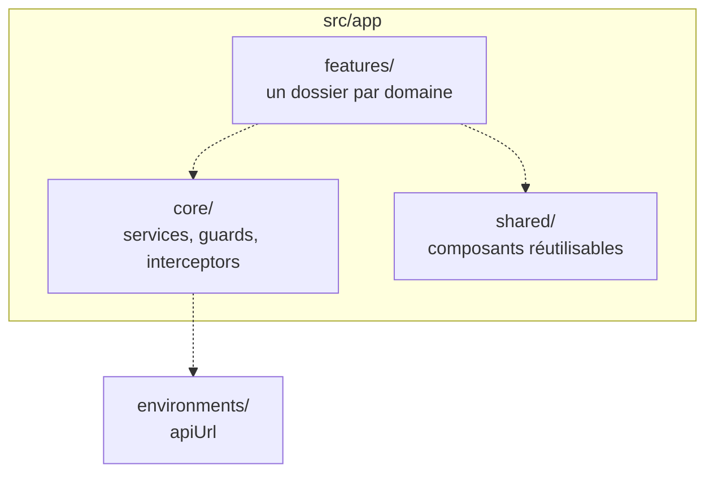
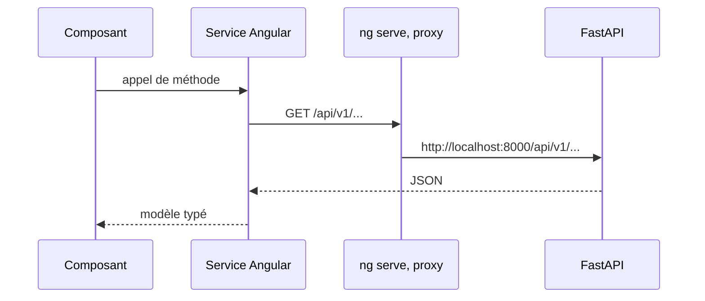

# Frontend

Application Angular 22, 100 % standalone, testée avec Vitest. Source dans `apps/frontend`.

## État actuel

Statut : `En cours`. Le projet est un `ng new` intact. Le tableau de la
[vue d'ensemble](00-vue-ensemble.md) le classe désormais correctement, le `README.md` racine le
disait encore « à initialiser » alors que le squelette existe depuis `49f4697`.

Ce qui est en place :

- Bootstrap par `bootstrapApplication(App, appConfig)`, **aucun `NgModule`** dans le dépôt.
- `app.config.ts` fournit `provideBrowserGlobalErrorListeners()` et `provideRouter(routes)`.
- Vitest via le builder `@angular/build:unit-test`, couverture activée, un fichier de test.
- Prettier configuré, parser `angular` pour les gabarits HTML.

Ce qui n'existe pas encore :

- `routes` est un tableau vide. Aucune page, aucune navigation.
- **`provideHttpClient` n'est pas fourni** et `@angular/common/http` n'est importé nulle part :
  l'application n'appelle aucune API.
- `app.html` est la page d'accueil Angular par défaut, commentaires de remplacement compris.
- Aucune bibliothèque de graphiques, aucun kit d'interface, aucune gestion d'état.
- Aucun lint : ESLint n'est pas installé.

## Arborescence cible

Statut : `Cible`. Elle n'est pas inventée ici : [`TESTING.md`](../../apps/frontend/TESTING.md) la
prescrit déjà dans ses gabarits de tests.

Un service HTTP par domaine dans `core/services`, les composants de page dans `features`, et rien
d'autre que du réutilisable dans `shared`. Les composants n'appellent jamais `HttpClient`
directement : ils passent par un service, ce qui rend le double de test trivial.

## Flux HTTP

Statut : `Cible`. Le chemin est câblé, rien ne l'emprunte encore.

En développement, `proxy.conf.json` redirige tout `/api` vers `http://localhost:8000`. C'est ce
qui évite le CORS sur le poste, et c'est pourquoi `environment.development.ts` se contente d'un
`apiUrl` relatif, `/api/v1`.

En production, il n'y a pas de proxy : `environment.ts` porte une URL absolue. Angular substitue
le fichier via `fileReplacements`, et la configuration `production` est celle par défaut.

**Dette connue.** `src/environments/environment.ts`, qui est la configuration de production,
pointe `http://localhost:8000/api/v1` en dur. La valeur est celle du poste de développement :
telle quelle, un build de production ne joindra jamais l'API. À corriger avant le premier
déploiement, en même temps que sera tranchée la question de l'ingress dans
[10-infra.md](10-infra.md).

## Exécution

| Commande | Effet |
|---|---|
| `npm ci` | Installe les dépendances. `node_modules/` n'est pas présent par défaut |
| `npm start` | `ng serve` sur le port 4200, proxy actif |
| `npm run build` | Build de production |
| `npm run test` | Vitest en mode observateur |
| `npm run test:ci` | Vitest en une passe |

Le frontend **n'a pas de cible dans le `Makefile` racine** et **aucun service dans
`docker-compose.yml`** : il se pilote uniquement par `npm`, depuis `apps/frontend`. Le port 4200
n'apparaît dans le compose que comme valeur par défaut d'`APP_CORS_ORIGINS`, côté backend.

Un `Dockerfile` frontend existe sur la branche `feat/pipeline-cd`, mais il est mono-étage et sans
`CMD` : il construit sans rien servir. Le `README.md` de l'application demande un multi-étage
avec un service statique, il reste à écrire.

## Sécurité

- Le frontend ne détient aucun secret : `environment.ts` ne porte qu'une URL.
- L'authentification n'existe pas côté API, donc pas de garde ni d'intercepteur de jeton à ce
  stade. `core/guards` et `core/interceptors` sont prévus pour cela.

## Tests

Conventions et gabarits : [`apps/frontend/TESTING.md`](../../apps/frontend/TESTING.md).

## Questions ouvertes

- **Quelle bibliothèque de graphiques** pour les séries temporelles, et si Grafana en couvre déjà
  une partie du besoin.
- **Gestion d'état** : signaux seuls, ou une bibliothèque dédiée.
- **Comment `apiUrl` est injecté en production** : build par environnement, ou configuration lue
  au démarrage.
