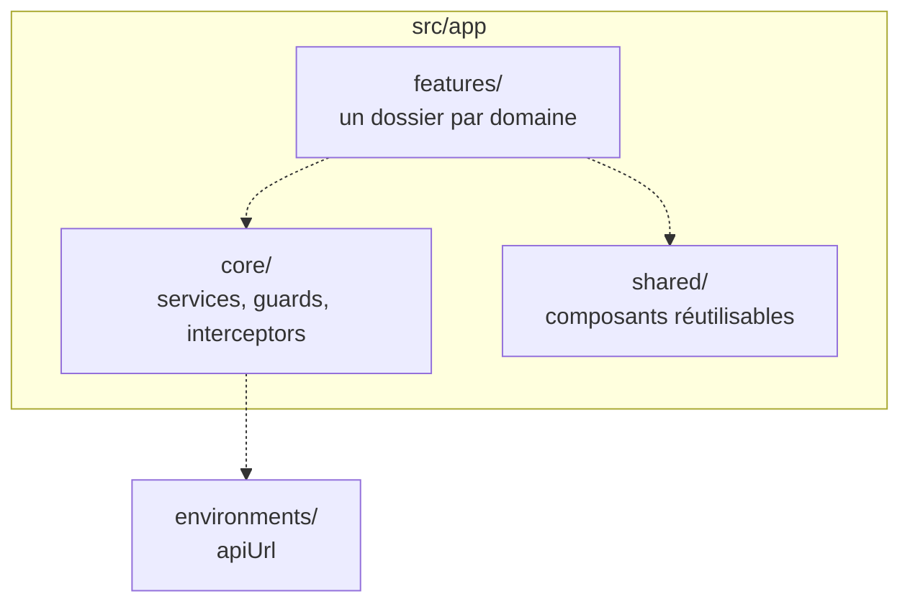
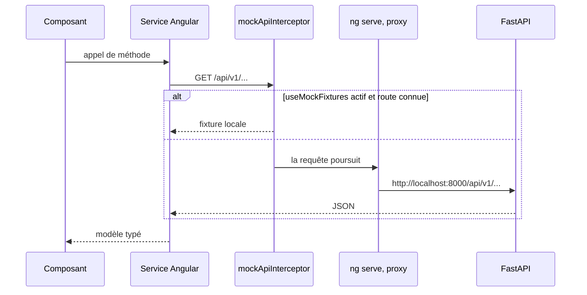

# Frontend

Application Angular 22, 100 % standalone, testée avec Vitest. Source dans `apps/frontend`.

## État actuel

Statut : `En cours`. L'application sert une première page métier, le tableau de bord, alimentée
par des fixtures : les endpoints qu'elle appelle n'existent pas encore côté API.

Ce qui est en place :

- Bootstrap par `bootstrapApplication(App, appConfig)`, **aucun `NgModule`** dans le dépôt.
- `app.config.ts` fournit `provideBrowserGlobalErrorListeners()`, `provideRouter(routes)` et
  `provideHttpClient(withInterceptors([mockApiInterceptor]))`.
- Une route `/dashboard` en composant différé, et une redirection depuis la racine.
- `core/services` porte `StatsService` et `AlertsService`, `core/interceptors` l'intercepteur de
  fixtures, `features/dashboard` la page, `shared/components` la jauge de consommation et le
  graphique de charge par site, tous deux construits sur Chart.js.
- L'état vit dans des signaux, sans bibliothèque dédiée.
- Vitest via le builder `@angular/build:unit-test`, couverture activée, sept fichiers de test.
- Prettier configuré, parser `angular` pour les gabarits HTML.

Ce qui n'existe pas encore :

- **Aucun endpoint réel derrière l'écran.** `GET /api/v1/stats/summary` et `GET /api/v1/alerts`
  sont servis par l'intercepteur ; l'API expose `/health`, `/auth` et `/users`, rien d'autre.
- Aucune authentification côté interface : ni garde de route, ni intercepteur de jeton, alors que
  les routes métier de l'API en exigent un. Voir
  [31-contrat-authentification.md](31-contrat-authentification.md).
- Aucun état de chargement : tant que la première réponse n'est pas arrivée, la page reste vide.
- Aucun lint : ESLint n'est pas installé.

## Arborescence

Statut : `Fait`. Elle suit ce que [`TESTING.md`](../../apps/frontend/TESTING.md) prescrit dans ses
gabarits de tests.

Un service HTTP par domaine dans `core/services`, les composants de page dans `features`, et rien
d'autre que du réutilisable dans `shared`. Les composants n'appellent jamais `HttpClient`
directement : ils passent par un service, ce qui rend le double de test trivial.

## Flux HTTP

Statut : `En cours`. Le chemin complet est câblé, mais un intercepteur se place devant et répond
lui-même tant que les endpoints n'existent pas.

`mockApiInterceptor` n'intercepte que `/stats/summary` et `/alerts`, et seulement si
`environment.useMockFixtures` est vrai. Le drapeau est à `true` en développement, à `false` en
production : toute autre requête, et toutes les requêtes en production, suivent le chemin réel.

En développement, `proxy.conf.json` redirige tout `/api` vers `http://localhost:8000`. C'est ce
qui évite le CORS sur le poste, et c'est pourquoi `environment.development.ts` se contente d'un
`apiUrl` relatif, `/api/v1`.

En production, il n'y a pas de proxy : `environment.ts` porte une URL absolue. Angular substitue
le fichier via `fileReplacements`, et la configuration `production` est celle par défaut.

**Dette connue.** `src/environments/environment.ts`, qui est la configuration de production,
pointe `http://localhost:8000/api/v1` en dur. La valeur est celle du poste de développement :
telle quelle, un build de production ne joindra jamais l'API. À corriger avant le premier
déploiement, en même temps que sera tranchée la question de l'ingress dans
[10-infra.md](10-infra.md).

## Exécution

| Commande | Effet |
|---|---|
| `npm ci` | Installe les dépendances. `node_modules/` n'est pas présent par défaut |
| `npm start` | `ng serve` sur le port 4200, proxy actif |
| `npm run build` | Build de production |
| `npm run test` | Vitest en mode observateur |
| `npm run test:ci` | Vitest en une passe |

**Version de Node.** L'Angular CLI refuse de démarrer en dessous de 22.22.3, 24.15.0 ou 26.0.0, et
le message d'erreur arrive avant toute compilation. Un poste en 22.21 ou en 24.12 ne peut donc ni
tester ni construire le frontend.

Le frontend a ses cibles dans le `Makefile` racine (`install-frontend`, `dev-frontend`,
englobées par `install` et `dev`), mais **aucun service dans `docker-compose.yml`** : en
développement il tourne toujours directement via `npm`, depuis `apps/frontend`. Le port 4200
n'apparaît dans le compose que comme valeur par défaut d'`APP_CORS_ORIGINS`, côté backend.

Un `Dockerfile` frontend existe sur la branche `feat/pipeline-cd`, mais il est mono-étage et sans
`CMD` : il construit sans rien servir. Le `README.md` de l'application demande un multi-étage
avec un service statique, il reste à écrire.

## Sécurité

- Le frontend ne détient aucun secret : `environment.ts` ne porte qu'une URL.
- L'authentification existe côté API mais pas côté interface : aucune garde de route, aucun
  intercepteur de jeton. `core/guards` reste à créer, `core/interceptors` n'héberge aujourd'hui
  que les fixtures.

## Tests

Conventions et gabarits : [`apps/frontend/TESTING.md`](../../apps/frontend/TESTING.md).

## Questions ouvertes

- **Gestion d'état** : les signaux suffisent aujourd'hui, la question se reposera quand plusieurs
  pages partageront le même état.
- **Comment `apiUrl` est injecté en production** : build par environnement, ou configuration lue
  au démarrage.
