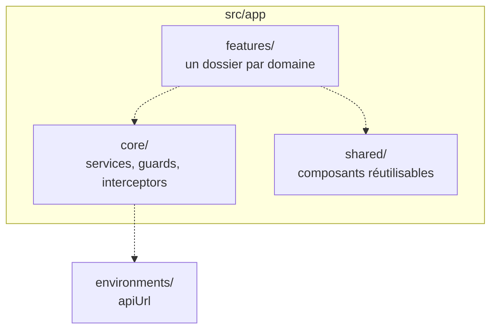
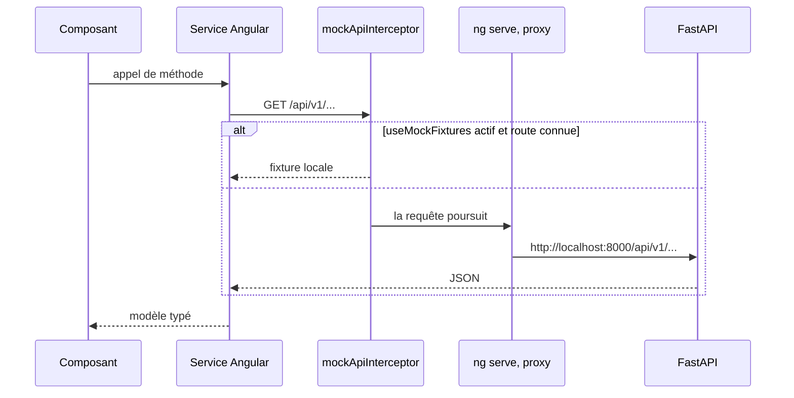

# Frontend

Application Angular 22, 100 % standalone, testée avec Vitest. Source dans `apps/frontend`.

## État actuel

Statut : `En cours`. L'application sert le tableau de bord, la liste et le détail des sites, la
supervision des capteurs (admin) et le flux des alertes actives, tous branchés sur l'API réelle.

Ce qui est en place :

- Bootstrap par `bootstrapApplication(App, appConfig)`, **aucun `NgModule`** dans le dépôt.
- `app.config.ts` fournit `provideBrowserGlobalErrorListeners()`, `provideRouter(routes)` et
  `provideHttpClient(withInterceptors([authInterceptor, mockApiInterceptor]))`.
- Des routes en composants différés (`/dashboard`, `/sites`, `/sites/:siteId`,
  `/monitoring/sensors` réservée au rôle `admin`) et une redirection depuis la racine.
- `core/services` porte un service HTTP par domaine (`StatsService`, `AlertsService` avec ses
  filtres `site_id` et `severity`, `PredictionsService`, `SitesService`, `ReadingsService`,
  `SensorsService`, `AuthService`), `core/interceptors` l'intercepteur de fixtures et l'intercepteur
  d'authentification (jeton porteur, rafraîchissement sur 401), `core/guards` la garde `authGuard`.
- `features/` porte une page par domaine. `shared/components` porte la jauge de consommation et
  les graphiques Chart.js, le widget `app-alert-feed` (flux d'alertes filtrable par site et
  sévérité, rafraîchi toutes les 60 s, première vue de l'application avec des états chargement /
  vide / indisponible) et, dans `shared/models`, des types alignés sur les schémas Pydantic du
  backend, plus les tables de présentation partagées (`alert-presentation.ts` : ton, libellé et
  unité par sévérité, type et métrique).
- Une authentification complète côté interface : connexion, mot de passe oublié/réinitialisation,
  changement de mot de passe, garde de route sur toute la zone authentifiée. Détail :
  [31-contrat-authentification.md](31-contrat-authentification.md).
- Un système de design partagé (`shared/components/ui/` : `ev-button`, `ev-card`, `ev-alert`,
  `ev-badge`, `ev-brand`, `ev-icon`, tokens CSS dans `styles/_tokens.scss`, classes globales de
  formulaire, de navigation et de tableau) que toute nouvelle page doit réutiliser plutôt que
  redéfinir ses propres styles. Détail :
  [32-design-systeme-frontend.md](32-design-systeme-frontend.md).
- L'état vit dans des signaux, sans bibliothèque dédiée.
- TypeScript en `"strict": true` ; `strictTemplates` n'est pas encore activé.
- Vitest via le builder `@angular/build:unit-test`, couverture activée.
- Prettier configuré, parser `angular` pour les gabarits HTML.

Ce qui n'existe pas encore :

- **Le mode fixtures est inactif.** `useMockFixtures` vaut `false` dans `environment.ts` comme dans
  `environment.development.ts` : `mockApiInterceptor` ne sert `/stats/summary` et `/alerts` que
  dans son propre spec. En développement, toutes les pages exigent un backend joignable et un jeton
  valide.
- Un état de chargement généralisé : seul `app-alert-feed` en a un, les autres pages restent vides
  tant que la première réponse n'est pas arrivée.
- Aucun lint : ESLint n'est pas installé.

## Arborescence

Statut : `Fait`. Elle suit ce que [`TESTING.md`](../../apps/frontend/TESTING.md) prescrit dans ses
gabarits de tests.

Un service HTTP par domaine dans `core/services`, les composants de page dans `features`, et rien
d'autre que du réutilisable dans `shared`. Les composants n'appellent jamais `HttpClient`
directement : ils passent par un service, ce qui rend le double de test trivial.

## Flux HTTP

Statut : `En cours`. Le chemin complet est câblé, mais un intercepteur se place devant et répond
lui-même tant que les endpoints n'existent pas.

`mockApiInterceptor` n'intercepte que `/stats/summary` et `/alerts`, et seulement si
`environment.useMockFixtures` est vrai. Le drapeau vaut `false` dans les deux fichiers
d'environnement : en pratique toutes les requêtes suivent le chemin réel et l'intercepteur n'est
exercé que par son spec. `/predictions` et `/auth/*` ne sont de toute façon jamais mockés. En
développement, un jeton valide et un backend joignable sont donc nécessaires pour que le tableau de
bord s'affiche.

En développement, `proxy.conf.json` redirige tout `/api` vers `http://localhost:8000`. C'est ce
qui évite le CORS sur le poste, et c'est pourquoi `environment.development.ts` se contente d'un
`apiUrl` relatif, `/api/v1`.

En production, `environment.ts` porte lui aussi un `apiUrl` relatif (`/api/v1`) plutôt qu'une URL
absolue : la dette qui pointait en dur sur `http://localhost:8000/api/v1` a été corrigée. Un build
de production sert donc l'appel `/api/v1/...` sur son propre origin, et c'est le **reverse proxy**
qui route `/api` vers le backend : `location /api/` dans `infra/proxy/conf.d/enervision.conf`, voir
[10-infra.md](10-infra.md) et l'[ADR 0007](../adr/0007-terminaison-tls-et-reverse-proxy-nginx.md).

## Exécution

| Commande | Effet |
|---|---|
| `npm ci` | Installe les dépendances. `node_modules/` n'est pas présent par défaut |
| `npm start` | `ng serve` sur le port 4200, proxy actif |
| `npm run build` | Build de production |
| `npm run test` | Vitest en mode observateur |
| `npm run test:ci` | Vitest en une passe |

**Version de Node.** L'Angular CLI refuse de démarrer en dessous de 22.22.3, 24.15.0 ou 26.0.0, et
le message d'erreur arrive avant toute compilation. Un poste en 22.21 ou en 24.12 ne peut donc ni
tester ni construire le frontend.

Le frontend a ses cibles dans le `Makefile` racine (`install-frontend`, `dev-frontend`,
englobées par `install` et `dev`). En développement il tourne directement via `npm`, depuis
`apps/frontend` : le port 4200 n'apparaît dans le compose que comme valeur par défaut
d'`APP_CORS_ORIGINS`, côté backend.

Le service `frontend` du `docker-compose.yml` sert le build statique par le nginx de
`apps/frontend/Dockerfile`, multi-étage, qui **écoute sur 3000**. En déploiement il n'est plus
publié du tout : le reverse proxy est seul à sortir sur le réseau, et l'atteint par le réseau
Compose.

## Sécurité

- Le frontend ne détient aucun secret : `environment.ts` ne porte qu'une URL.
- L'authentification existe des deux côtés désormais : `authGuard` protège `/dashboard` et
  `/sites`, `authInterceptor` pose le jeton porteur sur les requêtes sortantes et déclenche le
  rafraîchissement sur 401. Détail complet dans
  [31-contrat-authentification.md](31-contrat-authentification.md).
- **La CSP posée par le reverse proxy contraint le build.** `script-src 'self'` interdit les
  gestionnaires d'événements en ligne ; l'inlining du CSS critique en produisait un
  (`<link media="print" onload="this.media='all'">`), ce qui aurait laissé l'application sans
  style derrière le proxy. D'où `optimization.styles.inlineCritical: false` dans la configuration
  de production d'`angular.json`. La contrepartie est un rendu non stylé très bref au premier
  affichage. `style-src` conserve `'unsafe-inline'` : Angular injecte les styles de composants à
  l'exécution, et s'en passer demanderait un `ngCspNonce` que le SPA statique ne peut pas produire.

## Tests

Conventions et gabarits : [`apps/frontend/TESTING.md`](../../apps/frontend/TESTING.md).

## Questions ouvertes

- **Gestion d'état** : les signaux suffisent aujourd'hui, la question se reposera quand plusieurs
  pages partageront le même état.
- **Comment `apiUrl` est injecté en production** : build par environnement, ou configuration lue
  au démarrage.
