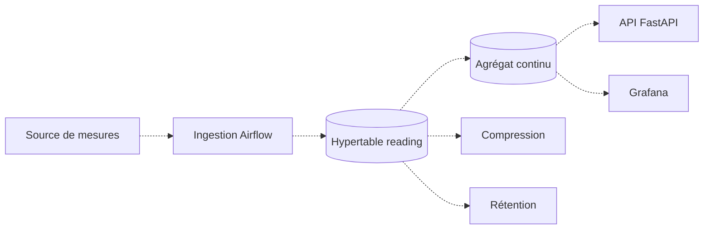
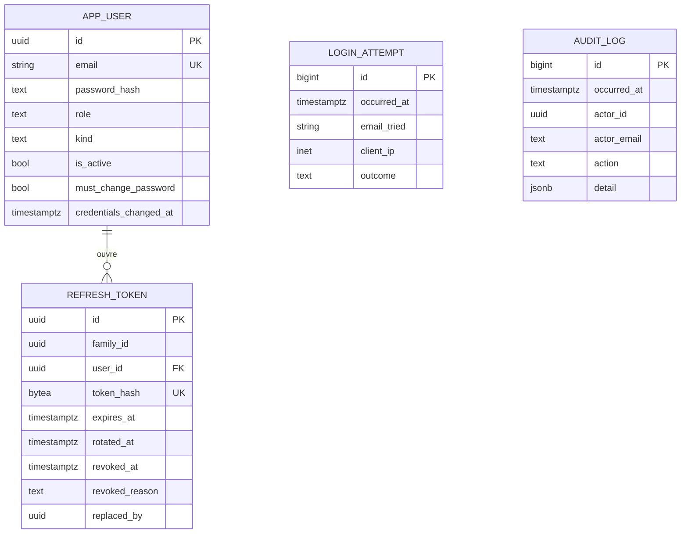

# Données

PostgreSQL 17 avec l'extension TimescaleDB. Le choix, ses alternatives et ses conséquences sont
dans l'[ADR 0001](../adr/0001-postgresql-timescaledb.md), qui fait foi. Ce document décrit le
système qui en découle.

## Ce que couvre ce document

**Dix tables applicatives existent** : quatre pour l'authentification, six pour les données
d'énergie, dont l'hypertable `reading`. Les sections marquées `Fait` relèvent le code. Celles
marquées `Cible` décrivent ce qui n'est pas écrit, au premier rang desquelles la chaîne
d'ingestion, les agrégats continus, la compression et la rétention.

## Trois emplacements, trois rôles

C'est la règle que l'ADR 0001 existe surtout pour fixer. La confondre coûte cher : un script placé
au mauvais endroit ne s'exécute jamais, ou s'exécute deux fois.

| Emplacement | Contenu | Quand ça s'exécute |
|---|---|---|
| `db/init/` | Extensions, bases annexes | **Une seule fois**, à la première initialisation du conteneur, quand `PGDATA` est vide. Ne rejoue jamais |
| `db/migrations/` | SQL versionné qui ne découle pas du schéma applicatif : rétention, compression | À la main, aujourd'hui vide |
| `apps/backend/alembic/` | Le schéma exposé par l'API, et lui seul | `alembic upgrade head`, c'est `Base.metadata` qui fait foi |

Une hypertable relève des deux derniers : **Alembic crée la table, et le `create_hypertable()`
vit dans la même révision**. Les séparer rendrait le schéma irreproductible depuis un seul
`alembic upgrade head`.

Détail de `db/init/` et du piège de montage : [`db/README.md`](../../db/README.md).

## Ce qui existe

Statut : `Fait`.

- `db/init/100-extensions.sql` crée l'extension `timescaledb`.
- `db/init/110-test-database.sql` crée `enervision_test`, dont le nom est attendu en dur par
  `apps/backend/tests/conftest.py`.
- Cinq révisions Alembic. La première, `5353c0e4f094`, **ne crée aucune table** : elle
  établit `alembic_version` et refuse de s'appliquer si l'extension manque :

```sql
IF NOT EXISTS (SELECT 1 FROM pg_extension WHERE extname = 'timescaledb') THEN
    RAISE EXCEPTION 'extension timescaledb absente, voir db/init et db/README.md';
END IF;
```

Cette garde forme paire avec le 503 de `/api/v1/health/ready`. Un bootstrap sauté ne se voit pas
au démarrage de l'API : ces deux gardes le rendent visible tôt, des deux côtés.

Les trois suivantes créent les tables de l'authentification, décrites plus bas : `app_user`,
puis `login_attempt` et `audit_log`, puis `refresh_token`. La cinquième, `e6d2026091501`, crée
les six tables de données décrites en fin de document et déclare l'hypertable `reading`.

## Cycle de vie d'une mesure

Statut : `Cible`, sauf l'hypertable `reading` qui existe. Ni l'ingestion, ni les agrégats
continus, ni la compression, ni la rétention ne sont écrits.



Les lectures de l'API et de Grafana visent l'agrégat continu, pas la table brute : c'est tout
l'intérêt de TimescaleDB, et cela doit rester vrai quand les volumes augmenteront.

## Tables d'authentification

Statut : `Fait`. Elles ne sont pas des séries temporelles et n'ont donc rien à voir avec les
hypertables ; elles vivent dans `apps/backend/alembic/`, qui porte le schéma exposé par l'API.



Quatre choix de modélisation portent une intention et se défendent seuls :

- **`app_user` et non `user`** : `user` est un mot réservé PostgreSQL, raccourci de
  `CURRENT_USER`. Le nom rappelle en prime qu'il s'agit d'un compte applicatif, par opposition
  au rôle PostgreSQL qui portera le cantonnement de l'ETL.
- **`credentials_changed_at`, une seule colonne**, couvre le changement de mot de passe, le
  changement de rôle et la désactivation. Un compteur de version ne dirait rien à un humain qui
  lit un audit.
- **`refresh_token.expires_at` est absolu et hérité** du prédécesseur à chaque rotation. S'il
  glissait, la promesse de sept jours serait fictive et une session active ne finirait jamais.
- **`audit_log.actor_id` n'a aucune clé étrangère**, et `actor_email` comme `actor_role` sont
  dénormalisés. Une contrainte `ON DELETE SET NULL` déclencherait un `UPDATE` que le déclencheur
  d'ajout seul refuserait. Voir l'[ADR 0004](../adr/0004-journal-d-audit-en-ajout-seul.md).

`audit_log` porte deux déclencheurs qui refusent `UPDATE`, `DELETE` et `TRUNCATE`. Elle n'est
donc **pas** une hypertable : une politique de rétention émettrait des `DELETE` qu'ils
refuseraient. `login_attempt`, à l'inverse, est faite pour se purger, puisque son volume est
piloté par l'attaquant.

## Gabarit de révision créant une hypertable

Conforme à la règle de l'ADR 0001 : table et hypertable dans la même révision. La révision
`e6d2026091501` en est l'exemple réel, réduit ici à l'essentiel.

```python
def upgrade() -> None:
    op.create_table(
        "reading",
        sa.Column("reading_id", sa.BigInteger(), autoincrement=True, nullable=False),
        sa.Column("site_id", sa.Text(), nullable=False),
        sa.Column("timestamp", sa.DateTime(timezone=True), nullable=False),
        sa.PrimaryKeyConstraint("reading_id", "timestamp"),
    )
    op.execute(
        "SELECT create_hypertable('reading', by_range('timestamp'), "
        "create_default_indexes => FALSE)"
    )


def downgrade() -> None:
    op.drop_table("reading")
```

La clé primaire inclut la colonne de temps parce que TimescaleDB l'exige : toute contrainte
unique d'une hypertable doit porter la colonne de partitionnement, et une clé sur le seul
`reading_id` serait refusée par `create_hypertable`.

`create_default_indexes => FALSE` écarte l'index que TimescaleDB pose d'office sur la seule
colonne de temps : les index déclarés dans la révision le couvrent déjà.

`drop_table` suffit au retour arrière : supprimer la table supprime l'hypertable et ses partitions.

## Conventions

- **Noms au singulier**, en minuscules, sans préfixe de table : `app_user`, `reading`.
- **Toute colonne de temps en `timestamptz`.** Jamais de `timestamp` nu : une mesure sans fuseau
  devient ininterprétable dès le premier changement d'heure.
- **La colonne de partitionnement entre dans la clé primaire.** Dans `reading` elle s'appelle
  `timestamp` : c'est un nom de colonne, son type reste `timestamptz`.
- **Les politiques de rétention et de compression** vont dans `db/migrations/`, pas dans Alembic :
  elles ne découlent pas du schéma applicatif.
- **Tout modèle doit être importé dans `app/models/__init__.py`**, sans quoi
  `alembic revision --autogenerate` ne le voit pas et génère un `drop` de sa table.

## Questions ouvertes

Elles relèvent du jalon J2, « valider le périmètre retenu ». Le schéma est livré : ce qui suit
porte sur son exploitation, plus sur sa forme.

- **Quelle granularité** à l'ingestion : la seconde, la minute, le quart d'heure.
- **Quels agrégats continus**, et sur quelles fenêtres.
- **Quelle profondeur de rétention** en données brutes, et à partir de quand on compresse.
- **Multi-tenant ou non** : un site appartient-il à un client, et faut-il cloisonner les lectures.

## Modélisation détaillée des données

Cette modélisation prend en compte les fichiers CSV historiques,
leurs métadonnées JSON et les données de l’API Mock.
Elle comprend six tables, depuis le stockage des mesures
jusqu’aux recommandations proposées à l’utilisateur.

### Schéma de données

Le diagramme ci-dessous présente les tables et leurs relations.
La révision `e6d2026091501` les crée.


*Figure : Modélisation des données EnerVision.*

### Description des tables

Chaque table remplit un rôle précis dans le traitement et l’exploitation
des données.

| Table | Rôle | Origine des informations |
|---|---|---|
| `dataset` | Identifier les jeux historiques, retrouver leurs fichiers et conserver leurs métadonnées | Archive CSV/JSON et informations ajoutées lors de l’import |
| `site` | Regrouper les informations des sites : identifiant, nom, type et caractéristiques disponibles | CSV et API Mock `/api/v1/sites` |
| `reading` | Stocker les mesures, leur provenance, leur qualité et les éventuelles valeurs imputées | CSV et API Mock `/current` et `/readings` |
| `prediction` | Conserver les prévisions, leur période cible et la référence du modèle utilisé | Traitements ML d’EnerVision |
| `alert` | Enregistrer les alertes, leur type, leur gravité et leur message | API Mock `/alerts` et détections EnerVision |
| `recommendation` | Proposer des actions et expliquer la règle qui les motive | Règles métier d’EnerVision |

Les anomalies historiques décrites dans les JSON sont conservées
dans `dataset.metadata`. Elles servent à l’analyse des données
et ne sont pas considérées comme des alertes actuelles.

### Relations entre les tables

- Un site possède plusieurs mesures, prévisions et alertes.
- Un jeu de données historique contient plusieurs mesures CSV.
- Les mesures API ne sont pas rattachées à un dataset historique.
- Une alerte peut être associée à une prévision du même site.
- Une alerte peut donner lieu à plusieurs recommandations.
