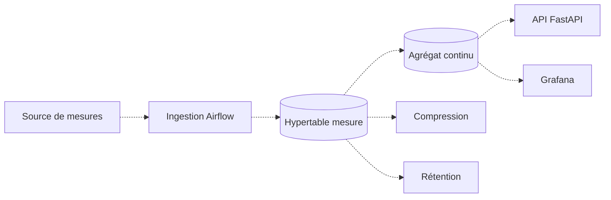
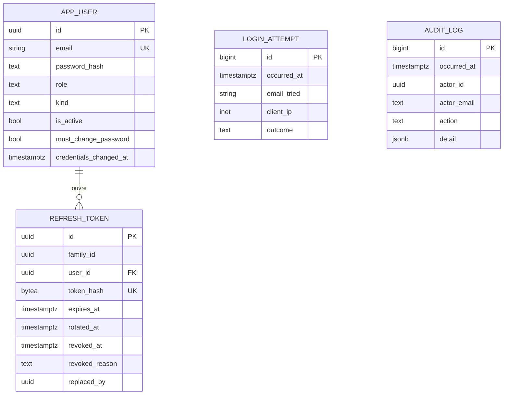
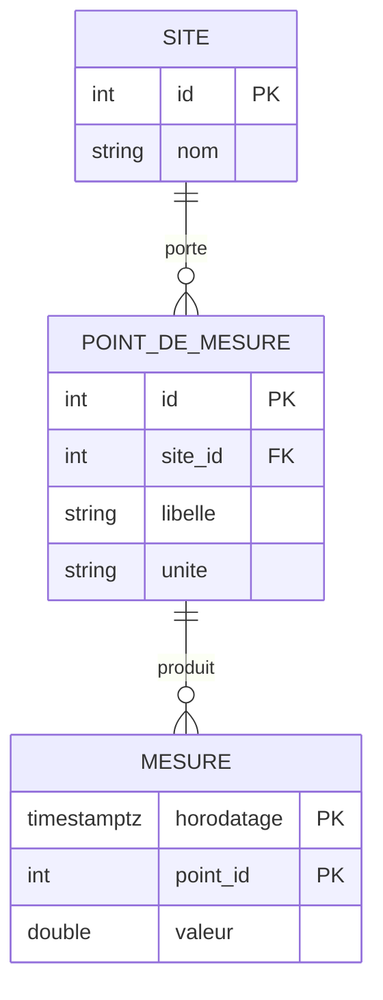

# Données

PostgreSQL 17 avec l'extension TimescaleDB. Le choix, ses alternatives et ses conséquences sont
dans l'[ADR 0001](../adr/0001-postgresql-timescaledb.md), qui fait foi. Ce document décrit le
système qui en découle.

## Avertissement

**Aucune table applicative n'existe à ce jour.** `Base.metadata` est vide, `app/models/` ne
contient qu'un commentaire, l'unique révision Alembic ne crée aucune table, et aucune hypertable
n'a été déclarée. Tout ce qui suit sous le statut `Cible` est une proposition de structure, pas un
relevé du code. Le modèle sera arrêté au jalon J2.

## Trois emplacements, trois rôles

C'est la règle que l'ADR 0001 existe surtout pour fixer. La confondre coûte cher : un script placé
au mauvais endroit ne s'exécute jamais, ou s'exécute deux fois.

| Emplacement | Contenu | Quand ça s'exécute |
|---|---|---|
| `db/init/` | Extensions, bases annexes | **Une seule fois**, à la première initialisation du conteneur, quand `PGDATA` est vide. Ne rejoue jamais |
| `db/migrations/` | SQL versionné qui ne découle pas du schéma applicatif : rétention, compression | À la main, aujourd'hui vide |
| `apps/backend/alembic/` | Le schéma exposé par l'API, et lui seul | `alembic upgrade head`, c'est `Base.metadata` qui fait foi |

Une hypertable relève des deux derniers : **Alembic crée la table, et le `create_hypertable()`
vit dans la même révision**. Les séparer rendrait le schéma irreproductible depuis un seul
`alembic upgrade head`.

Détail de `db/init/` et du piège de montage : [`db/README.md`](../../db/README.md).

## Ce qui existe

Statut : `Fait`.

- `db/init/100-extensions.sql` crée l'extension `timescaledb`.
- `db/init/110-test-database.sql` crée `enervision_test`, dont le nom est attendu en dur par
  `apps/backend/tests/conftest.py`.
- Quatre révisions Alembic. La première, `5353c0e4f094`, **ne crée aucune table** : elle
  établit `alembic_version` et refuse de s'appliquer si l'extension manque :

```sql
IF NOT EXISTS (SELECT 1 FROM pg_extension WHERE extname = 'timescaledb') THEN
    RAISE EXCEPTION 'extension timescaledb absente, voir db/init et db/README.md';
END IF;
```

Cette garde forme paire avec le 503 de `/api/v1/health/ready`. Un bootstrap sauté ne se voit pas
au démarrage de l'API : ces deux gardes le rendent visible tôt, des deux côtés.

Les trois suivantes créent les tables de l'authentification, décrites plus bas : `app_user`,
puis `login_attempt` et `audit_log`, puis `refresh_token`.

## Cycle de vie d'une mesure

Statut : `Cible`. Aucun de ces maillons n'existe.



Les lectures de l'API et de Grafana visent l'agrégat continu, pas la table brute : c'est tout
l'intérêt de TimescaleDB, et cela doit rester vrai quand les volumes augmenteront.

## Tables d'authentification

Statut : `Fait`. Elles ne sont pas des séries temporelles et n'ont donc rien à voir avec les
hypertables ; elles vivent dans `apps/backend/alembic/`, qui porte le schéma exposé par l'API.



Quatre choix de modélisation portent une intention et se défendent seuls :

- **`app_user` et non `user`** : `user` est un mot réservé PostgreSQL, raccourci de
  `CURRENT_USER`. Le nom rappelle en prime qu'il s'agit d'un compte applicatif, par opposition
  au rôle PostgreSQL qui portera le cantonnement de l'ETL.
- **`credentials_changed_at`, une seule colonne**, couvre le changement de mot de passe, le
  changement de rôle et la désactivation. Un compteur de version ne dirait rien à un humain qui
  lit un audit.
- **`refresh_token.expires_at` est absolu et hérité** du prédécesseur à chaque rotation. S'il
  glissait, la promesse de sept jours serait fictive et une session active ne finirait jamais.
- **`audit_log.actor_id` n'a aucune clé étrangère**, et `actor_email` comme `actor_role` sont
  dénormalisés. Une contrainte `ON DELETE SET NULL` déclencherait un `UPDATE` que le déclencheur
  d'ajout seul refuserait. Voir l'[ADR 0004](../adr/0004-journal-d-audit-en-ajout-seul.md).

`audit_log` porte deux déclencheurs qui refusent `UPDATE`, `DELETE` et `TRUNCATE`. Elle n'est
donc **pas** une hypertable : une politique de rétention émettrait des `DELETE` qu'ils
refuseraient. `login_attempt`, à l'inverse, est faite pour se purger, puisque son volume est
piloté par l'attaquant.

## Modèle métier

Statut : `Cible`. Les entités ci-dessous sont des **candidates**, à valider en J2. Elles
s'appuient sur les gabarits de [`apps/backend/TESTING.md`](../../apps/backend/TESTING.md), qui
évoquent déjà un modèle `Site`, un `SiteRepository` et un `ConsumptionService` exposant un
`total_kwh(site_id)`.



`MESURE` est la table destinée à devenir une hypertable, partitionnée sur `horodatage`. Sa clé
primaire doit inclure la colonne de temps : TimescaleDB l'exige, une clé sur le seul identifiant
de point serait refusée.

## Gabarit de révision créant une hypertable

Conforme à la règle de l'ADR 0001 : table et hypertable dans la même révision.

```python
def upgrade() -> None:
    op.create_table(
        "mesure",
        sa.Column("horodatage", sa.DateTime(timezone=True), nullable=False),
        sa.Column("point_id", sa.Integer(), sa.ForeignKey("point_de_mesure.id"), nullable=False),
        sa.Column("valeur", sa.Float(), nullable=False),
        sa.PrimaryKeyConstraint("horodatage", "point_id"),
    )
    op.execute("SELECT create_hypertable('mesure', by_range('horodatage'))")


def downgrade() -> None:
    op.drop_table("mesure")
```

`drop_table` suffit au retour arrière : supprimer la table supprime l'hypertable et ses partitions.

## Conventions

- **Noms au singulier**, en minuscules, sans préfixe de table.
- **Toute colonne de temps en `timestamptz`.** Jamais de `timestamp` nu : une mesure sans fuseau
  devient ininterprétable dès le premier changement d'heure.
- **La colonne de partitionnement s'appelle `horodatage`** et entre dans la clé primaire.
- **Les politiques de rétention et de compression** vont dans `db/migrations/`, pas dans Alembic :
  elles ne découlent pas du schéma applicatif.
- **Tout modèle doit être importé dans `app/models/__init__.py`**, sans quoi
  `alembic revision --autogenerate` ne le voit pas et génère un `drop` de sa table.

## Questions ouvertes

Elles relèvent du jalon J2, « valider le périmètre retenu », et bloquent le modèle définitif.

- **Quelles sources de mesures**, et selon quel protocole elles sont collectées.
- **Quelle granularité** à l'ingestion : la seconde, la minute, le quart d'heure.
- **Quels agrégats continus**, et sur quelles fenêtres.
- **Quelle profondeur de rétention** en données brutes, et à partir de quand on compresse.
- **Quelles unités** sont manipulées, et si une même table les mélange.
- **Multi-tenant ou non** : un site appartient-il à un client, et faut-il cloisonner les lectures.
