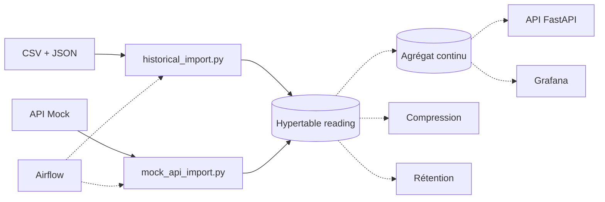
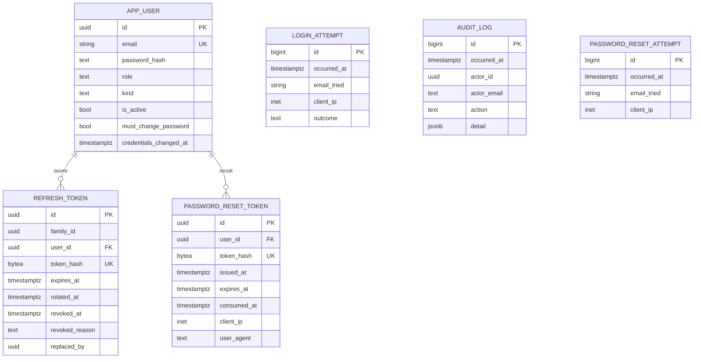
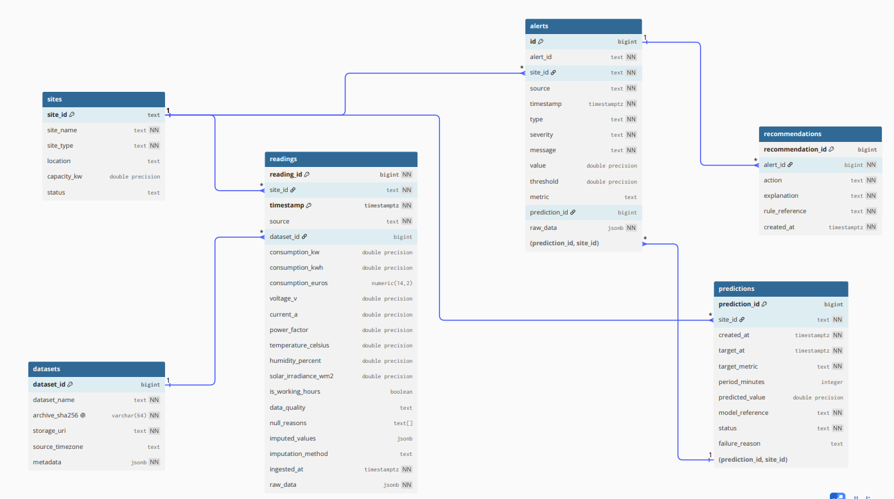

# Données

PostgreSQL 17 avec l'extension TimescaleDB. Le choix, ses alternatives et ses conséquences sont
dans l'[ADR 0001](../adr/0001-postgresql-timescaledb.md), qui fait foi. Ce document décrit le
système qui en découle.

## Ce que couvre ce document

**Douze tables applicatives existent** : six pour l'authentification et six pour les données
d'énergie, dont l'hypertable `reading`.

Les sections marquées `Fait` relèvent du code déjà implémenté. Les sections marquées `Cible`
décrivent les éléments prévus mais pas encore réalisés.

L'ingestion des **mesures** est implémentée pour les deux sources du MVP, le dataset CSV/JSON et
l'API Mock. Celle des **alertes** de l'API Mock, `/alerts`, reste à faire : voir
l'[ADR 0006](../adr/0006-moteur-de-regles-dans-le-backend.md). Les alertes `source='enervision'`,
elles, sont produites par la détection interne, désormais ordonnancée par le DAG Airflow `alertes`
(issue #116). L'orchestration de l'ingestion, les agrégats continus, la compression et la
rétention restent des cibles.

## Trois emplacements, trois rôles

C'est la règle que l'ADR 0001 existe surtout pour fixer. La confondre coûte cher : un script placé
au mauvais endroit ne s'exécute jamais, ou s'exécute deux fois.

| Emplacement | Contenu | Quand ça s'exécute |
|---|---|---|
| `db/init/` | Extensions, bases annexes | **Une seule fois**, à la première initialisation du conteneur, quand `PGDATA` est vide. Ne rejoue jamais |
| `db/migrations/` | SQL versionné qui ne découle pas du schéma applicatif : rétention, compression | À la main, aujourd'hui vide |
| `apps/backend/alembic/` | Le schéma exposé par l'API, et lui seul | `alembic upgrade head`, c'est `Base.metadata` qui fait foi |

Une hypertable relève des deux derniers : **Alembic crée la table, et le `create_hypertable()`
vit dans la même révision**. Les séparer rendrait le schéma irreproductible depuis un seul
`alembic upgrade head`.

Détail de `db/init/` et du piège de montage : [`db/README.md`](../../db/README.md).

## Ce qui existe

Statut : `Fait`.

- `db/init/100-extensions.sql` crée l'extension `timescaledb`.
- `db/init/110-test-database.sql` crée `enervision_test`, dont le nom est attendu en dur par
  `apps/backend/tests/conftest.py`.
- Six révisions Alembic sont actuellement appliquées.
- La première, `5353c0e4f094`, **ne crée aucune table** : elle établit `alembic_version`
  et refuse de s'appliquer si l'extension TimescaleDB manque.
- Les révisions suivantes créent les tables liées à l'authentification :
  `app_user`, `login_attempt`, `audit_log` et `refresh_token`.
- La révision `e6d2026091501` crée six des sept tables Data et déclare l'hypertable `reading`.
- La révision `d3f1a2b7c904` ajoute `drift_report`, la septième.
- La révision `c0adab96238c` ajoute les tables `password_reset_attempt`
  et `password_reset_token`.

La garde de la première migration est :

```sql
IF NOT EXISTS (SELECT 1 FROM pg_extension WHERE extname = 'timescaledb') THEN
    RAISE EXCEPTION 'extension timescaledb absente, voir db/init et db/README.md';
END IF;
```

Cette garde forme paire avec le 503 de `/api/v1/health/ready`. Un bootstrap sauté ne se voit pas
au démarrage de l'API : ces deux gardes le rendent visible tôt, des deux côtés.

## Cycle de vie d'une mesure

Statut : `Partiellement fait`.

Les mécanismes d'ingestion sont maintenant implémentés pour les deux sources de données du MVP :

- le dataset historique CSV/JSON avec `historical_import.py` ;
- l'API Mock avec `mock_api_import.py`.

Les traitements sont actuellement exécutables directement depuis le backend.

L'orchestration avec Apache Airflow reste une cible, tout comme les agrégats continus,
la compression et les politiques de rétention.



Les flèches pleines représentent les traitements actuellement implémentés.

Les flèches pointillées représentent les éléments encore prévus comme cibles.

Les lectures de l'API et de Grafana viseront l'agrégat continu, pas la table brute : c'est tout
l'intérêt de TimescaleDB, et cela doit rester vrai quand les volumes augmenteront.

## Tables d'authentification

Statut : `Fait`.

Elles ne sont pas des séries temporelles et n'ont donc rien à voir avec les hypertables ;
elles vivent dans `apps/backend/alembic/`, qui porte le schéma exposé par l'API.



Six choix de modélisation portent une intention et se défendent seuls :

- **`app_user` et non `user`** : `user` est un mot réservé PostgreSQL, raccourci de
  `CURRENT_USER`. Le nom rappelle en prime qu'il s'agit d'un compte applicatif, par opposition
  au rôle PostgreSQL qui portera le cantonnement de l'ETL.
- **`credentials_changed_at`, une seule colonne**, couvre le changement de mot de passe, le
  changement de rôle et la désactivation. Un compteur de version ne dirait rien à un humain qui
  lit un audit.
- **`refresh_token.expires_at` est absolu et hérité** du prédécesseur à chaque rotation. S'il
  glissait, la promesse de sept jours serait fictive et une session active ne finirait jamais.
- **`audit_log.actor_id` n'a aucune clé étrangère**, et `actor_email` comme `actor_role` sont
  dénormalisés. Une contrainte `ON DELETE SET NULL` déclencherait un `UPDATE` que le déclencheur
  d'ajout seul refuserait. Voir l'[ADR 0004](../adr/0004-journal-d-audit-en-ajout-seul.md).
- **`password_reset_token` ne stocke que l'empreinte du jeton**, jamais sa valeur. Une fuite de
  la table ne donne donc rien à rejouer.
- **`password_reset_attempt` est séparée de `audit_log`** : son volume est piloté par le
  demandeur, comme celui de `login_attempt`, donc elle doit pouvoir se purger.

`audit_log` porte deux déclencheurs qui refusent `UPDATE`, `DELETE` et `TRUNCATE`. Elle n'est
donc **pas** une hypertable : une politique de rétention émettrait des `DELETE` qu'ils
refuseraient. `login_attempt`, à l'inverse, est faite pour se purger, puisque son volume est
piloté par l'attaquant.

## Gabarit de révision créant une hypertable

Conforme à la règle de l'ADR 0001 : table et hypertable dans la même révision.

La révision `e6d2026091501` en est l'exemple réel, réduit ici à l'essentiel.

```python
def upgrade() -> None:
    op.create_table(
        "reading",
        sa.Column("reading_id", sa.BigInteger(), autoincrement=True, nullable=False),
        sa.Column("site_id", sa.Text(), nullable=False),
        sa.Column("timestamp", sa.DateTime(timezone=True), nullable=False),
        sa.PrimaryKeyConstraint("reading_id", "timestamp"),
    )
    op.execute(
        "SELECT create_hypertable('reading', by_range('timestamp'), "
        "create_default_indexes => FALSE)"
    )


def downgrade() -> None:
    op.drop_table("reading")
```

La clé primaire inclut la colonne de temps parce que TimescaleDB l'exige : toute contrainte
unique d'une hypertable doit porter la colonne de partitionnement, et une clé sur le seul
`reading_id` serait refusée par `create_hypertable`.

`create_default_indexes => FALSE` écarte l'index que TimescaleDB pose d'office sur la seule
colonne de temps : les index déclarés dans la révision le couvrent déjà.

`drop_table` suffit au retour arrière : supprimer la table supprime l'hypertable et ses partitions.

## Conventions

- **Noms au singulier**, en minuscules, sans préfixe de table : `app_user`, `reading`.
- **Toute colonne de temps en `timestamptz`.** Jamais de `timestamp` nu : une mesure sans fuseau
  devient ininterprétable dès le premier changement d'heure.
- **La colonne de partitionnement entre dans la clé primaire.** Dans `reading` elle s'appelle
  `timestamp` : c'est un nom de colonne, son type reste `timestamptz`.
- **Les politiques de rétention et de compression** vont dans `db/migrations/`, pas dans Alembic :
  elles ne découlent pas du schéma applicatif.
- **Tout modèle doit être importé dans `app/models/__init__.py`**, sans quoi
  `alembic revision --autogenerate` ne le voit pas et génère un `drop` de sa table.

## Questions ouvertes

Elles relèvent du jalon J2, « valider le périmètre retenu ». Le schéma et l'ingestion sont
livrés : ce qui suit porte sur leur exploitation, plus sur leur forme.

- **Quelle granularité** conserver à long terme à l'ingestion : seconde, minute ou quart d'heure.
- **Quels agrégats continus** créer et sur quelles fenêtres.
- **Quelle profondeur de rétention** conserver en données brutes et à partir de quand compresser.
- **Multi-tenant ou non** : un site appartient-il à un client et faut-il cloisonner les lectures.

## Modélisation détaillée des données

Cette modélisation prend en compte :

- les fichiers CSV historiques ;
- leurs métadonnées JSON ;
- les données de l'API Mock.

Elle comprend sept tables Data, depuis le stockage des mesures jusqu'aux recommandations
proposées à l'utilisateur, et jusqu'au suivi de la dérive du modèle.

### Schéma de données

Le diagramme ci-dessous présente les tables et leurs relations.

La révision `e6d2026091501` les crée.



*Figure : Modélisation des données EnerVision.*

### Description des tables

Chaque table remplit un rôle précis dans le traitement et l'exploitation des données.

| Table | Rôle | Origine des informations |
|---|---|---|
| `dataset` | Identifier les jeux historiques, retrouver leurs fichiers et conserver leurs métadonnées | Archive CSV/JSON et informations ajoutées lors de l'import |
| `site` | Regrouper les informations des sites : identifiant, nom, type et caractéristiques disponibles | CSV et API Mock `/api/v1/sites` |
| `reading` | Stocker les mesures, leur provenance, leur qualité et les éventuelles valeurs imputées | CSV et API Mock `/current` et `/readings` |
| `prediction` | Conserver les prévisions, leur période cible et la référence du modèle utilisé | Traitements ML d'EnerVision |
| `alert` | Enregistrer les alertes, leur type, leur gravité et leur message | API Mock `/alerts` et détections EnerVision |
| `recommendation` | Proposer des actions et expliquer la règle qui les motive | Règles métier d'EnerVision |
| `drift_report` | Suivre l'écart entre prévisions et réalisé, par site et tous sites confondus | Surveillance de dérive d'EnerVision |

Le scoring (`ml_score`) charge le modèle depuis un fichier local (`models/lightgbm-consumption.txt`)
et trace son empreinte SHA-256 dans `prediction.model_reference`. Il ne lit aucune version depuis
le Model Registry MLflow (`ml/`) : ce registre sert aujourd'hui à la traçabilité des
entraînements, pas au déploiement du modèle de scoring.
Les anomalies historiques décrites dans les JSON sont conservées dans `dataset.metadata`.

Elles servent à l'analyse des données et ne sont pas considérées comme des alertes actuelles.

Les lignes de `drift_report` sont écrites par `app.monitoring.drift`, ordonnancé par le DAG
`derive`. Une ligne dont le `site_id` est `NULL` porte le résultat global, tous sites confondus :
c'est pourquoi l'unicité passe par un index sur `coalesce(site_id, '')` et non par une contrainte,
qui ne dédoublonnerait jamais deux lignes globales. Le calcul, ses seuils et ce qu'il refuse de
comparer sont dans l'[ADR 0013](../adr/0013-surveillance-de-derive-dans-le-backend.md).

Les lignes de `recommendation` sont écrites par le moteur de règles du backend
(`app/services/recommendation_rules.py`), déclenché par `POST /api/v1/recommendations/generate`,
par `make recommendations`, ou par la seconde tâche du DAG `alertes`, à partir des alertes déjà en
base. Le couple `(alert_id, rule_reference)` est unique : rejouer le moteur sur les mêmes alertes
n'ajoute aucune ligne.

### Relations entre les tables

- Un site possède plusieurs mesures, prévisions et alertes.
- Un jeu de données historique contient plusieurs mesures CSV.
- Les mesures API ne sont pas rattachées à un dataset historique.
- Une alerte peut être associée à une prévision du même site.
- Une alerte peut donner lieu à plusieurs recommandations.
- Un site possède plusieurs rapports de dérive ; un rapport global n'est rattaché à aucun site.

## Ingestion des données historiques

Statut : `Fait`.

Le MVP EnerVision initialise les données énergétiques à partir du dataset fourni dans le cadre
du projet.

Le dataset de référence contient 122 647 mesures issues de 7 sites et couvre la période
du 1er janvier 2023 au 31 décembre 2024.

Les fichiers sources CSV et JSON sont nécessaires uniquement pour l'initialisation des données.

Ils ne sont pas versionnés dans Git et sont placés localement dans `data/raw/`.

### Architecture du flux historique

```text
Dataset CSV + métadonnées JSON
              |
              v
     historical_import.py
              |
       +------+------+
       |             |
       v             v
   Validation     SHA-256
       |          Traçabilité
       +------+------+
              |
              v
      Normalisation
      + qualité data
              |
              v
    Chargement par batches
              |
              v
 PostgreSQL / TimescaleDB
       |      |       |
       v      v       v
    dataset  site   reading
```

Le pipeline est développé en Python.

Pandas est utilisé pour l'extraction, la validation et la préparation des données.

SQLAlchemy Async assure le chargement transactionnel dans PostgreSQL/TimescaleDB.

Une empreinte SHA-256 permet d'identifier le dataset utilisé et d'assurer sa traçabilité.

Les valeurs manquantes sont conservées pendant l'ingestion afin de préserver les données sources.

Aucune imputation n'est réalisée à cette étape.

Le chargement des mesures est effectué par batches de 1 000 lignes.

Les données provenant du dataset CSV sont identifiées par :

```text
source = "csv"
dataset_id = identifiant du dataset
```

### Résultats validés pour l'historique

Le chargement de référence a permis d'obtenir :

- 1 dataset ;
- 7 sites ;
- 122 647 mesures ;
- 0 doublon détecté dans le dataset source.

L'idempotence a également été vérifiée par une deuxième exécution du pipeline :
aucune nouvelle mesure n'a été créée et le nombre de `reading` est resté à 122 647.

La procédure détaillée d'installation, d'exécution, de validation et de contrôle du pipeline
est disponible dans `etl/README.md`.

## Ingestion depuis l'API Mock

Statut : `Fait`.

La deuxième source du pipeline Data est l'API Mock EnerVision.

Le traitement est implémenté dans :

```text
apps/backend/app/etl/mock_api_import.py
```

### Endpoints utilisés

Le pipeline récupère les informations des sites depuis :

```text
GET /api/v1/sites
```

puis les mesures historiques simulées depuis :

```text
GET /api/v1/readings
```

Pour `/api/v1/readings`, les informations suivantes sont envoyées :

```text
site_id
start_time
end_time
limit
```

Les paramètres de ligne de commande disponibles pour l'import sont :

```text
--start-time
--end-time
--dry-run
```

**Piège sur `limit`, corrigé dans le code plutôt que documenté** : l'API ne renvoie pas un flux à
un rythme naturel, elle répartit exactement `limit` lectures, espacées uniformément, sur toute la
fenêtre `[start_time, end_time)` demandée, la première au tout début de la fenêtre (vérifié
empiriquement en interrogeant directement l'API). Une fenêtre d'une heure avec `limit=1000`, le
réglage d'origine, renvoyait donc 1000 lectures espacées de 3,6 secondes à l'intérieur de cette
heure, pas une lecture horaire, incompatible avec les lags positionnels de `build_features`.
Plutôt que documenter la règle « `limit` = nombre d'heures de la fenêtre » et compter sur chaque
appelant pour la respecter, `limit_for_window()` la porte : `import_mock_api_history()` calcule
`limit` depuis la fenêtre reçue, refuse une fenêtre dont `start_time` ne tombe pas pile sur
l'heure (c'est elle qui ancre l'alignement), et refuse un intervalle de plus de 1000 heures (le
plafond `limit` de l'API). `--limit` n'existe donc plus côté CLI. Deux formes de fenêtre sont
gérées : un multiple entier d'heures (`limit` = ce nombre d'heures, une lecture par heure
espacée d'1h pile, chemin du backfill manuel) ou une fenêtre plus courte qu'une heure, ou qui
n'en est pas un multiple entier (`limit=1`, seule valeur qui reste alignée quand l'espacement
`durée / limit` ne peut valoir 1h pile). Le DAG `mock_api_import` est dans ce second cas : il
demande la fenêtre `[heure pile précédant le déclenchement, instant du déclenchement)`, plus
courte qu'une heure, plutôt que l'intervalle Airflow `[data_interval_start, data_interval_end)`
tel quel (`[:45, :45)`) qui aurait placé l'unique lecture à :45, hors de la grille horaire du
reste du schéma.

### Flux d'ingestion API Mock

```text
        API Mock
           |
     +-----+------+
     |            |
     v            v
   /sites      /readings
     |            |
     +-----+------+
           |
           v
 mock_api_import.py
           |
           v
 Transformation
 + qualité data
           |
           v
PostgreSQL / TimescaleDB
     |          |
     v          v
   site       reading
```

Les informations des sites sont insérées ou mises à jour dans `site`.

Les mesures sont enregistrées dans l'hypertable `reading` avec :

```text
source = "api_history"
dataset_id = NULL
```

Les données provenant de l'API Mock ne sont donc pas associées à un enregistrement de la table
`dataset`.

La réponse source reçue depuis l'API est conservée dans :

```text
raw_data
```

### Frontière de confiance avec l'API Mock

L'API Mock de l'école n'a aucune authentification et expose un endpoint mutatif à quiconque. Sa
réponse est donc traitée comme une entrée hostile, conformément à API10 dans
[la traçabilité OWASP](owasp-traceabilite.md). Le risque premier n'est pas la fausse alerte,
c'est l'empoisonnement du jeu d'entraînement du modèle de prédiction.

Cinq garde-fous, tous dans `mock_api_import.py` :

| Garde-fou | Mise en œuvre |
|---|---|
| Timeout | `APP_MOCK_API_TIMEOUT_SECONDS`, dix secondes par défaut |
| Taille de tableau plafonnée | `MAX_SITES` sites, et au plus `--limit` mesures par site |
| Bornes physiques | `PHYSICAL_BOUNDS`, une plage par grandeur |
| Frontière d'anti-corruption | `build_site_row()` et `build_reading_row()`, qui ne recopient que les champs attendus |
| Refus de recouvrir l'historique | `refuse_if_overlaps_historical_dataset()`, voir ci-dessous |

Une valeur hors bornes, d'un type inattendu, `NaN` ou infinie devient `NULL`. Elle laisse sa
trace dans `null_reasons` sous la forme `out_of_physical_bounds:<colonne>`, et `data_quality`
descend à `degraded`. Une `data_quality` que `ck_reading_quality` refuserait devient `NULL`
plutôt que de faire échouer le lot entier. Dans tous les cas `raw_data` conserve la réponse
d'origine intacte : rien n'est perdu, seule son exploitation est bornée.

Le plafond de taille s'applique après désérialisation de la réponse. Borner le corps HTTP
lui-même demanderait une lecture en flux, et reste à faire.

### Réconciliation entre les deux sources (issue #15)

`historical_import` (source `csv`) et `mock_api_import` (source `api_history`) écrivent toutes
deux dans `reading`. Trois décisions ferment cette réconciliation :

- **Le trou temporel est accepté.** Le dataset historique s'arrête au 31/12/2024, et
  `mock_api_import` n'importe que l'heure précédant chaque déclenchement : rien ne comble
  automatiquement la période intermédiaire, et rien ne le pourra jamais, aucune mesure réelle
  n'existe pour ces instants. Conséquence pour le ML, pas nouvelle mais que ce trou rend
  définitive : `build_features()` calcule ses lags par `shift(n)` positionnel, et `train.py`
  n'écarte que les lignes où `lag_168h` est `NaN`. Pour un site présent dans les deux sources, les
  168 premières lectures `api_history` qui suivent le trou héritent donc de lags et de moyennes
  glissantes calculés sur décembre 2024 (et tant que l'ingestion a moins de 7 jours, c'est le cas
  de toutes les lectures). Même effet, plus ponctuel, pour chaque heure que le DAG manque
  (`mock_api_import` en échec, Airflow arrêté). Aucun garde-fou ne détecte aujourd'hui un lag
  calculé sur un écart réel différent de celui attendu ; issue de suivi à ouvrir.
- **Le recouvrement est refusé à l'ingestion.** `uq_reading_source` autorise deux lignes au même
  `(site_id, timestamp)` dès que `source` diffère : rien dans le schéma n'empêche donc un import
  Mock API manuel avec une fenêtre passée (le script accepte `--start-time`/`--end-time`
  arbitraires) de dupliquer un point déjà couvert par le CSV. `import_mock_api_history()` appelle
  `refuse_if_overlaps_historical_dataset()` avant toute écriture, y compris en `--dry-run` (le
  contrôle est en lecture seule) et avant le moindre appel à l'API Mock : si la fenêtre demandée
  recouvre au moins une lecture `source='csv'`, l'import est refusé (`ValueError`) plutôt que
  d'écrire un doublon inter-source silencieux. Le contrôle ne porte que sur la fenêtre demandée,
  pas sur les lectures reçues : `fetch_readings()` écarte donc toute lecture dont le `timestamp`
  déborde de `[start_time, end_time)`, pour qu'une réponse hors fenêtre (bug du mock, ou hostile)
  ne puisse pas le contourner. Ce contrôle compare des instants, pas des chaînes : `parse_datetime()`
  pose `tzinfo=UTC` sur une entrée sans fuseau (même pattern que `_vers_utc()` dans
  `app/services/reading.py`), sans quoi l'encodeur `timestamptz` d'asyncpg lirait un datetime naïf
  dans le fuseau local du **processus**, correct dans le conteneur Airflow (UTC) mais décalé pour
  un import manuel lancé depuis un poste en Europe/Paris.
- **Le pipeline ML déduplique en défense.** Le garde-fou ci-dessus protège l'ingestion, pas
  la lecture : si un recouvrement se produisait malgré tout (import direct en base, contournement
  du script), `ml/enervision_ml/data.py` ne doit pas casser silencieusement l'hypothèse de
  `build_features` (« une ligne par `(site_id, timestamp)` »). `load_from_database()` et
  `load_recent_from_database()` utilisent donc `SELECT DISTINCT ON (site_id, timestamp)`, `source
  = 'csv'` gagnant sur `'api_history'` en cas d'égalité, l'historique étant une source vérifiée,
  l'API Mock une entrée hostile (cf. ci-dessus). **Cette préférence est spécifique au chargeur
  ML.** `GET /readings` renvoie les deux lignes sans les fusionner, et `DriftRepository` /
  `ReadingRepository.latest_by_site()` / `.latest_for_site()` départagent par `reading_id` le plus
  grand (en pratique la ligne insérée en dernier, pas forcément `csv`) : en cas de recouvrement, la
  dérive comparerait alors une prévision à une valeur différente de celle sur laquelle le modèle a
  appris. Pas d'incohérence aujourd'hui tant que le recouvrement reste refusé à l'ingestion ; à
  aligner si ce garde-fou devait un jour être contourné.

### Qualité des données de l'API Mock

Les valeurs `NULL` ne sont pas remplacées pendant l'ingestion.

Les informations suivantes fournies par l'API sont conservées :

```text
data_quality
null_reasons
```

Cette conservation permet de distinguer une valeur manquante d'une valeur réelle égale à zéro
et de garder les informations liées aux éventuelles défaillances de capteurs.

Aucune imputation n'est réalisée pendant cette phase :

```text
imputed_values = NULL
imputation_method = NULL
```

### Validation de l'import API Mock

Un scénario de validation a été exécuté pour les 7 sites sur la période :

```text
15/06/2024 12:00 UTC
à
15/06/2024 13:00 UTC
```

avec :

```text
limit = 60
```

Résultat :

```text
7 sites
60 lectures par site
420 lectures récupérées
```

Les données ont été chargées dans PostgreSQL/TimescaleDB puis contrôlées directement en base.

Les contrôles ont confirmé :

- `source = "api_history"` ;
- `dataset_id = NULL` ;
- la conservation des valeurs `NULL` ;
- la conservation de `data_quality` ;
- la conservation de `null_reasons` ;
- la conservation de `raw_data`.

L'idempotence a été vérifiée en rejouant le même import.

Une mesure déjà présente n'est pas ajoutée une seconde fois.

Les tests automatisés couvrent également :

- la récupération des sites ;
- les paramètres envoyés à `/api/v1/readings` ;
- les réponses HTTP en erreur ;
- le format de la réponse ;
- la transformation des mesures ;
- les valeurs manquantes ;
- la qualité des données ;
- la conservation des données sources ;
- l'idempotence en base.

## Évolution prévue

La prochaine étape consiste à orchestrer les deux mécanismes d'ingestion avec Apache Airflow.

```text
CSV / JSON ----------------+
                           |
                           v
                 +------------------+
                 |     Airflow      |
                 +------------------+
                           |
          +----------------+----------------+
          |                                 |
          v                                 v
historical_import.py               mock_api_import.py
          |                                 |
          +----------------+----------------+
                           |
                           v
                PostgreSQL / TimescaleDB
```

Airflow servira à :

- planifier les traitements ;
- définir leur ordre d'exécution ;
- suivre leur état ;
- gérer et remonter les erreurs ;
- faciliter les exécutions récurrentes.

Airflow ne remplacera pas la logique ETL déjà implémentée.

Les scripts Python resteront responsables de l'extraction, de la validation, de la transformation
et du chargement des données.

Le pipeline servira ensuite de base à la préparation des données nécessaires au modèle
de Machine Learning.
