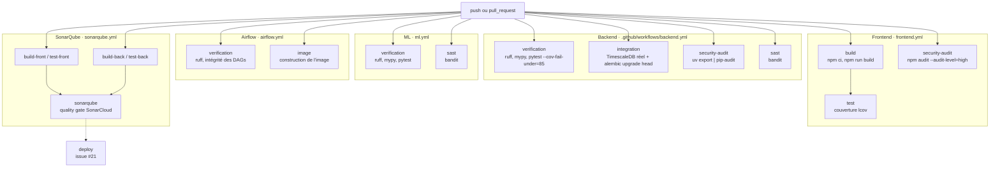

# Intégration et livraison continues

Ce document décrit la chaîne qui s'exécute entre un `git push` et un merge autorisé : ce qui est
vérifié, ce qui bloque, et ce qui ne l'est pas.

| Étage | Sert à | Statut |
|---|---|---|
| Intégration continue | Interdire le merge d'un code qui casse la qualité, les tests ou la sécurité | `Fait` |
| Livraison continue | Porter un artefact vérifié jusqu'à la machine de déploiement | `Cible` |

Le **D** de CI/CD n'existe pas encore : aucun job de déploiement, aucune construction d'image
publiée, aucun environnement GitHub. L'issue #21 le porte. C'est la limite principale de cet
étage, et elle est nommée ici plutôt que découverte en soutenance.

## Vue d'ensemble

## Déclenchement

Les cinq workflows se déclenchent sur `push` **et** sur `pull_request`, filtrés par **chemin** :
`backend.yml` sur `apps/backend/**`, `frontend.yml` sur `apps/frontend/**`, `ml.yml` sur `ml/**`,
`airflow.yml` sur `etl/airflow/**` **et sur `ml/**`**, chacun incluant son propre fichier de
workflow dans le filtre pour qu'une modification du pipeline déclenche le pipeline.

Le filtre d'`airflow.yml` mérite un mot : il inclut `ml/pyproject.toml`, `ml/uv.lock` et
`ml/enervision_ml/**` parce que l'image Airflow copie le code et les dépendances du module ML.
Une modification de `ml/` peut donc casser la construction de cette image, et le filtre le voit.

**Piège à connaître** : il n'y a **aucun filtre de branche**. Une branche de travail déclenche la
CI complète à chaque push, et un merge vers n'importe quelle branche la déclenche aussi. C'est
délibéré pendant le projet (retour au plus tôt, et la CI tournera sur `main` dès la remontée sans
rien changer), mais ce serait à borner sur un dépôt à forte fréquence de push.

`backend.yml`, `ml.yml` et `airflow.yml` déclarent en plus un groupe de concurrence par référence
git avec `cancel-in-progress`, ce qui annule un run devenu obsolète par un push plus récent.

**Piège de version** : `etl/airflow` tourne en **Python 3.12** et non 3.14, parce qu'Airflow 2.10
ne supporte pas encore 3.14. Le 3.14 du module ML ne vit, dans ce contexte, que dans l'image
Docker et son propre environnement.

## Ce qui bloque un merge

| Gate | Où | Seuil | Effet d'un échec |
|---|---|---|---|
| Formatage `ruff format --check` | backend, ml | zéro écart | Bloque |
| Analyse statique `ruff check` | backend, ml | zéro constat | Bloque |
| Typage `mypy` | backend (`app`), ml (strict) | zéro erreur | Bloque |
| Tests unitaires `pytest` | backend, ml | **`--cov-fail-under=85`** côté backend | Bloque |
| Tests d'intégration | backend | marqueur `integration`, base réelle | Bloque |
| Audit de dépendances `pip-audit` | backend | sur le **verrou figé** | Bloque |
| Audit de dépendances `npm audit` | frontend | `--audit-level=high` | Bloque |
| **SAST `bandit`** | backend (`app`), ml (`enervision_ml`) | **MEDIUM et au-dessus** | Bloque |
| Quality gate SonarCloud | tout le dépôt | gate par défaut, couverture du **code neuf** | Bloque |
| Build `npm run build` | frontend | compilation | Bloque |
| Intégrité des DAGs | airflow | chargement des DAGs sans erreur d'import | Bloque |
| Construction de l'image Airflow | airflow | `docker build` de `etl/airflow/Dockerfile` | Bloque |

Deux seuils portent une décision qu'il faut savoir défendre :

- **`npm audit --audit-level=high`** et non `moderate` : une vulnérabilité modérée dans une
  dépendance de développement ne doit pas immobiliser une livraison. Le corollaire est que les
  `moderate` sont invisibles en CI, et qu'elles se regardent à la main.
- **Bandit bloque à partir de MEDIUM**, et une seconde passe sans seuil publie les constats LOW
  sans bloquer. Sans cette seconde passe, un constat LOW disparaîtrait du journal sans trace. Au
  21/09/2026, les deux modules sont à **zéro constat, tous niveaux confondus**, sur 5 904 lignes
  analysées.

## Le job d'intégration, et pourquoi il ne suffisait pas d'un `postgres`

`backend.yml` monte un service `timescale/timescaledb-ha:pg17`, **la même image que
`docker-compose.yml`**, et non une image `postgres` nue. La première migration s'arrête
volontairement si l'extension TimescaleDB manque : un écart d'image entre la CI et le poste
rendrait ce job vert sur une base qui n'est pas la nôtre.

Sur le poste, c'est `db/init/110-test-database.sql` qui pose l'extension. Ce fichier n'est pas
monté dans le service GitHub Actions, d'où l'étape `CREATE EXTENSION IF NOT EXISTS timescaledb`
avant `alembic upgrade head`.

La couverture est **désactivée** sur ce job (`pytest -m integration --no-cov`) : il ne joue qu'une
partie de la suite, et son taux n'aurait aucun sens face au seuil de 85 %.

## SonarCloud, et l'incident qui a immobilisé trois PR

Le workflow `sonarqube.yml` exécute quatre jobs de préparation (`build-front`, `test-front`,
`build-back`, `test-back`) qui produisent chacun un rapport de couverture en artefact, puis un
cinquième job qui les télécharge et lance `SonarSource/sonarqube-scan-action@v8` avec le secret
`SONAR_TOKEN`. Le périmètre est décrit par `sonar-project.properties` à la racine.

**L'incident, à raconter tel quel.** Les 18 et 19 septembre, trois PR (#103, #105, #107) sont
restées bloquées sur une quality gate rouge annonçant une couverture du code neuf à 0 %, alors que
la couverture globale du backend dépassait 87 %. Le diagnostic était **hors du code de ces PR** :
`sonar.test.inclusions` ne reconnaissait que les fichiers `test_*.py`, si bien que
`tests/api/acces.py`, `tests/factories.py` et les `__init__.py` du dossier de tests étaient
comptés comme **code de production non couvert**. Le motif `tests` sans joker ne désignait par
ailleurs que la racine.

Deux commits ont corrigé la configuration (`9e6a5c0` classe tout `apps/backend/tests` comme test,
`af2b8cb` déclenche l'analyse quand `sonar-project.properties` change). La gate est verte sur
toutes les PR depuis. Ce qui compte pour la suite : **la cause a été traitée en configuration, pas
contournée** en désactivant la gate ou en excluant les fichiers gênants.

## Dependabot

`.github/dependabot.yml` déclare **cinq entrées hebdomadaires groupées** : `npm` sur
`/apps/frontend`, `uv` sur `/apps/backend`, `github-actions` sur `/`, et `docker` sur les deux
dossiers d'application. Les mises à jour arrivent en PR, donc elles traversent les mêmes gates que
n'importe quel changement : une montée de version qui casse les tests ne se merge pas.

## Stratégie de branche et conventions

| Règle | Détail |
|---|---|
| Préfixes de branche | `feat/`, `fix/`, `chore/`, `docs/`, `test/` |
| Messages de commit | Conventional Commits |
| Branche d'intégration | `dev` ; `main` est la branche par défaut du dépôt public |
| Revue | Toute PR passe par une revue écrite avant merge |
| ADR | Toute décision structurante porte son ADR dans la même PR |
| Vues d'architecture | Toute PR qui change un composant met à jour sa vue **dans la même PR** |

## Secrets

Un seul secret est consommé par la CI : **`SONAR_TOKEN`**, porté par les dépôts GitHub Actions.
Les identifiants de la base du job d'intégration sont des valeurs de test en clair dans le
workflow, ce qui est volontaire : elles ne protègent rien, la base est créée et détruite avec le
run. Aucune clé de déploiement n'existe encore, puisqu'il n'y a pas de déploiement (issue #22).

## Ce qui manque, et pourquoi

| Manque | Issue | Conséquence assumée |
|---|---|---|
| Job de déploiement (CD) | #21 | La chaîne s'arrête au merge. Rien ne part vers une machine |
| DAST (OWASP ZAP) | #41 | Aucune vérification sur l'application en fonctionnement, seulement sur le code et les dépendances |
| Tests end to end | #46 | Les parcours utilisateur ne sont pas vérifiés en CI |
| Tests de charge | #47 | Aucun garde-fou de performance |
| Scan d'image de conteneur | aucune | Les `Dockerfile` sont construits en local, pas analysés |

## Reproduire la CI en local

`make check` enchaîne formatage, analyse statique, typage et tests du backend, c'est à dire le job
`verification`. `make ml-check` fait la même chose pour le module ML. Les tests d'intégration
demandent une base : `make db-up` puis `uv run pytest -m integration`.

Le SAST se rejoue à l'identique : `uvx bandit --recursive app --severity-level medium
--confidence-level medium` depuis `apps/backend`.
