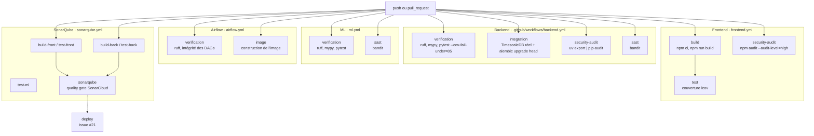

# Intégration et livraison continues

Ce document décrit la chaîne qui s'exécute entre un `git push` et un merge autorisé : ce qui est
vérifié, ce qui bloque, et ce qui ne l'est pas.

| Étage | Sert à | Statut |
|---|---|---|
| Intégration continue | Interdire le merge d'un code qui casse la qualité, les tests ou la sécurité | `Fait` |
| Livraison continue | Porter un artefact vérifié jusqu'à la machine de déploiement | `Cible` |

Le **D** de CI/CD n'existe pas encore : aucun job de déploiement, aucune construction d'image
publiée, aucun environnement GitHub. L'issue #21 le porte. C'est la limite principale de cet
étage, et elle est nommée ici plutôt que découverte en soutenance.

## Vue d'ensemble

## Déclenchement

Les workflows de qualité se déclenchent sur `push` **et** sur `pull_request`, filtrés par **chemin** :
`backend.yml` sur `apps/backend/**`, `frontend.yml` sur `apps/frontend/**`, `ml.yml` sur `ml/**`,
`airflow.yml` sur `etl/airflow/**` **plus des chemins de `ml/` et de `apps/backend/`**, chacun
incluant son propre fichier de workflow dans le filtre pour qu'une modification du pipeline
déclenche le pipeline.

Le filtre d'`airflow.yml` mérite un mot : il inclut `ml/pyproject.toml`, `ml/uv.lock`,
`ml/enervision_ml/**`, `apps/backend/pyproject.toml`, `apps/backend/uv.lock` et
`apps/backend/app/**` parce que l'image Airflow copie le code et les dépendances des deux
modules : celles du ML pour `ml_train`/`ml_score`, celles du backend depuis que le DAG `alertes`
y exécute les commandes de détection ([ADR 0008](../adr/0008-airflow-execute-le-code-du-backend.md)).
Une modification de l'un ou l'autre peut donc casser la construction de cette image, et le filtre
le voit.

**Piège à connaître** : il n'y a **aucun filtre de branche**. Une branche de travail déclenche la
CI complète à chaque push, et un merge vers n'importe quelle branche la déclenche aussi. C'est
délibéré pendant le projet (retour au plus tôt, et la CI tournera sur `main` dès la remontée sans
rien changer), mais ce serait à borner sur un dépôt à forte fréquence de push.

`backend.yml`, `ml.yml` et `airflow.yml` déclarent en plus un groupe de concurrence par référence
git avec `cancel-in-progress`, ce qui annule un run devenu obsolète par un push plus récent.

**Piège de version** : `etl/airflow` tourne en **Python 3.12** et non 3.14, parce qu'Airflow 2.10
ne supporte pas encore 3.14. Le 3.14 du module ML ne vit, dans ce contexte, que dans l'image
Docker et son propre environnement.

## Ce qui bloque un merge

| Gate | Où | Seuil | Effet d'un échec |
|---|---|---|---|
| Formatage `ruff format --check` | backend, ml | zéro écart | Bloque |
| Analyse statique `ruff check` | backend, ml | zéro constat | Bloque |
| Typage `mypy` | backend (`app`), ml (strict) | zéro erreur | Bloque |
| Tests unitaires `pytest` | backend, ml | **`--cov-fail-under=85`** côté backend | Bloque |
| Tests d'intégration | backend | marqueur `integration`, base réelle | Bloque |
| Audit de dépendances `pip-audit` | backend | sur le **verrou figé** | Bloque |
| Audit de dépendances `npm audit` | frontend | `--audit-level=high` | Bloque |
| **SAST `bandit`** | backend (`app`), ml (`enervision_ml`) | **MEDIUM et au-dessus** | Bloque |
| Quality gate SonarCloud | tout le dépôt | gate par défaut, couverture du **code neuf** | Bloque |
| Build `npm run build` | frontend | compilation | Bloque |
| Intégrité des DAGs | airflow | chargement des DAGs sans erreur d'import | Bloque |
| Construction de l'image Airflow | airflow | `docker build` de `etl/airflow/Dockerfile` | Bloque |

Deux seuils portent une décision qu'il faut savoir défendre :

- **`npm audit --audit-level=high`** et non `moderate` : une vulnérabilité modérée dans une
  dépendance de développement ne doit pas immobiliser une livraison. Le corollaire est que les
  `moderate` sont invisibles en CI, et qu'elles se regardent à la main.
- **Bandit bloque à partir de MEDIUM**, et une seconde passe sans seuil publie les constats LOW
  sans bloquer. Sans cette seconde passe, un constat LOW disparaîtrait du journal sans trace. Le
  revers à connaître : cette seconde étape porte `continue-on-error`, donc le job reste **vert**
  même quand elle relève quelque chose ; un LOW ne se voit qu'en ouvrant le journal. Au
  21/09/2026, les deux modules sont à **zéro constat, tous niveaux confondus**, sur 5 904 lignes
  analysées.
- **La version de Bandit est épinglée** (`uvx bandit==1.9.4`) dans les deux jobs. Sans épingle,
  une nouvelle version passerait la CI au rouge sans qu'une seule ligne du dépôt ait changé, et
  le rejeu à l'identique promis plus bas n'existerait pas.

## Le job d'intégration, et pourquoi il ne suffisait pas d'un `postgres`

`backend.yml` monte un service `timescale/timescaledb-ha:pg17`, **la même image que
`docker-compose.yml`**, et non une image `postgres` nue. La première migration s'arrête
volontairement si l'extension TimescaleDB manque : un écart d'image entre la CI et le poste
rendrait ce job vert sur une base qui n'est pas la nôtre.

Sur le poste, c'est `db/init/110-test-database.sql` qui pose l'extension. Ce fichier n'est pas
monté dans le service GitHub Actions, d'où l'étape `CREATE EXTENSION IF NOT EXISTS timescaledb`
avant `alembic upgrade head`.

La couverture est **désactivée** sur ce job (`pytest -m integration --no-cov`) : il ne joue qu'une
partie de la suite, et son taux n'aurait aucun sens face au seuil de 85 %.

## SonarCloud, et l'incident qui a immobilisé trois PR

Le workflow `sonarqube.yml` exécute cinq jobs de préparation (`build-front`, `test-front`,
`build-back`, `test-back`, `test-ml`) dont les tests produisent chacun un rapport de couverture en
artefact, puis un dernier job qui les télécharge et lance `SonarSource/sonarqube-scan-action@v8`
avec le secret `SONAR_TOKEN`. Le périmètre est décrit par `sonar-project.properties` à la racine.

Le périmètre couvre `apps/frontend`, `apps/backend`, `ml/` et `etl/airflow` (les deux derniers
ajoutés après coup : ils n'étaient pas analysés, une PR qui ne touchait qu'eux ne lançait pas
Sonar). `ml/` publie `ml/coverage.xml` (`pytest-cov`, même mécanisme que le backend, sans seuil
propre : la gate porte sur le code neuf). `etl/airflow` est exclu de la **couverture**
(`sonar.coverage.exclusions`) : ses tests ne font que charger les DAGs, ils ne mesurent rien.
Piège : tout nouveau dossier de tests doit être déclaré dans `sonar.tests`, faute de quoi il est
compté comme code de production non couvert (cf. l'incident ci-dessous).

**L'incident, à raconter tel quel.** Les 18 et 19 septembre, trois PR (#103, #105, #107) sont
restées bloquées sur une quality gate rouge annonçant une couverture du code neuf à 0 %, alors que
la couverture globale du backend dépassait 87 %. Le diagnostic était **hors du code de ces PR** :
`sonar.test.inclusions` ne reconnaissait que les fichiers `test_*.py`, si bien que
`tests/api/acces.py`, `tests/factories.py` et les `__init__.py` du dossier de tests étaient
comptés comme **code de production non couvert**. Le motif `tests` sans joker ne désignait par
ailleurs que la racine.

Deux commits ont corrigé la configuration (`9e6a5c0` classe tout `apps/backend/tests` comme test,
`af2b8cb` déclenche l'analyse quand `sonar-project.properties` change). La gate est verte sur
toutes les PR depuis. Ce qui compte pour la suite : **la cause a été traitée en configuration, pas
contournée** en désactivant la gate ou en excluant les fichiers gênants.

## Dependabot

`.github/dependabot.yml` déclare **six entrées hebdomadaires groupées, sur cinq écosystèmes** :
`npm` sur `/apps/frontend`, `uv` sur `/apps/backend`, `github-actions` sur `/`, `docker` sur les
deux dossiers d'application, et `docker-compose` sur `/`. Les mises à jour arrivent en PR, donc
elles traversent les mêmes gates que n'importe quel changement : une montée de version qui casse
les tests ne se merge pas.

## Stratégie de branche et conventions

| Règle | Détail |
|---|---|
| Préfixes de branche | `feat/`, `fix/`, `chore/`, `docs/`, `test/` |
| Messages de commit | Conventional Commits |
| Branche d'intégration | `dev` ; `main` est la branche par défaut du dépôt public |
| Revue | Toute PR passe par une revue écrite avant merge |
| ADR | Toute décision structurante porte son ADR dans la même PR |
| Vues d'architecture | Toute PR qui change un composant met à jour sa vue **dans la même PR** |

## Secrets

Un seul secret est consommé par la CI : **`SONAR_TOKEN`**, porté par les dépôts GitHub Actions.
Les identifiants de la base du job d'intégration sont des valeurs de test en clair dans le
workflow, ce qui est volontaire : elles ne protègent rien, la base est créée et détruite avec le
run. Aucune clé de déploiement n'existe encore, puisqu'il n'y a pas de déploiement : le job de
déploiement est porté par l'issue #21, les secrets qu'il consommera et leur injection par
l'issue #22.

## Scan DAST (OWASP ZAP)

Statut : `En cours`. Le workflow `dast.yml` attaque l'API **en fonctionnement**, ce que ni Bandit,
ni `pip-audit`, ni Sonar ne font. Il se lance à la main (`workflow_dispatch`), chaque lundi à 3h
UTC, et sur une PR qui modifie le scan lui-même. Pas à chaque PR : un scan actif dure plusieurs
minutes.

Le job démarre sur le runner la base (même image TimescaleDB que `docker-compose.yml`, base
jetable) et le backend, puis `scripts/dast-token.sh` crée un compte **`lecteur`** et rend son
jeton. ZAP charge le contrat `/openapi.json` (`zap-api-scan.py -f openapi`) et envoie ce jeton
dans l'en-tête `Authorization`. Sans lui, ZAP ne verrait que les deux sondes et `/auth/login`.

Trois décisions à savoir défendre :

- **Le compte du scan est `lecteur`, jamais `admin`.** Un scan actif avec un jeton admin frapperait
  `POST /users` et la réinitialisation de mots de passe pour de bon. Le script passe par un admin
  jetable pour créer le lecteur (l'API n'a pas d'inscription publique) puis ne s'en sert plus.
- **Un compte neuf est en `must_change_password`**, et toute route gardée le refuse tant que le
  mot de passe n'est pas changé. Le script fait ce changement et vérifie `GET /sites` = 200 avant
  de rendre le jeton ; sans cela, tout le scan authentifié ne testerait que des `403`.
- **`APP_ACCESS_TOKEN_TTL_SECONDS=3600`** (plafond de la configuration) : le jeton par défaut
  dure 15 minutes et le scan bien plus.

Les routes d'authentification qui changent l'état du compte (`login`, `password`, `logout-all`,
`forgot-password`, `reset-password`) sont exclues du scan actif : elles y déclencheraient la
limitation de débit et fermeraient les sessions sans rien apprendre de plus.

**Un scan vert n'est pas un scan qui a testé quelque chose.** Au premier passage, le job était vert
alors que ZAP n'avait importé que **2 URL sur 26 opérations** du contrat (`Number of Imported URLs:
2`) : il n'avait envoyé que des requêtes vouées au 404, sans jamais atteindre une route gardée
(rapport : 100 % de réponses 4xx, zéro alerte). ZAP « réussit » dans ce cas. Le job porte donc un
garde-fou qui, lui, **bloque** : il échoue si moins de 10 URL sont importées. Le journal interne de
ZAP (`zap.log`) et sa sortie complète (`zap-stdout.log`) sont publiés dans l'artefact `zap-report`
(dossier `zap-logs/`) pour diagnostiquer un import raté.

Diagnostic du premier passage : `zap-api-scan.py` appelle `importUrl` sur `/openapi.json`, ZAP répond
**400**, le contrat n'est pas chargé et ZAP se rabat sur l'exploration de la racine. Le job charge
donc le contrat **depuis un fichier** (`-t /zap/wrk/openapi.json -O http://localhost:8000`) et
renomme dans cette copie, sans toucher au contrat versionné, les deux schémas de sécurité aux noms
accentués (`Jeton d'accès`, `Cookie de rafraîchissement`) que l'analyseur de ZAP peut refuser. La
cause exacte du 400 n'est pas confirmée : si l'import échoue encore, `zap-logs/zap.log` la donne.
Deuxième diagnostic (contrat importé, 81 endpoints) : **toutes** les requêtes de ZAP recevaient un 400
`Invalid HTTP request received` d'uvicorn, y compris `/api/v1/health/live` sans authentification,
et le job restait vert. Un second garde-fou fait donc échouer le job si 100 % des réponses sont des
4xx. Tant que la cause n'est pas établie, le job intercale `socat -v` entre ZAP et l'API (octets
échangés publiés dans `zap-logs/`, jeton masqué) et lance uvicorn avec `--http h11` : uvicorn n'indique
pas ce que son analyseur a refusé. Ce diagnostic est à retirer une fois le scan authentifié qui
fonctionne.

Piège de permissions : le dossier `zap-out` appartient à l'uid 1000 du conteneur, le runner n'y écrit
plus après le `chown` ; les journaux vont donc dans `zap-logs/`, que le runner possède.

**Non bloquant pour l'instant** (`continue-on-error`) pour ce qui est des alertes. Le volume d'alertes d'un premier passage est
inconnu ; le rapport HTML/JSON/Markdown est publié en artefact `zap-report` et dans le résumé du
job. Fixer un seuil viendra une fois les alertes triées.

**Limite à ne pas oublier :** le scan tape la configuration par défaut du backend (`APP_ENV=local`,
pas de TLS, pas de reverse proxy). Il remontera des alertes qui n'existent pas derrière le proxy
(HSTS absent...) et ne dit **rien** des en-têtes ni du TLS que le proxy pose en production. Un
second passage sur la stack complète reste à faire.

## Ce qui manque, et pourquoi

| Manque | Issue | Conséquence assumée |
|---|---|---|
| Job de déploiement (CD) | #21 | La chaîne s'arrête au merge. Rien ne part vers une machine |
| DAST bloquant | #41 | Le scan ZAP existe mais ne bloque rien : aucun seuil n'est fixé tant que les alertes du premier passage ne sont pas triées |
| Tests end to end | #46 | Les parcours utilisateur ne sont pas vérifiés en CI |
| Tests de charge | #47 | Aucun garde-fou de performance |
| Scan d'image de conteneur | aucune | Les `Dockerfile` sont construits en local, pas analysés |

## Reproduire la CI en local

`make check` enchaîne formatage, analyse statique, typage et tests du backend, c'est à dire le job
`verification`. `make ml-check` fait la même chose pour le module ML. Les tests d'intégration
demandent une base : `make db-up` puis `uv run pytest -m integration`.

Le SAST se rejoue à l'identique : `uvx bandit==1.9.4 --recursive app --severity-level medium
--confidence-level medium` depuis `apps/backend`, et la même commande sur `enervision_ml` depuis
`ml`.
