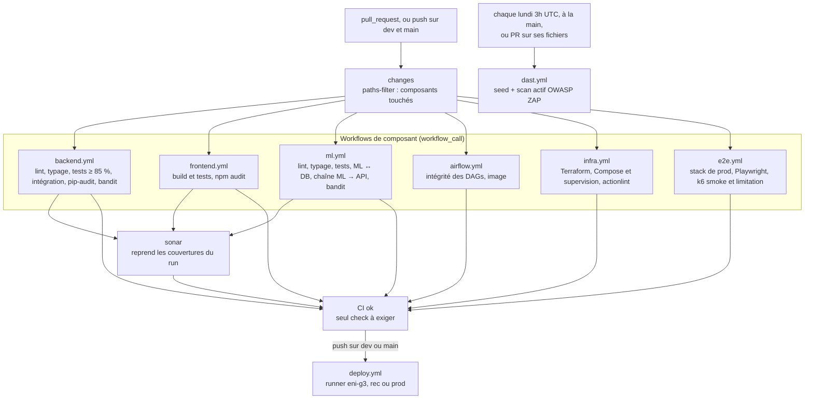

# Intégration et livraison continues

Ce document décrit la chaîne qui s'exécute entre un `git push` et un merge autorisé : ce qui est
vérifié, ce qui bloque, et ce qui ne l'est pas.

| Étage | Sert à | Statut |
|---|---|---|
| Intégration continue | Interdire le merge d'un code qui casse la qualité, les tests ou la sécurité | `Fait` |
| Livraison continue | Déployer chaque branche d'intégration sur son environnement de la VM ENI | `En cours` |

Le **D** de CI/CD est écrit depuis le 21/09 : `deploy.yml` déploie `dev` en recette et `main` en
production sur la VM de l'école, par un runner auto-hébergé (issue #21,
[ADR 0009](../adr/0009-deux-environnements-compose-sur-la-vm-eni.md)). Depuis le 23/09, il ne part
plus qu'une fois la CI du commit verte ([ADR 0014](../adr/0014-pipeline-ci-unique-et-deploiement-conditionne.md)).
Il n'a encore rien déployé : le runner n'est pas enregistré sur la machine. Statut à
basculer sur `Fait` au premier déploiement vert. Sa limite, nommée ici plutôt que découverte en
soutenance : les images sont construites sur la machine à chaque déploiement, aucun artefact
n'est publié puis promu d'un environnement à l'autre.

Ce que ce workflow ne fait pas, et ne fera pas : préparer la machine. Installation de Docker,
clones, `.env`, certificats et enregistrement du runner sont provisionnés par
`infra/terraform/environments/vm-eni`
([ADR 0010](../adr/0010-terraform-provisionne-github-actions-deploie.md)). Terraform provisionne,
GitHub Actions déploie ; aucun des deux ne fait le travail de l'autre.

## Vue d'ensemble

`ci.yml` est le seul point d'entrée des PR et des push sur `dev` et `main`. Il appelle les
workflows de composant, qui n'ont plus de déclencheur propre, selon les fichiers modifiés
([ADR 0014](../adr/0014-pipeline-ci-unique-et-deploiement-conditionne.md)).



## Déclenchement

**Sur une PR**, le job `changes` lit la liste des fichiers modifiés par l'API GitHub
(`dorny/paths-filter`, épinglé sur un SHA) et chaque composant n'est appelé que si son filtre
vaut vrai. Une PR de documentation ne joue que `changes` et `CI ok`. Modifier `ci.yml` rejoue
tout.

**Sur un push vers `dev` ou `main`**, tous les filtres valent vrai. C'est le moment où l'analyse
Sonar doit couvrir tout le dépôt, et paths-filter comparerait sinon le push à sa base de fusion
avec `main`, en retard de 80 commits. Une branche de travail ne déclenche plus rien par un push :
la CI part de sa PR, une seule fois par commit.

Deux filtres écoutent plus que leur dossier, parce que ce qu'ils testent dépend d'autres modules :

- `airflow` inclut `ml/pyproject.toml`, `ml/uv.lock`, `ml/enervision_ml/**`,
  `apps/backend/pyproject.toml`, `apps/backend/uv.lock` et `apps/backend/app/**`. L'image
  Airflow copie le code et les dépendances des deux modules
  ([ADR 0008](../adr/0008-airflow-execute-le-code-du-backend.md)), et une modification de l'un
  ou de l'autre peut casser sa construction.
- `e2e` inclut le frontend, l'API, ses migrations et son Dockerfile, le proxy, les fichiers
  Compose, `db/`, `tests/` et les scripts qu'il appelle : tout ce qui change un parcours.

`dast.yml` reste hors de l'orchestrateur : un scan actif est trop long pour chaque PR. Il se
lance à la main, chaque lundi, et sur une PR qui modifie le scan, son jeu de données ou ses
comptes.

Le groupe de concurrence de `ci.yml` annule le run d'une PR devenu obsolète par un push plus
récent. Pour un push sur `dev` ou `main`, le groupe est le SHA et rien n'est annulé : un run
coupé en plein `make stack-up` laisserait la stack à moitié redémarrée.

**Piège de version** : `etl/airflow` tourne en **Python 3.12** et non 3.14 : c'est l'interpréteur
de l'image `apache/airflow:3.3.2-python3.12` retenue, et les tests d'intégrité doivent tourner sur
le même. Le 3.14 du module ML ne vit, dans ce contexte, que dans l'image Docker et son propre
environnement.

## Déploiement

`deploy.yml` est le seul workflow qui ne tourne pas chez GitHub : il s'exécute sur un runner
auto-hébergé installé sur la VM ENI, label `eni-g3`, parce que les runners hébergés ne joignent
pas une adresse privée d'école. Le runner se connecte en sortie vers GitHub, aucun port entrant
n'est ouvert. Il n'a pas de déclencheur propre en dehors de `workflow_dispatch` : c'est le job
`deploy` de `ci.yml` qui l'appelle, sur un push, une fois « CI ok » vert.

| Événement | Environnement GitHub | Dossier sur la VM | Garde |
|---|---|---|---|
| `push` sur `dev`, « CI ok » vert | `rec` | `/srv/enervision/rec` | aucune de plus : la recette suit `dev` |
| `push` sur `main`, « CI ok » vert | `prod` | `/srv/enervision/prod` | approbation d'un relecteur dans l'environnement `prod`, branche `main` seule autorisée |
| `workflow_dispatch` sur toute autre branche | `dev` | `/srv/enervision/dev` | droit d'écriture sur le dépôt, seul à pouvoir lancer un workflow ([ADR 0017](../adr/0017-environnement-dev-a-la-demande.md)) |

Le job aligne le clone sur **le commit testé** (`fetch`, `checkout`, `reset --hard $GITHUB_SHA`),
et non sur la pointe de branche du moment, qui a pu avancer pendant la CI. Il lance
`make stack-up`, qui reconstruit les images, redémarre les conteneurs puis applique les
migrations Alembic dans le conteneur backend, et attend jusqu'à trois minutes que
`/api/v1/health/ready` réponde derrière le proxy. Cette sonde ne vérifie que la connexion à la
base et la présence de TimescaleDB : sans la migration, le déploiement serait vert sur une base
sans schéma, et c'est pourquoi `make stack-up` la porte.

Les CI de deux push rapprochés peuvent finir dans le désordre. Deux gardes empêchent un
environnement de reculer ou de sauter un commit :

- un commit qui **précède** celui déjà déployé depuis la même branche est ignoré, avec une
  annotation dans le run. Dans `dev`, une autre branche que celle en place est toujours déployée ;
- les déploiements d'un même environnement passent un par un sous un verrou `flock` posé dans le
  clone de la VM, y compris deux branches lancées coup sur coup dans `dev`. Un groupe
  `concurrency` ne convenait pas : GitHub n'y garde qu'un job en attente, et un troisième arrivé
  l'annule sans erreur.

Le job ne fait pas de `actions/checkout` dans son espace de travail, et c'est voulu : le dossier
de l'environnement est stable, hors du runner, parce que `.env`, certificats et volumes doivent
survivre d'un déploiement à l'autre.

**Piège à connaître.** Un runner auto-hébergé sur un dépôt public exécute ce qu'un workflow lui
envoie, et une PR de fork peut ajouter son propre workflow qui vise le label `eni-g3`. L'absence
de `pull_request` dans `deploy.yml` ne suffit donc pas. Ce qui protège vraiment le runner :

- le dépôt exige l'approbation des workflows de tous les contributeurs externes (Settings,
  Actions, « Require approval for all external contributors ») ;
- les environnements `rec` et `prod` n'acceptent que leur branche (`dev`, `main` avec un
  relecteur), ce qui bloque un job qui les déclare avant qu'il atteigne le runner ;
- le runner tourne sous un utilisateur dédié membre du groupe `docker`, jamais root.

Les deux réglages de dépôt restent à activer par l'administratrice. Tous les autres workflows
restent sur `ubuntu-latest`.

Cet utilisateur dédié doit posséder `/srv/enervision` : sinon git refuse les deux clones pour
propriété douteuse et le `.env` en `600` lui échappe. `PROPRIETAIRE=<utilisateur du runner>`
passé à `scripts/provision-host.sh` fixe ce propriétaire.

La machine se prépare avec `scripts/provision-host.sh`, qui vérifie Docker et Compose 2.24.4 ou
plus, clone les deux branches, génère les secrets de chaque `.env` et les certificats
auto-signés, et ne démarre rien. Le détail des trois environnements, ports et noms d'hôte, est
dans [10-infra.md](10-infra.md).

## Ce qui bloque un merge

| Gate | Où | Seuil | Effet d'un échec |
|---|---|---|---|
| Formatage `ruff format --check` | backend, ml | zéro écart | Bloque |
| Analyse statique `ruff check` | backend, ml | zéro constat | Bloque |
| Typage `mypy` | backend (`app`), ml (strict) | zéro erreur | Bloque |
| Tests unitaires `pytest` | backend, ml | **`--cov-fail-under=85`** côté backend | Bloque |
| Tests d'intégration | backend | marqueur `integration`, base réelle | Bloque |
| Tests d'intégration ML ↔ DB | ml | marqueur `integration`, base réelle migrée par Alembic | Bloque |
| Chaîne ML → DB → API | ml | marqueur `chaine`, vrais binaires en sous-processus | Bloque |
| Audit de dépendances `pip-audit` | backend | sur le **verrou figé** | Bloque |
| Audit de dépendances `npm audit` | frontend | `--audit-level=high` | Bloque |
| **SAST `bandit`** | backend (`app`), ml (`enervision_ml`) | **MEDIUM et au-dessus** | Bloque |
| Quality gate SonarCloud | tout le dépôt | gate par défaut, couverture du **code neuf** | Bloque |
| Build `npm run build` | frontend | compilation | Bloque |
| Intégrité des DAGs | airflow | chargement des DAGs sans erreur d'import | Bloque |
| Construction de l'image Airflow | airflow | `docker build` de `etl/airflow/Dockerfile` | Bloque |
| Formatage et validité Terraform | infra | `fmt -check -recursive`, puis `init` et `validate` par racine | Bloque |
| Verrous uv à jour | backend, ml, airflow | `uv sync --locked` : un `uv.lock` qui ne suit plus `pyproject.toml` échoue | Bloque |
| Fichiers Compose | infra | `docker compose config` sur la stack de dev et la stack déployée, tous profils | Bloque |
| Supervision | infra | `promtool check config`, `promtool test rules` (un cas par alerte), `amtool check-config`, JSON des tableaux | Bloque |
| Workflows | infra | `actionlint`, shellcheck compris sur les blocs `run:` | Bloque |
| Parcours de bout en bout | e2e | 18 parcours Playwright contre la stack de prod (proxy TLS) | Bloque |
| Tir k6 de fumée | e2e | p95 < 500 ms et p99 < 1 s sur les lectures, moins de 1 % d'échecs | Bloque |
| Limitation de débit | e2e | k6 par le proxy : des 429 au-delà de 20 req/s, aucune 5xx | Bloque |
| **CI ok** | ci.yml | aucun job en `failure` ou `cancelled` | Bloque, **seul check à exiger** |

Deux seuils portent une décision qu'il faut savoir défendre :

- **`npm audit --audit-level=high`** et non `moderate` : une vulnérabilité modérée dans une
  dépendance de développement ne doit pas immobiliser une livraison. Le corollaire est que les
  `moderate` sont invisibles en CI, et qu'elles se regardent à la main.
- **Bandit bloque à partir de MEDIUM**, et une seconde passe sans seuil publie les constats LOW
  sans bloquer. Sans cette seconde passe, un constat LOW disparaîtrait du journal sans trace. Le
  revers à connaître : cette seconde étape porte `continue-on-error`, donc le job reste **vert**
  même quand elle relève quelque chose ; un LOW ne se voit qu'en ouvrant le journal. Au
  21/09/2026, les deux modules sont à **zéro constat, tous niveaux confondus**, sur 5 904 lignes
  analysées.
- **La version de Bandit est épinglée** (`uvx bandit==1.9.4`) dans les deux jobs. Sans épingle,
  une nouvelle version passerait la CI au rouge sans qu'une seule ligne du dépôt ait changé, et
  le rejeu à l'identique promis plus bas n'existerait pas.

## Le job d'intégration, et pourquoi il ne suffisait pas d'un `postgres`

`backend.yml` monte un service `timescale/timescaledb-ha:pg17`, **la même image que
`docker-compose.yml`**, et non une image `postgres` nue. La première migration s'arrête
volontairement si l'extension TimescaleDB manque : un écart d'image entre la CI et le poste
rendrait ce job vert sur une base qui n'est pas la nôtre.

Sur le poste, c'est `db/init/110-test-database.sql` qui pose l'extension. Ce fichier n'est pas
monté dans le service GitHub Actions, d'où l'étape `CREATE EXTENSION IF NOT EXISTS timescaledb`
avant `alembic upgrade head`.

La couverture est **désactivée** sur ce job (`pytest -m integration --no-cov`) : il ne joue qu'une
partie de la suite, et son taux n'aurait aucun sens face au seuil de 85 %.

### Pourquoi le job d'intégration ML installe aussi le backend

Le schéma de la base n'a qu'une source, les six révisions Alembic de `apps/backend/alembic` : le
backend est propriétaire du schéma, `ml/` n'en est que consommateur. Reconstruire ce schéma à la
main dans le job ML donnerait un job vert sur une base qui n'est pas la nôtre, exactement l'erreur
qu'évite déjà le choix de l'image `timescaledb-ha` plutôt qu'un `postgres` nu. Le job installe
donc les deux environnements uv, applique `alembic upgrade head`, puis joue `-m integration` côté
`ml/` et `-m chaine` côté backend.

Conséquence sur le déclenchement : le filtre `ml` de `ci.yml` inclut `apps/backend/alembic/**` et
`apps/backend/app/models/**`. Sans eux, une migration qui renomme une colonne de `reading` ne
déclencherait pas ce job, le SQL brut du pipeline dériverait du schéma, et **rien ne casserait
avant la production**. Le prix est qu'une PR touchant seulement une migration lance aussi le lint
et le typage de `ml/` : environ deux minutes de runner, en parallèle. Même arbitrage que le filtre
d'`airflow.yml`, qui écoute déjà `ml/**` et `apps/backend/app/**` parce que son image réunit les
deux.

Le marqueur `chaine` est distinct d'`integration` pour une raison mécanique : le job `integration`
de `backend.yml` n'installe pas `ml/.venv`, et sélectionnerait sinon un test qui lance les
binaires du pipeline. Il est aussi exclu d'`addopts`, sans quoi `make test` échouerait sur tout
poste où `ml/` n'est pas installé.

## SonarCloud, et l'incident qui a immobilisé trois PR

Le job `sonar` de `ci.yml` ne reconstruit ni ne reteste rien. Les jobs `verification` de
`backend.yml`, `ml.yml` et `frontend.yml` versent leur rapport de couverture en artefact, et
`sonar` les télécharge dans le même run, un par un (backend et ML nomment tous deux le leur
`coverage.xml`), puis lance `SonarSource/sonarqube-scan-action`, épinglée sur un SHA, avec le
secret `SONAR_TOKEN`. Il ne tourne ni pour Dependabot ni pour une PR de fork, qui n'ont pas ce
secret. Le périmètre est décrit par `sonar-project.properties` à la racine, seul fichier de
configuration Sonar du dépôt.

Jusqu'au 23/09, un `sonarqube.yml` à part rejouait build et tests des trois modules pour produire
ces rapports, en double exact des workflows qui le faisaient déjà. Les exclusions de
`sonar-project.properties` sont aussi passées en globs (`**/tests/**`, `**/alembic/**`) : un
motif sans `**` ne vise que la racine du dépôt.

Le périmètre couvre `apps/frontend`, `apps/backend`, `ml/` et `etl/airflow` (les deux derniers
ajoutés après coup : ils n'étaient pas analysés, une PR qui ne touchait qu'eux ne lançait pas
Sonar). `ml/` publie `ml/coverage.xml` (`pytest-cov`, même mécanisme que le backend, sans seuil
propre : la gate porte sur le code neuf). `etl/airflow` est exclu de la **couverture**
(`sonar.coverage.exclusions`) : ses tests ne font que charger les DAGs, ils ne mesurent rien.
Piège : tout nouveau dossier de tests doit être déclaré dans `sonar.tests`, faute de quoi il est
compté comme code de production non couvert (cf. l'incident ci-dessous).

**L'incident, à raconter tel quel.** Les 18 et 19 septembre, trois PR (#103, #105, #107) sont
restées bloquées sur une quality gate rouge annonçant une couverture du code neuf à 0 %, alors que
la couverture globale du backend dépassait 87 %. Le diagnostic était **hors du code de ces PR** :
`sonar.test.inclusions` ne reconnaissait que les fichiers `test_*.py`, si bien que
`tests/api/acces.py`, `tests/factories.py` et les `__init__.py` du dossier de tests étaient
comptés comme **code de production non couvert**. Le motif `tests` sans joker ne désignait par
ailleurs que la racine.

Deux commits ont corrigé la configuration (`9e6a5c0` classe tout `apps/backend/tests` comme test,
`af2b8cb` déclenche l'analyse quand `sonar-project.properties` change). La gate est verte sur
toutes les PR depuis. Ce qui compte pour la suite : **la cause a été traitée en configuration, pas
contournée** en désactivant la gate ou en excluant les fichiers gênants.

## Dependabot

`.github/dependabot.yml` déclare **sept entrées hebdomadaires, sur cinq écosystèmes** : `npm`
sur `/apps/frontend` et sur `/tests/e2e`, `uv` sur `/apps/backend`, `github-actions` sur `/`,
`docker` sur les deux dossiers d'application, et `docker-compose` sur `/`, qui suit aussi les
images de supervision et de k6. Les mises à jour arrivent en PR, donc
elles traversent les mêmes gates que n'importe quel changement : une montée de version qui casse
les tests ne se merge pas.

## Stratégie de branche et conventions

| Règle | Détail |
|---|---|
| Préfixes de branche | `feat/`, `fix/`, `chore/`, `docs/`, `test/` |
| Messages de commit | Conventional Commits |
| Branche d'intégration | `dev` ; `main` est la branche par défaut du dépôt public |
| Revue | Toute PR passe par une revue écrite avant merge |
| ADR | Toute décision structurante porte son ADR dans la même PR |
| Vues d'architecture | Toute PR qui change un composant met à jour sa vue **dans la même PR** |

## Secrets

Un seul secret est consommé côté GitHub : **`SONAR_TOKEN`**, porté par les secrets du dépôt.
Les identifiants de la base du job d'intégration sont des valeurs de test en clair dans le
workflow, ce qui est volontaire : elles ne protègent rien, la base est créée et détruite avec le
run.

Le déploiement ne consomme **aucun secret GitHub** (issue #22). Les secrets de chaque
environnement, mots de passe PostgreSQL et Airflow, clés de signature, clé Fernet, vivent dans le
`.env` de son dossier sur la VM, en `600`, générés sur la machine par `scripts/provision-host.sh`.
Ils ne transitent ni par git ni par GitHub, et le runner, qui travaille dans ce dossier, n'a rien
à recevoir. Le revers : ils ne sont sauvegardés nulle part ailleurs. Un `.env` perdu se
régénère, ce qui invalide les sessions et les connexions chiffrées par Airflow.

## Scan DAST (OWASP ZAP)

Statut : `En cours`. Le workflow `dast.yml` attaque l'API **en fonctionnement**, ce que ni Bandit,
ni `pip-audit`, ni Sonar ne font. Il se lance à la main (`workflow_dispatch`), chaque lundi à 3h
UTC, et sur une PR qui modifie le scan lui-même. Pas à chaque PR : un scan actif dure plusieurs
minutes.

Le job démarre sur le runner la base (même image TimescaleDB que `docker-compose.yml`, base
jetable), applique les migrations, y sème `db/seeds/demo.sql` (sans données, `GET /sites` rend
`[]`, chaque `/{site_id}` rend 404, et le scan actif ne frappe que des gestionnaires d'erreur),
démarre le backend, puis `scripts/dast-token.sh` s'appuie sur `scripts/comptes-test.sh` pour
créer les comptes et rend le jeton du **`lecteur`**. Le jeu et les comptes sont ceux de l'e2e.

ZAP charge le contrat `/openapi.json` depuis un fichier (`zap-api-scan.py -f openapi -t
/zap/wrk/openapi.json`) et en importe les 26 opérations **quel que soit le jeton** : c'est le
contrat qui décide de ce qui est exploré, pas l'authentification. Le jeton ne change que les
réponses obtenues sur les routes gardées : sans lui, elles répondraient toutes `401` plutôt que
de dérouler leur logique. Huit routes n'exigent aucun jeton porteur (les deux sondes, `login`,
`refresh`, `logout`, `forgot-password`, `reset-password` et `reset-password/validate`) et
répondent donc pareil avec ou sans lui.

Décisions à savoir défendre :

- **Le compte du scan est `lecteur`, jamais `admin`.** Un scan actif avec un jeton admin frapperait
  `POST /users` et la réinitialisation de mots de passe pour de bon. Le script passe par un admin
  jetable pour créer le lecteur (l'API n'a pas d'inscription publique) puis ne s'en sert plus.
- **Un compte neuf est en `must_change_password`**, et toute route gardée le refuse tant que le
  mot de passe n'est pas changé. Le script fait ce changement et vérifie `GET /sites` = 200 avant
  de rendre le jeton ; sans cela, tout le scan authentifié ne testerait que des `403`.
  `POST /auth/password` rend déjà un nouveau jeton valide (l'`iat` tronqué documenté dans
  `app/api/deps.py` ne le rejette pas comme antérieur à la session) : le script s'en sert
  directement plutôt que de se reconnecter, deux hachages Argon2id (19456 Kio chacun) et deux
  allers-retours de refresh-token de moins sur le chemin critique de la CI.
- **`APP_ACCESS_TOKEN_TTL_SECONDS=3600`** (plafond de la configuration) : le jeton par défaut
  dure 15 minutes. `scanner.maxScanDurationInMins=15` (ci-dessous) borne le scan actif très en
  dessous, marge comprise pour les étapes qui l'entourent.
- **Le jeton ne transite ni par `${{ }}` dans le script de l'étape, ni par l'argv de `docker
  run`.** Le premier finirait en clair dans le fichier de commande que GitHub écrit sur le disque
  du runner pour toute la durée de l'étape ; le second serait visible par `ps aux` et par
  `docker inspect zap` tant que le conteneur existe. Il est écrit dans un fichier de
  configuration ZAP séparé (`-configfile`), monté en lecture seule hors de `/zap/wrk` pour ne
  jamais atterrir dans l'artefact publié. ZAP journalise malgré tout la valeur de chaque
  `-config`/`-configfile` chargé à un niveau visible sans `-d` : les copies de `zap.log` et
  `zap-stdout.log` publiées en artefact sont donc caviardées avant publication.

**Deux pièges d'autorisation** sur ce fichier de configuration (`zap-auth.conf`), tous les deux
propres au montage bind Docker : le conteneur y lit avec son propre uid (1000), distinct de celui
du runner qui l'a écrit, sans remappage automatique.

- Un `chmod 600` seul rend le fichier illisible pour le conteneur (« File not readable :
  /zap/auth.conf »). ZAP échoue dès le lancement, mais `zap-api-scan.py` attend les `-T` minutes
  complètes avant d'abandonner : dix minutes qui ressemblent à un scan actif, pour un daemon mort
  depuis le début. Corrigé par `sudo chown 1000:1000` du fichier avant de le passer à `644`.
- Ce `chown` déplace la propriété du fichier hors de l'utilisateur du runner : un `chmod` qui
  suit sans `sudo` échoue alors (« Operation not permitted »), et le `-e` implicite des étapes
  bash de GitHub Actions arrête toute l'étape avant même `docker run` — un scan « réussi » en une
  fraction de seconde, sans le moindre journal ni rapport produit. Les deux commandes doivent
  passer par `sudo`.

Les routes d'authentification qui changent l'état du compte (`login`, `password`, `logout-all`,
`forgot-password`, `reset-password`) sont exclues du scan actif : elles y déclencheraient la
limitation de débit et fermeraient les sessions sans rien apprendre de plus.

**Un scan vert n'est pas un scan qui a testé quelque chose.** Deux garde-fous, eux, **bloquent** :

- **Moins de 80% des opérations du contrat importées.** Constaté une première fois : 2 URL sur 26
  opérations importées, ZAP n'avait envoyé que des requêtes vouées au 404 (l'analyseur de ZAP
  refusait alors le nom accentué d'un des deux schémas de sécurité du contrat, corrigé depuis en
  ASCII côté backend). Le seuil est dérivé du contrat (`zap-out/openapi.json`, présent à cette
  étape) plutôt que d'un nombre fixe : un contrat qui grossit ne doit pas rendre la garde plus
  permissive qu'elle ne l'était.
- **Aucune réponse 2xx.** Constaté une deuxième fois, cause différente : la clé de configuration
  du nom d'en-tête pour la règle Replacer est `matchstr`, pas `matchstring` (celui-ci n'existe que
  pour le job d'automatisation ZAP, pas pour `-config`) ; ZAP acceptait la mauvaise clé sans
  erreur et laissait le nom d'en-tête vide, qu'uvicorn refusait par un `400` sur **toute** requête,
  y compris les routes publiques. Piège de conception rencontré en corrigeant cette garde : borner
  le *pourcentage* de 4xx ne marche pas, un scan actif fuzze délibérément un grand nombre
  d'entrées invalides, si bien qu'un scan sain contre l'API seedée reste à 98% de 4xx avec
  seulement 1% de 2xx. C'est la forme normale d'un scan actif. Le signal qui distingue vraiment un
  scan cassé (2xx nul, absent du rapport dans les deux incidents) d'un scan sain (2xx non nul,
  aussi faible soit-il) est l'absence de succès, pas la part d'échecs. Les deux gardes lisent
  `zap-out/zap-report.json` (champs structurés `insights[]`), pas le texte libre du rapport
  Markdown.

Le journal interne de ZAP (`zap.log`) et sa sortie complète (`zap-stdout.log`) sont publiés dans
l'artefact `zap-report` (dossier `zap-logs/`, propriété du runner : `zap-out/` bascule sous l'uid
1000 du conteneur ZAP dès que le contrat y est copié, le runner n'y écrit plus ensuite) pour
diagnostiquer un futur import raté.

**Non bloquant pour l'instant** (`continue-on-error`, sur la seule étape du scan) pour ce qui est
des alertes elles-mêmes. Le volume d'un premier passage trié est inconnu ; le rapport
HTML/JSON/Markdown est publié en artefact `zap-report`, et sa synthèse (jusqu'aux tableaux
d'alertes, sans le détail par alerte) dans le résumé du job. Fixer un seuil viendra une fois les
alertes triées.

**Limite à ne pas oublier :** le scan tape la configuration par défaut du backend (`APP_ENV=local`,
pas de TLS, pas de reverse proxy). Il remontera des alertes qui n'existent pas derrière le proxy
(HSTS absent...) et ne dit **rien** des en-têtes ni du TLS que le proxy pose en production. Un
second passage sur la stack complète reste à faire.

## Tests de bout en bout et de charge

Le workflow `e2e.yml` démarre la stack telle qu'elle est déployée, derrière le proxy TLS, sur
`https://localhost` ([ADR 0015](../adr/0015-tests-e2e-et-de-charge-contre-la-stack-compose.md)) :

1. Il construit et démarre `db`, `mailpit`, `backend`, `frontend` et `proxy` avec
   `docker-compose.prod.yml`, sans Airflow. C'est le seul job qui construit les images backend et
   frontend avant un déploiement.
2. Il migre la base, pose le rôle `supervision`, sème `db/seeds/demo.sql` et crée les comptes
   (`scripts/comptes-test.sh`).
3. Il joue les 18 parcours Playwright de `tests/e2e`, sur un seul worker et avec une session par
   fichier. Le rapport HTML et les traces du premier réessai sont versés en artefact.
4. Il lance le tir k6 `smoke`, directement sur `backend:8000`, puis `limitation-debit` par le
   proxy. Les synthèses s'affichent dans le résumé du job, et les rapports HTML sont versés en
   artefact.

La charge nominale (`make load-test`) et le stress (`make load-stress`) ne tournent pas en CI :
voir `tests/load/README.md`.

## Ce qui manque, et pourquoi

| Manque | Issue | Conséquence assumée |
|---|---|---|
| Images publiées et promues par digest (GHCR) | aucune | Chaque environnement reconstruit ses images : la production n'exécute pas l'artefact validé en recette, mais un second build du même commit |
| DAST bloquant | #41 | Le scan ZAP existe mais ne bloque rien : aucun seuil n'est fixé tant que les alertes du premier passage ne sont pas triées |
| Tir de charge nominal automatisé | #47 | Seul le smoke tourne en CI ; la charge à 50 utilisateurs se lance à la main en recette (`make load-test`), rec et prod partageant la VM |
| Cache de couches Docker en CI | aucune | Le job E2E reconstruit les images backend et frontend à chaque run, deux à quatre minutes de plus |
| Scan d'image de conteneur | aucune | Les images sont construites par le job E2E, pas analysées |

## Reproduire la CI en local

`make check` enchaîne formatage, analyse statique, typage et tests du backend, c'est à dire le job
`verification`. `make ml-check` fait la même chose pour le module ML.

Les tests d'intégration demandent une base **migrée**, et `db/init` ne crée `enervision_test` que
vide :

```bash
make db-up migrate-test     # la base de test reçoit les six révisions Alembic
make test-integration       # backend, marqueur `integration`
make ml-test-integration    # pipeline ML, marqueur `integration`
make test-chaine            # vrais binaires ML puis relecture par l'API, marqueur `chaine`
```

Les autres jobs se rejouent aussi sur le poste :

```bash
make e2e-prepare e2e        # parcours Playwright contre `make dev` (tests/e2e/README.md)
make load-smoke K6_EMAIL=... K6_PASSWORD=...   # tir k6 d'une minute (tests/load/README.md)
make monitoring-check       # promtool, amtool et JSON des tableaux de bord, comme le job Infra
```

Le SAST se rejoue à l'identique : `uvx bandit==1.9.4 --recursive app --severity-level medium
--confidence-level medium` depuis `apps/backend`, et la même commande sur `enervision_ml` depuis
`ml`.
