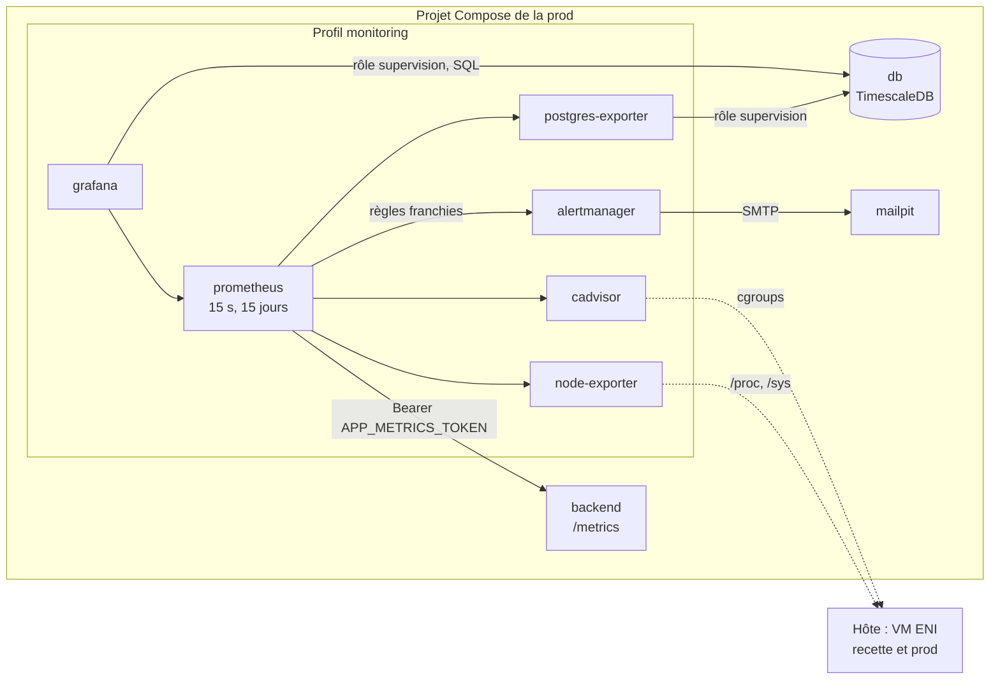

# Observabilité

Ce document décrit ce qu'on voit du système en fonctionnement : métriques, tableaux de bord,
alertes et journaux. Décision dans l'[ADR 0016](../adr/0016-supervision-en-profil-compose.md),
mode d'emploi dans [`monitoring/README.md`](../../monitoring/README.md).

| Brique | Sert à | Statut |
|---|---|---|
| Métriques de l'API | Débit, erreurs et latences par route | `Fait` |
| Collecte et alertes | Prometheus, neuf règles testées, Alertmanager vers Mailpit | `Fait` |
| Tableaux de bord | Grafana : API, données et modèle, infrastructure | `Fait` |
| Métriques d'Airflow | StatsD ou OpenTelemetry des DAGs | `Cible` |
| Journaux centralisés | Loki ou équivalent | `Cible` |

## Vue d'ensemble

Tout vit dans le projet Compose de la prod, sur son réseau. La recette n'a pas de supervision
propre. node-exporter et cAdvisor voient pourtant tout l'hôte : la mémoire de la VM et de chaque
conteneur couvre donc aussi la recette, qu'on distingue au préfixe `enervision-rec-`.

## Ce que mesure chaque source

| Source | Métriques utiles | Où les lire |
|---|---|---|
| API (`prometheus-fastapi-instrumentator`) | `http_requests_total` par route et classe de statut, `http_request_duration_seconds` par route (seaux 50 ms à 2,5 s), `http_request_duration_highr_seconds` global, mémoire du processus | Tableau « API » |
| postgres-exporter | `pg_up`, connexions par état, `max_connections`, transactions validées, taille des bases | Tableau « Infrastructure » |
| node-exporter | Processeur, mémoire disponible, espace disque de `/` | Tableau « Infrastructure » |
| cAdvisor | Mémoire (`working_set`) et processeur par conteneur | Tableau « Infrastructure » |
| TimescaleDB, en SQL | Fraîcheur des relevés par site, relevés ingérés par heure, alertes par sévérité, `drift_report` | Tableau « Données et modèle » |

Deux choix de l'instrumentation se lisent dans ces courbes :

- **Les sondes `/health/*` et `/metrics` ne sont pas comptées.** La sonde Docker frappe toutes
  les 30 s : incluse, elle ferait baisser la latence moyenne et gonfler le débit d'une API au
  repos.
- **Les seaux par route encadrent 500 ms**, seuil de charge de l'ADR 0015. Grafana lit ainsi le
  même p95 que k6 pendant un tir.

## Alertes

| Groupe | Alertes | Sévérité |
|---|---|---|
| API | Indisponible 2 min, 5xx au-delà de 5 %, p95 au-delà d'une seconde | critical, critical, warning |
| Base | PostgreSQL injoignable 2 min, connexions au-delà de 80 % | critical, warning |
| Hôte | Mémoire au-delà de 90 %, disque sous 10 %, processeur au-delà de 90 % | warning, critical, warning |
| Supervision | Un exporteur muet 5 min | warning |

- **Tests des règles.** Chaque règle a un cas dans `monitoring/prometheus/tests/`, joué par
  `promtool test rules` dans le job Infra de la CI. Une règle qui ne se déclenche plus, ou se
  déclenche à tort, casse la CI avant d'atteindre la prod.
- **Envoi.** Alertmanager groupe les alertes par nom et sévérité et les envoie par courriel via
  Mailpit, qui les capture sans rien relayer. Un `critical` est rappelé toutes les heures, un
  `warning` toutes les douze. Un `critical` masque le `warning` de la même cible.

## Sécurité

- **Aucune interface exposée.** Prometheus, Alertmanager et Grafana n'écoutent que sur
  `127.0.0.1`, et rien ne passe par le proxy (ADR 0007). Accès par tunnel SSH.
- **`/metrics` gardé par jeton.** Il n'est pas routé par nginx, et Prometheus y présente
  `APP_METRICS_TOKEN`, que l'API exige dès qu'il est posé. Le jeton lui parvient en secret
  Compose, jamais en clair dans sa configuration.
- **Base en lecture seule.** Grafana et postgres-exporter lisent la base par le rôle
  `supervision`, en lecture seule, limité aux tables métier (`db/roles/supervision.sql`). Ils
  n'ont ni `app_user`, ni jetons, ni journal d'audit.
- **Grafana verrouillé.** Il refuse de démarrer sans `GRAFANA_ADMIN_PASSWORD`. Inscription,
  accès anonyme et appels sortants (statistiques d'usage, vérification de mises à jour) y sont
  désactivés.
- **cAdvisor en `privileged`.** Il tourne ainsi pour lire les cgroups, avec des montages en
  lecture seule et sans port publié.

## Journaux

Les journaux restent ceux de Docker : `docker compose logs`, `make stack-logs`,
`make monitoring-logs`. L'API écrit du JSON dès `APP_ENV=prod`, caviardé des jetons et des mots
de passe (voir [20-backend.md](20-backend.md)). Aucune agrégation centralisée n'est en place.

## Ce qui manque

| Manque | Conséquence assumée |
|---|---|
| Métriques d'Airflow (StatsD, OpenTelemetry) | Un DAG qui échoue ne se voit que dans Airflow ; le tableau « Données » le trahit indirectement par des relevés qui vieillissent |
| Alerte sur la fraîcheur des relevés | Visible dans Grafana, mais aucune règle Prometheus ne la porte : il faudrait une métrique calculée par l'API ou un exportateur SQL |
| Journaux centralisés | Un incident se diagnostique conteneur par conteneur |
| Destinataire réel des alertes | Mailpit capture tout : les alertes se lisent dans son interface, elles ne réveillent personne |
