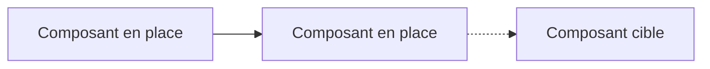

# Architecture

Les vues d'architecture d'EnerVision. Un ADR (`../adr/`) **décide** et date une décision
structurante ; une vue d'architecture **décrit** le système qui en résulte. Quand les deux se
contredisent, c'est l'ADR qui fait foi et la vue qui est en retard.

## Les documents

| Document | Ce qu'il couvre |
|---|---|
| [00-vue-ensemble.md](00-vue-ensemble.md) | Jalons du projet, contexte, conteneurs, sécurité, flux bout en bout |
| [10-infra.md](10-infra.md) | Poste de développement, cible k3s, décisions figées, ports et noms |
| [20-backend.md](20-backend.md) | Couches FastAPI, séquence de démarrage, routes, configuration, contrat OpenAPI |
| [30-frontend.md](30-frontend.md) | Angular, arborescence cible, flux HTTP |
| [31-contrat-authentification.md](31-contrat-authentification.md) | Ce que le frontend doit savoir pour coder la connexion |
| [32-design-systeme-frontend.md](32-design-systeme-frontend.md) | Tokens CSS, composants `ev-*` partagés, règle anti-couleur-en-dur |
| [40-data.md](40-data.md) | Frontières `db/` et `alembic/`, cycle de vie d'une mesure, modèle |
| [50-cicd.md](50-cicd.md) | Workflows, gates bloquantes, SonarCloud, Dependabot, ce qui manque |

La CI/CD a désormais son document : cinq workflows et seize jobs, c'est assez de matière pour
qu'une section de plus dans une autre vue devienne illisible. L'observabilité, elle, n'en a
toujours pas : `monitoring/` ne contient que des `.gitkeep`. Elle en sortira le jour où elle aura
de la matière. Un fichier vide de plus n'aide personne.

L'orchestration Airflow, elle, en a depuis les issues #115 et #116 : trois DAGs, leur image et
leurs contraintes sont décrits dans [10-infra.md](10-infra.md).

La sécurité applicative, elle, a désormais de la matière : la vue consolidée reste dans
[00-vue-ensemble.md](00-vue-ensemble.md), le détail dans [20-backend.md](20-backend.md), la
traçabilité OWASP dans [owasp-traceabilite.md](owasp-traceabilite.md), et les décisions dans les
ADR 0002 à 0004.

## Conventions

### Mermaid, et rien d'autre

GitHub rend Mermaid nativement dans les fichiers `.md`. Un diagramme est donc du texte : il se
relit en revue, il se diffe, et il ne se périme pas dans un binaire que plus personne ne sait
rouvrir six mois plus tard. Aucune image exportée, aucun `.drawio`, aucun `.png`.

### Chaque section porte son statut

Une large part de la stack n'est pas écrite. Une vue qui mélange l'existant et la cible sans le
dire devient fausse sans prévenir.

| Statut | Sens |
|---|---|
| `Fait` | Le code existe et tourne |
| `En cours` | Commencé, incomplet |
| `Cible` | Décidé, pas encore écrit |

### Légende des diagrammes

Trait plein pour ce qui tourne, trait pointillé pour ce qui est cible.

## Maintenance

**Toute PR qui change un composant met à jour sa vue dans la même PR.** Une vue qu'on promet de
mettre à jour plus tard ne l'est jamais.

Une documentation fausse coûte plus cher qu'une documentation absente : on la lit, on la croit, et
on construit dessus. Si une section ne peut plus être tenue à jour, elle est supprimée plutôt que
laissée à dériver.
